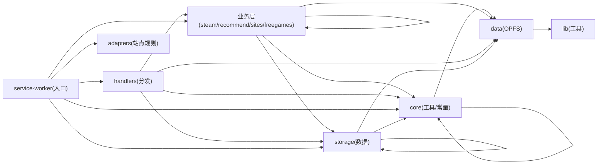

# 游戏雷达 Game Radar - 游戏智能推荐

基于浏览行为学习的 Chrome 浏览器扩展，自动预判游戏下载概率、集成 Steam 评分系统，并支持多下载站资源智能检索。

[](https://github.com/tgfxpfgt/game-recommender)

## 核心功能

### 1. 浏览行为追踪与智能推荐
- 自动追踪用户在下载站（XDGame、咸鱼单机、Gamer520、3DM、游侠、游民星空等）的浏览行为
- 基于浏览历史学习用户偏好，智能推荐相关游戏
- 在列表页实时显示推荐分数徽章

### 2. Steam 信息集成
- 在下载站详情页自动注入 Steam 信息浮窗
- 显示 Steam 总体评价、简体中文评价、SteamDB 评分三重评价体系
- 展示中文支持情况（简/繁体中文、音频、字幕）
- 显示热门用户标签、发行日期、开发商等信息
- 展示简体中文评测摘要

### 3. Steam 好评率过滤
- 在列表页自动显示每个游戏的 Steam 好评率徽章
- 支持按好评率阈值过滤，隐藏低评分游戏
- 过滤后自动重排列表，不留空白
- 阈值可在扩展菜单和设置页面中调整（0%-95%，步进 5%）

### 3.5 虚拟机版过滤
- 在下载站列表页隐藏标题包含"虚拟机板/虚拟机"关键词的游戏（可自定义关键词）
- 命中后从 DOM 移除整个栅格列容器，避免留空
- 过滤在请求 Steam 数据之前执行，同时节省 API 调用

### 4. 下载站资源检索
- 在 Steam 游戏详情页自动搜索三大下载站（XDGame/咸鱼单机/Gamer520）的对应资源（检索范围可在设置中自定义勾选）
- 显示资源更新日期、版本、文件大小等元信息
- 支持跨语言标题匹配（中英文独立匹配算法 + 自适应检索）
- 提供下载站详情页跳转链接，用户可在详情页手动获取资源

### 5. 下载历史记录
- 在下载站详情页自动记录每次下载行为
- 显示上次下载时间、下载站点、下载次数
- 提供快捷链接跳转至上次下载页面

### 6. 限免游戏监控
- 自动监控 Epic Games、GOG、GamerPower 等平台的限免游戏
- 每日自动刷新，支持一键领取跳转
- 浏览器扩展图标角标显示未领取数量

### 7. 数据管理
- 支持数据备份与恢复（JSON 格式）
- 设置页面支持自动保存（800ms 防抖，无需手动点击保存）
- 游戏缓存管理页：按 AppID/中英文名/好评率/Steam 标签/下载站多条件组合检索、分页查看、单个删除或清空全部缓存；AppID 可点击跳转 Steam、支持单条手动更新（Steam 中英文名/标签 + 下载站地址）；一键清理过期缓存、一键修复异常中英文名
- 可配置的日志记录系统（内存缓冲防抖写入）
- 调试面板（开发模式）

### 8. 适配规则管理（v3.0）
- 设置页"规则管理"面板：查看/编辑下载站适配规则（JSON 编辑器 + 校验 + 字段说明表）
- 保存的规则覆盖内置规则，可独立导出/导入分享，一键恢复内置
- 后台安全校验：纯数据白名单、拒绝函数注入、规模上限

### 9. 统一浮窗体系（v3.1）
- 所有浮窗（工作状态/诊断调试、Steam 信息、下载站资源、下载历史）统一管理
- 分区定位、防重叠堆叠、统一折叠/关闭
- 工作状态浮窗：任务进度 → 完成统计（计时）→ 3 秒后自动消失或切换诊断视图

### 10. 自适应检索（v3.1.2）
- 游戏名检索失败时自动尝试删词组合搜索（尾部/头部逐词删除 + 已学噪声词清洗）
- 成功后自动学习被跳过的噪声词（计数确认 ≥3 次生效，防误学副标题）
- 检索规则随使用自动改进，新站点标题修饰词无需手动维护

## 安装方式

### 开发者模式加载
1. 下载本项目代码到本地
2. 打开 Chrome 浏览器，访问 `chrome://extensions/`
3. 开启右上角"开发者模式"
4. 点击"加载已解压的扩展程序"
5. 选择项目根目录文件夹

### 权限说明
| 权限 | 用途 |
|------|------|
| `storage` | 存储用户偏好、浏览记录、缓存数据 |
| `alarms` | 定时刷新限免游戏与自动备份 |
| `<all_urls>` | 内容脚本注入与跨域请求（下载站/Steam/限免 API/用户自定义 LLM 端点） |

## 项目结构

```
game-recommender/
├── manifest.json              # 扩展配置文件（Manifest V3）
├── adapters/                  # 适配规则（default 基础 + sites 各站）
│   ├── default.js / index.js
│   └── sites/                 # 6 个下载站独立配置
├── shared/
│   └── escape.js              # 共享 HTML 转义工具（popup/options/dashboard/freegames）
├── background/                # 后台（模块化）
│   ├── service-worker.js      # 入口（导入/监听/定时/初始化）
│   ├── handlers.js            # 消息处理与分发映射
│   ├── core/                  # 常量/工具/设置/规则/重置
│   ├── storage/               # 数据模块（缓存/注册表/索引/日志/备份/噪声词...）
│   ├── steam/                 # 标题解析/API/编排器
│   ├── recommend/engine.js    # 推荐算法
│   ├── sites/search.js        # 下载站搜索
│   └── freegames/manager.js   # 限免管理
├── content/                   # 内容脚本（模块化）
│   ├── tracker.js             # 入口（预热/init/启动/监听）
│   ├── core/                  # common 工具 / floats 统一浮窗 / status-bar 状态栏 / debug 调试
│   ├── adapters/builder.js    # 适配器构建
│   ├── list/list-page.js      # 列表页功能
│   ├── detail/detail-page.js  # 详情页功能
│   └── tracking/download-tracking.js # 下载追踪
├── data/
│   └── data-store.js          # OPFS 数据存储层
├── lib/
│   └── ndjson.js              # ND-JSON 编解码库
├── tests/                     # 自动化测试套件（vitest 15 套件单 runner）
├── styles/content.css
├── popup/                     # 工具栏弹窗
├── options/                   # 设置页（入口 + panels/ 四面板）
├── dashboard/                 # 数据分析
├── freegames/                 # 限免页面
└── icons/
```

## 技术架构

### 依赖分层（v4.1.0 静态断言 + 自动生成图）
后台单向分层 `core → storage → 业务层 → handlers → 入口`，由 `tests/integration/test-integrity.mjs` 静态扫描全部 import 断言（CI 拦截回归，v6.3.0 起 test-layers 并入）；`node tests/integration/test-integrity.mjs --print` 可重新生成下图：



### 后台服务工作者 (service-worker.js)
- **Steam API 编排器**：搜索游戏 → 获取详情 → 解析语言支持 → 获取评测 → SteamDB/SteamSpy 数据；自适应检索（删词组合 + 噪声词自动学习）
- **下载站搜索引擎**：多搜索词策略 + 跨语言匹配算法 + 链接匹配度评分，站点配置来自规则文件
- **三层缓存系统（v5，以 appId 为唯一标识）**：
  - `gameRegistry` 游戏注册表：中英文名以 Steam 官方为准 + 下载站标题名称变体 + 封面图，永久保留、30 天重确认
  - `nameIndex` 名称索引：游戏名 → appId O(1) 反查（含规范化名键，跨站变体命中同一 appId），2h 负缓存
  - `downloadUrls` 下载站网址缓存：30 天有效，按站点分桶存储（v2），列表页批量写入 + 详情页访问更新
  - 三层均带内存缓存与防抖批量写入，减少 storage I/O；Steam 好评率等缓存跨站共享，检索优先命中缓存
  - 中英文名异常自动自愈（并行获取官方名）；一键清理过期缓存（三类按 TTL）
- **消息分发**：统一的 handler 映射表，支持行为追踪、推荐计算、设置管理等
- **SSRF 防护**：所有外部请求经 host 校验（仅 http/https，拒绝私有/环回地址），本地 LLM 端点除外

### 内容脚本 (tracker.js)
- **规则驱动的页面适配**：适配规则来自 `adapters/sites/` 目录（域名、列表页识别、列表项提取选择器），添加新下载站只需在规则文件中新增一项
- **document_start 注入 + 预热**：脚本加载即并行唤醒后台/加载规则，DOM 就绪立即开始工作（零延迟）
- **两波好评率流程**：第一波仅查缓存（命中徽章即时显示），未命中的后台从 Steam 拉取、每批完成后增量推送
- **统一浮窗体系（GR.float）**：状态/诊断/Steam 信息/下载站资源/下载历史全部统一管理，分区定位、防重叠、可折叠关闭
- **好评率徽章**：在列表页游戏标题前显示 Steam 好评率；0 评测游戏显示灰色 AppID，未匹配显示"未找到"
- **好评率过滤**：根据阈值自动移除低评分游戏并重排列表
- **预载下一页**：延迟 2s 自动预热下一页 Steam 缓存，翻页后好评率过滤秒开
- **appId 直取**：从页面 Steam 图片 URL 提取 appId 直接获取详情，绕过标题搜索
- **异步消息通信**：与后台服务工作者通过 Chrome Messaging API 通信
- **性能优化**：调试面板防抖刷新（250ms），下载追踪使用事件委托，全页扫描设上限（500 链接）

### 设置页面 (options.js)
- **自动保存**：所有设置修改后 800ms 自动保存，无需手动点击
- **实时状态反馈**：保存中/已保存状态指示器
- **防抖处理**：避免频繁保存请求

### 安全设计
- 所有用户输入经 HTML 转义防 XSS
- 百度网盘链接拼接提取码时进行域名验证
- 所有外部请求经 host 校验（仅 http/https，拒绝 localhost/环回/私有/保留地址），防 SSRF

## 支持的下载站

| 站点 | 域名 | 支持功能 |
|------|------|----------|
| XDGame | xdgame.com | 列表/详情 + Steam 资源检索 |
| 咸鱼单机 | xianyudanji.gg | 列表/详情 + Steam 资源检索 |
| Gamer520 | gamer520.com | 列表/详情 + Steam 资源检索 |
| 3DM游戏 | 3dmgame.com | 列表/详情/行为追踪（无站内检索） |
| 游侠网 | ali213.net | 列表/详情/行为追踪（无站内检索） |
| 游民星空 | gamersky.com | 列表/详情/行为追踪（无站内检索） |

## 数据源

- **Steam Store API**：游戏搜索、应用详情、评测数据
- **SteamDB**：评分、在线人数、历史最低价
- **SteamSpy**：SteamDB 被拦截时的补充数据
- **Epic Games API**：限免游戏信息
- **GOG API**：限免游戏信息
- **GamerPower API**：限免游戏聚合

## 配置与设置

在扩展设置页面（右键扩展图标 → 选项）可配置：
- 启用/禁用插件、工作状态浮窗开关
- 推荐高亮阈值（30%-90%）
- Steam 好评率过滤（开关 + 0%-95% 阈值）
- 虚拟机版过滤（关键词自定义）
- 推荐算法权重（点击率、下载率、关键词匹配、Steam 评分）
- AI 大模型推荐（支持 Ollama 本地模型 / OpenAI 兼容接口）
- 缓存有效期（小时/天/月/年，0=长期有效）
- 追踪网站管理与 Steam 检索范围
- 适配规则管理（编辑/导入导出/恢复内置）
- 日志配置（级别/保留天数/存储形式）
- 数据备份与恢复、自动备份开关与间隔

**所有设置自动保存**，修改后 800ms 自动同步，也可点击底部"立即保存"按钮强制保存。

## 开发说明

### 本地开发
```bash
# 贡献指南（架构心智模型/测试体系/发布流程）/ contributing guide
# 见 CONTRIBUTING.md

# 一键验证（lint + 单测）/ full check (lint + unit tests)
npm run check

# 单测（v6.2.0 起单 runner 全量统一）：vitest 覆盖全部 15 套件（464 test）
npm test          # vitest run（15 套件，含 content-sim 与 handlers 集成）
npm run coverage  # vitest 覆盖率（v8 provider）

# 安装 git 钩子（提交信息格式校验 + 暂存 JS 语法检查，v4.1.2）
npm run install-hooks

# 语法检查
node --check background/service-worker.js
node --check content/tracker.js
node --check popup/popup.js
node --check options/options.js

# 加载到 Chrome 进行调试
# 访问 chrome://extensions/ → 开发者模式 → 加载已解压的扩展程序
```

### 发布前深度扫描（Mimosa）
完整发布（大版本/中版本/触发线达标）前执行 Mimosa 深度安全扫描（`security_scan` 工具，focusFiles 覆盖本次改动文件），将返回的 **seal**（`sha256:...`）记录到 release notes 与项目记忆，作为可复核的封印标识；历史扫描存放于仓库外 `~/.mimosa/security-scans/`（仓库内 `.mimosa/` 产物已 gitignore）。

### 缓存版本控制
修改 `STEAM_CACHE_VERSION` 常量可强制使旧缓存失效，用于发布数据结构变更后的强制刷新。

## 更新日志

### v7.0.0（大版本：皮肤系统 + 数据模型重构 + 8 项设置体系升级）
- **① 好评率过滤文案优化**：明确"保留条件/下限"语义（与/或/非/混合四种组合的保留含义逐一说明），消除歧义
- **② 关键词过滤改为纯规则体系**：不再内置任何规则（虚拟机等默认规则移除），全部以规则列表逐条存在（每条：关键词 + 排除误报词）；三处 UI 同步
- **③ 日志查看增强**：显示时间/级别/模块/消息，新增级别筛选 + 关键词搜索
- **④ 皮肤系统（替代独立 Vista 界面）**：menu-vista 移除，改为**可选皮肤**——Steam 深蓝（默认）/ Vista Aero / Win3.1 / Win95 / Win98 / WinXP / Win7 / Win8 Metro / Win10 扁平 / Win11 圆角 共 10 套；CSS 变量主题化（styles/themes.css），各页面 body[data-theme] 切换，设置页即时预览
- **⑤ ITAD 多套配置**：可添加多套 API Key（名称 + 脱敏显示）、切换激活、删除、测试激活项；限免校验使用激活配置（旧单 Key 兼容）
- **⑥ 站点按用途分类管理**：游戏平台（Steam/Epic/GOG/GamerPower）/ 下载站 / 辅助站（Bing 搜索兜底）分组，每条独立开关；关闭的源不再调用其接口；下载站规则编辑器 + 导入导出保留
- **⑦ 缓存管理细化**：Steam 缓存按信息类型（基础/好评率/详情/热度）统计条数与过期数，每条目显示各类型缓存新鲜度标签；TTL 建议在"缓存有效期"设置中展示
- **⑧ Steam API 获取模块开关**：meta（基础）/ rating（好评率）/ detail（详情页信息）/ spy（SteamSpy）独立开关 + 独立缓存 TTL；关闭的模块不调用其接口（缓存数据仍展示）
- **质量**：vitest 566 test · lint 0 · typecheck 0 · E2E 38/38（皮肤切换/保存/生效断言）

### v6.4.18（过滤新增"混合模式"：任一≥高值 或 双≥低值）
- **新过滤关系"混合"**（用户需求：30 天与总好评率**任一 ≥90% 或 双 ≥80% 保留，其余过滤隐藏**）：`ratingFilterMode` 新增 `hybrid` 值——**高值 = 两阈值的较大者（任一达到即保留），低值 = 较小者（两者都达到才保留）**；设置总阈值 90 / 30 天阈值 80 即实现"任一≥90 或 双≥80"；阈值 ≤0 的维度不参与（单阈值退化为该阈值过滤）
- **三处 UI 同步**：设置页过滤面板（含说明文案）/ Vista 菜单 / popup 均新增"混合"选项
- **单测 +7 断言**：用户场景全组合（任高/双低/单高/双不达/无阈值/单阈值退化）
- **质量**：vitest 566 test · lint 0 · typecheck 0 · E2E 42/42

### v6.4.17（搜索引擎兜底 + 直取校验修复——109515 端到端命中 3764200）
- **搜索引擎兜底**（用户要求）：规则匹配失败时用 **Bing 搜索"标题 steam"**，从结果页提取 `store.steampowered.com/app/{id}` 官方链接 → **appdetails 官方名校验 + 标题相关性校验**（防无关链接）→ 采用；成功缓存 7d / 失败 24h（独立 web: 缓存键，与 LLM 兜底互不阻断）；免费无需配置（manifest 新增 `cn.bing.com` host 权限，权限最小化单域）
- **修复直取路径误拒**（109515 真正根因）：标题带 **"Build.22898177"** 噪声——"build" 被算作英文词使标题判为"混合语言"，跨语言信任失效，**封面直取的正确 appid（3764200）被误拒**转标题搜索（中文索引无）→ 未找到。修复：词提取排除下载站噪声词（build/plus/full/crack/repack/update）——封面直取直接命中正确游戏
- **跨语言信任加数字冲突校验**：`namesRelated` 跨语言分支要求双方数字集合不冲突（"生化危机9" vs "Resident Evil 4" 系列旧作被拒；候选无数字放行）
- **兜底链**：规则匹配 → 搜索引擎兜底（Bing）→ AI/LLM 兜底（用户配置时）→ 全部失败显示"未找到"（可报错纠正入黑名单）
- **质量**：vitest 566 test · lint 0 · typecheck 0 · E2E 42/42；端到端实测 109515 浮窗显示 store.steampowered.com/app/3764200 ✅

### v6.4.16（appid 错配根治 + AI/LLM 匹配兜底——真实站点诊断驱动）
- **错配根因**（gamer520 109515"生化危机9 安魂曲"→ 错误匹配 Jrago III 4021140，正确应为 Resident Evil Requiem 3764200）：扩展组合搜索把标题删词成**通用词"安魂曲"**，storesearch 返回名字含"安魂曲"的无关游戏"Jrago III 夜之安魂曲"；`nameMatchesSearch` 只校验"结果名包含搜索词"、**不校验与完整标题相关** → 错配。实测 storesearch：中文索引无"生化危机 安魂曲"，英文"Resident Evil Requiem"正确返回 3764200
- **规则层修复（三层）**：①**跨语言信任收紧**——中文搜索词命中英文结果名不再无条件放行（schinese 搜索的中文词英文结果多为索引噪声），仅当标题含共同英文词才放行；②**删词变体校验** `nameMatchesSearchVariant`——变体搜索的结果名须与标题**其余核心词**有交集（拒"安魂曲"→"Jrago III 夜之安魂曲"）；③**多候选打分排序**——`matchCandidateScore` 按与完整标题的共同核心词评分（英文词权重更高），分数 0 不采用
- **AI/LLM 兜底**（用户要求）：规则匹配全部失败时，若配置了 LLM（useLLM + endpoint）——LLM 从标题提取 Steam 官方名 → **storesearch / appdetails 官方数据校验**（防幻觉）→ 命中才采用；成功缓存 7d、失败缓存 24h（防反复打 LLM）；**未配置 LLM 时显示"未找到"而非错误 appid**（错配比未找到更糟，可走报错纠正黑名单）。端到端实测（mock LLM）：109515 → 3764200 ✅
- **质量**：vitest 556 test（+8 名称匹配/打分 +11 AI 兜底解析/链路）· lint 0 · typecheck 0 · E2E 42/42

### v6.4.15（列表页好评率提速 + 失败固化可恢复——真实站点诊断驱动）
- **真实站点诊断**（xianyudanji.gg/pcdj、gamer520.com/pcplay 实测）：①xianyudanji 100 链接 ≈ 50 游戏，**25 秒只完成 24 个**（3 并发 + 中国网络下 Steam 请求挂起 5-15s）——后半部分长时间无徽章；②gamer520 首访 **16/44 显示 #appid**（好评率获取失败态），12 秒后恢复至 1 个——失败多为暂时性网络/限流
- **修复问题 1（后半部分无徽章）**：`ratings-batch.js` 批量并发**自适应提速**——正常 6 并发（原 3）/ 检测到 Steam 限流异常时降为 2 + 既有降速等待。实测 xianyudanji **25 秒游戏覆盖 24 → 48**（翻倍，50 游戏约 30 秒完成）
- **修复问题 2（大量 #appid 永久失败）**：失败固化（ratingFailCount ≥ 3）原为**永久停止重试**——限流/超时是暂时性的，固化导致游戏永远显示 #appid；改为**长冷却（1 小时）后重置重试**（`needsRatingRefetch` 新分支）；失败徽章提示文案同步为"稍后自动重试"
- **单测 +4**：失败固化长冷却分支（冷却内不重取 / 冷却过后恢复 / 高计数不永久固化）
- **质量**：vitest 535 test · lint 0 · typecheck 0 · E2E 42/42

### v6.4.14（重磅修复：数据持久化失效——v3.4.1 起所有模块写入从未真正落盘）
- **终极根因（三轮"过滤设置无法保存"排查）**：data-store 的原子写用 `move()` 把临时文件移动到目标——**实测 Edge/Chrome 的 `FileSystemHandle.move()` 对"目标已存在"的文件不替换**（源被移除、目标保留原内容）。v3.4.1 引入原子写以来，**所有模块（settings/缓存/注册表/备份等）的写入从未真正持久化**：保存后内存缓存更新"看似成功"，**浏览器重启后全部回退默认值**——设置、Steam 缓存、学习模型每次重启都丢
- **修复**：`_writeHandle` 改为**直接截断覆盖目标文件**（createWritable 默认截断；崩溃留下的半截文件由读取侧 corrupt 备份+重置机制兜底）；新增 **`.tmp` 数据救援**——目标文件缺失时自动尝试读取 `<name>.tmp` 中的有效数据并写回正确位置（历史 move bug 残留的数据可救回）
- **回归防护**：E2E 新增**第 6 节「重启持久化」**——保存设置 → 关闭浏览器 → 同一 profile 重启验证写盘（此前所有 E2E 断言都在同一会话内读内存缓存，永远无法暴露此类问题）
- **排查工具沉淀**：OPFS 目录 dump + move() 语义实验脚本（验证 API 真实行为而非文档假设）
- **质量**：vitest 531 test · lint 0 · typecheck 0 · E2E 42/42（含重启持久化）

### v6.4.13（小版本：修复设置页面板错位——多余 </div> 致面板逃逸容器）
- **修复设置页"过滤类设置页面错位"**：HTML 结构检查发现 panel-general（常规面板）日志查看区块后**多一个 `</div>`**——浏览器按 HTML5 解析时隐式闭合 section/main，**后续全部面板（过滤/推荐/网站/规则/缓存/日志）逃逸出 `.settings-shell` 布局容器**，失去 flex 布局与样式上下文（v6.4.8 引入日志在线查看时遗留）——删除多余闭合标签，7 个面板全部回归内容区
- **好评率过滤保存验证**（真实浏览器复现 8/9）：设置页与 popup 的好评率过滤开关/阈值保存与重开回显全部正常；写盘链路复核（OPFS 写失败自动降级 storage.local，再失败 UI 可见报错）无静默丢失
- **E2E +1 回归**：好评率过滤开关 + 阈值保存往返 + 重开回显断言（41/41）
- **质量**：vitest 531 test · lint 0 · typecheck 0 · E2E 41/41

### v6.4.12（小版本：保存链路加固——串行队列防竞态 + 失败可见 + 过滤保存回归）
- **真实浏览器复现验证**（playwright 六场景 14 项全过）：设置页过滤**全部**控件（总好评/30 天阈值/关系模式/重排/关键词/匹配模式/规则编辑器）经立即保存/自动保存/重开回显三条路径均持久化；popup/Vista 过滤保存往返正常
- **保存链路加固（三处 UI）**：popup/Vista/options 的保存改为**串行队列**——此前快速连续操作（连续开关多项）时并发 GET→SAVE 基于旧快照互相覆盖（"保存了但部分丢失"）；**保存失败可见**（popup 红色提示条 / Vista 状态栏 ✗ 保存失败 / options 保存状态支持错误态）；options"立即保存"改为 await 完成反馈（此前 fire-and-forget，点击后立即关页可能未送达）
- **E2E +2 回归**：过滤设置全量保存往返（阈值/关系/关键词）+ popup 快速连续 3 项修改全部保留
- **质量**：vitest 531 test · lint 0 · typecheck 0 · E2E 40/40

### v6.4.11（小版本触发完整发布：菜单一致性 + 全量覆盖 + 集中入口 + 过滤保存根治）
- **修复过滤设置无法保存（根因根治）**：① **options 保存收集漏读 4 个 DOM 字段**——30 天好评过滤开关/阈值、过滤关系（与/或/非）、按好评率重排（仅绑定事件触发保存，收集阶段从未读取，保存时被旧值覆盖）——补齐；② **Vista 菜单 savePatch 点号键 bug**——`Object.assign` 把 `'badgeVisibility.recent'`/`'llmConfig.*'` 拍平为字面量顶层键，嵌套设置永远写不进——新增 `shared/settings-utils.js`（deepSet/getByPath/applyPatch）三处 UI 共用
- **弹出菜单与设置页一致 + 全覆盖（#1）**：popup 重构为**全量快捷设置**（与设置页同键同名）——常规/好评率过滤（总+30天+关系+重排）/关键词过滤/推荐权重 6 项+LLM/徽章 4 项/自动备份/日志 5 项全部可调；底部"设置/分析"独立入口改为"🏠 设置中心"集中入口
- **设置页覆盖所有选项（#2）**：classic 设置页新增**自动备份**（开关/间隔/保留份数）与**日志条数上限**；Vista 菜单新增**行为记录上限**与**自动备份配置**（此前仅默认值生效、无 UI）
- **集中入口 Hub（#3）**：新建 `hub/` 设置中心——侧栏一键切换**设置（经典）/Vista 菜单/数据分析/限免游戏** 四个页面（iframe 内嵌 + hash 直达 + postMessage 面板联动）；各页面新增"🏠 中心"返回按钮；popup 底部统一经 hub 进入
- **连带修复**：options 规则列表首次加载补渲染（renderSettings 先于 __renderRules 定义）；6 处 `catch (e)` 未用变量 + 1 处 prefer-const（lint 门禁）
- **质量**：vitest 531 test（+9 settings-utils 深路径套件）· lint 0 · typecheck 0 · E2E 38/38（+30 天过滤保存往返 / Vista 徽章嵌套保存 / hub 切换断言）

### v6.4.10（小版本：四项 bug 修复——API 状态/重试机制/过滤/权重归一）
- **修复 Steam API 状态失效**：GET_API_STATUS handler 返回 `{status: {...}}` 嵌套而 popup 读顶层字段——永远显示"采样中"；扁平化返回修复（E2E +1 断言）
- **好评率失败重试机制**：缓存条目新增 `ratingFailCount`——获取失败 +1 / 成功归零；`needsRatingRefetch` 失败固化重试**上限 3 次**（页面刷新触发一次 + 冷却防连打，3 次后停止避免无限请求）
- **修复好评率过滤失效**：30 天过滤（enableRecentFilter）在 `positiveRate` 为 null 时被外层检查整块跳过——过滤判定独立于 positiveRate（任一过滤启用且任一评分有值即判定）
- **推荐权重超 1 归一化**：六项权重和 > 1 时按比例缩放（保证评分 0-100% 有意义；默认 1.0 不变）
- **content-sim 偶发根治**：推送处理错误不再静默（catch 可见）；vitest 串行化（content-sim 高负载与并行竞争）——20 次连跑 0 失败
- **质量**：vitest 522 test · lint 0 · typecheck 0 · E2E 28/28

### v6.4.9（小版本：全面审查修复——菜单一致性 + 交互覆盖）
- **全面审查**（大规模重构后）：基线 516 test + E2E 24/24 + typecheck/lint 全绿确认；代码审查新功能边界（filterRules 空列表兜底/ITAD 脱敏回显/日志空态）无缺陷
- **菜单一致性修复**：**Vista 菜单补齐"追踪站点管理"**（此前 options 有 trackedSites 管理、Vista 遗漏——添加/移除自定义站点 + 权限回收）；**popup 的"虚拟机版过滤"标签改为"关键词过滤"**（通用化语义同步）；规则列表标注"优先于简单关键词"
- **E2E 增强**：Vista 交互覆盖（规则添加编辑器行 / ITAD 保存测试按钮 / 日志查看渲染）——24 → 27
- **质量**：vitest 516 test · lint 0 · typecheck 0 · E2E 27/27

### v6.4.8（小版本：过滤保存修复 + 关键词规则列表 + 缓存/日志增强）
- **修复过滤设置无法保存**：`filterMatchMode` 渲染回显缺失（下拉每次打开显示默认值，保存时覆盖掉用户选择）——补回显（settings.js）
- **关键词过滤规则列表**（v6.4.7 单条升级）：`filterRules` 数组——**每条规则含排除误报词**（如 {keyword:'虚拟机', exclude:'非虚拟机'}：命中关键词且不命中排除词才过滤）；Vista/options 双菜单规则编辑器（添加/删除/失焦保存）；旧 filterKeywords 简单模式兜底
- **缓存管理增强**：列表条目 `downloadUrls` 每站含 **lastCalled（上次调用时间）**——options 表格按站显示"调用时间"、Vista 缓存列表显示好评率 + 按站网址 + 调用时间
- **日志在线查看**：Vista 日志面板 + options 日志面板新增查看区（GET_RUNTIME_LOGS 200 条 + 刷新 + 清空，级别着色）
- **质量**：vitest 516 test · lint 0 · typecheck 0 · E2E 24/24

### v6.4.7（小版本：通用关键词过滤（防误报）+ ITAD Key 保存/测试/脱敏）
- **通用关键词过滤**（旧"虚拟机版过滤"扩展）：`filterKeywords`（逗号分隔任意关键词，兼容旧 `vmFilterKeywords` 字段迁移）+ **防误报 `filterMatchMode`**：
  - `contains` 子串匹配（默认）
  - `exact` 整段匹配——关键词必须是标题完整分段/前缀/后缀（"虚拟机"命中"虚拟机版游戏"但不误伤"虚拟主机"）
- **ITAD API Key 增强**（Vista + options 双菜单）：**保存按钮**（显式保存）+ **测试按钮**（调 ITAD API 验证有效性——401/403=无效/200=有效）+ **脱敏显示**（保存后显示 `••••后4位`，聚焦清空重输；明文不持久显示）
- **测试稳定性根治**：content-sim 偶发失败根因定位——并发下 bootPromise 慢导致节 2 推送时消息监听未注册（推送丢失）——节 1 改为**轮询等待监听器就绪**；推荐徽章/批次请求等待全部 waitFor 化（10 次连跑稳定）
- **质量**：vitest 516 test（10 次连跑稳定）· lint 0 · typecheck 0 · E2E 24/24

### v6.4.6（小版本触发完整发布：Vista Aero 全新菜单 + 新老一键切换）
- **全新 Vista Aero 菜单** `menu-vista/`（零历史包袱独立实现）：Aero 毛玻璃（backdrop-filter）主窗口 + 光泽渐变按钮 + 蓝绿配色 + 高光边缘
- **不遗漏任何功能**（8 面板）：常规（启用/阈值/状态浮窗/调试/扫描上限/徽章×4/重排）、过滤（总+30天+与或非/虚拟机）、推荐（六项权重/AI 全参数/ITAD）、限免（列表/刷新/类型标记/领取）、缓存（TTL×7/缓存管理）、数据（导出/备份/导入/清空）、日志（全参数）、统计（概览/命中率/最近行为）
- **新老菜单一键切换**（双向）：新菜单标题栏"🎨 经典菜单"→ options；经典侧边栏"✨ 新菜单（Vista Aero）"→ menu-vista
- 全新 menu.js（保存前重读合并防快照覆盖）；E2E +3（Vista 渲染/全功能/无错误）
- **质量**：vitest 516 test 全过 · lint 0 · typecheck 0 · E2E 24/24

### v6.4.5（小版本：全 UI 重构——Steam 主页美术风格设计系统）
- **Steam 设计系统** `styles/ui-theme.css`：CSS 变量驱动（深蓝黑背景 #1b2838 / Steam 蓝强调 #66c0f4 / 渐变按钮 #588fe3→#2f6db3 / 卡片 #2a475e / 圆角阴影）+ 组件类（gr-btn/gr-card/gr-tag/gr-switch/gr-range/gr-input）
- **popup 重构**：渐变头部 + 统计卡片（蓝色辉光数字）+ Steam 滑块式开关 + 折叠区块 hover 高亮
- **freegames 重构**：Steam 商店风格横向游戏卡片（封面图 + 平台/类型标签 + 渐变领取按钮）+ 标签式平台筛选
- **dashboard 重构**：渐变横幅 + 数据卡片网格 + 表格行 hover 高亮
- **options 重构**：侧边栏"🔧 高级设置"分组（推荐/缓存/日志归高级）+ 全部设置参数 Steam 化（开关/滑块/输入/按钮）；**常见设置（常规/过滤/网站）直观易得，高级设置（权重/AI/TTL/缓存/日志）一键可达——一切参数可调**
- **兼容**：全部 DOM id 保留（E2E 21/21 验证）；UI 逻辑零改动，纯视觉层
- **质量**：vitest 516 test 全过 · lint 0 · typecheck 0 · E2E 21/21

### v6.4.4（小版本：四项功能——浮窗左侧 / 缓存合并 / 重排序 / 30 天过滤三态）
- **详情页浮窗改左侧**：Steam 信息浮窗从右上 → 左上（floats 新增 TOP_LEFT 分区；下载站面板仍在左下，互不遮挡）
- **缓存合并**：下载站网址缓存与"上次调用"合并——`recordDownloadUrl` 扩展 meta 参数（更新日期/版本/大小/网盘提取码），搜索命中后写入网址缓存条目（`lastCalled` 记录上次调用时间），detail 页二次展示免重抓
- **按好评率重排**（默认关闭）：`enableSortByRating` 设置项——列表页好评率获取完成后按 positiveRate 降序重排 DOM（无评分沉底；评分最高在前）
- **30 天好评率过滤 + 与/或/非关系**：新增 `enableRecentFilter`/`minRecentSteamRatingFilter` + `ratingFilterMode`（and=总与30天都达标 / or=任一达标 / not=仅看30天好评）；`ratingFilterPass` 纯函数导出
- **质量**：vitest 516 test（4 次连跑稳定）· lint 0 · typecheck 0 · E2E 21/21

### v6.4.3（小版本：缓存范围扩充——下载站搜索 / LLM 评分 / Steam 判定）
- **在线数据梳理与扩充**（此前 Steam 数据/限免已有缓存；本次补齐三处未缓存请求）：
  - **下载站搜索结果缓存**（新模块 `storage/search-cache.js`，24h TTL，LRU 200）：搜索是高频操作，此前每次逐站逐词重复请求——命中免请求；siteKeys 变更自动失效
  - **LLM 推荐评分缓存**（新模块 `storage/llm-cache.js`，7d TTL，LRU 300）：列表批量场景每游戏调用 LLM（慢且贵）——命中免计算
  - **Steam 官方判定缓存**（`determineSteamFreeType` 内存缓存，12h TTL）：通知去重，防重复 appdetails+商店页请求
- 新缓存纳入 DATA_MODULES（备份/导出/清除覆盖）+ OPFS MODULE_FILES + resetInMemoryCaches
- **质量**：vitest 515 test 全过 · lint 0 · typecheck 0

### v6.4.2（小版本：限免判定升级——Steam 官方接口区分喜加一 vs 免费周末）
- **determineSteamFreeType**（导出纯函数 + 通知路径接入）：Steam 官方 appdetails 判定 100% OFF 类型——
  -  → **f2p**（永久免费，官方权威信号）
  - 原价>0 且现价 0 → **喜加一入库候选**（-100% 促销），**商店页按钮复核**（Play Now「立即游玩」→ 免费周末；Add to Cart → 喜加一）
  - 现价 0 无原价 → **weekend**（Play Now 模式保守处理）
  - 当前非免费 → null（数据过期）
- **通知过滤升级**：Steam 平台通知候选经官方判定——仅【喜加一入库】推送；免费周末/F2P 拦截（ITAD 确认免费 + 官方类型判定双重校验）
- **质量**：vitest 512 test 全过 · lint 0 · typecheck 0

### v6.4.1（小版本：popup/options 状态一致性修复 + options E2E 覆盖）
- **修复快照覆盖**：popup 的 8 处 SAVE_SETTINGS 由加载时快照改为**保存前重读最新设置**（saveSettingsPatch）——后台 saveSettings 替换缓存引用，popup 打开期间 options 的改动会被旧快照覆盖（双向编辑一致性）
- **E2E 增强**：新增 options 设置页冒烟（渲染/标题/无 console error）+ **popup↔options 双向状态一致性**（options 切 VM 过滤 → popup 一致；popup 回切 → options 一致）——E2E 16 → 21 项
- **质量**：vitest 506 test 全过 · lint 0 · typecheck 0 · E2E 21/21

### v6.4.0（中版本：正式更名 游戏雷达 Game Radar）
- **品牌更名**：Game Recommender → **游戏雷达 Game Radar**（111 个文件全库替换：扩展名/页面标题/启动日志/文件头注释）
- 命名结合功能特点：📡 下载站 Steam 好评率徽章（雷达扫描）· 🎯 行为学习智能推荐（雷达锁定）· 🎁 限免监控三类区分（雷达告警）
- GitHub 仓库名 game-recommender 保留（技术标识，不影响克隆/URL）
- **质量**：vitest 506 test 全过 · lint 0 · typecheck 0 · E2E 16/16

### v6.3.3（小版本：限免功能优化——三类区分 + 垃圾 key 过滤 + ITAD 二次校验）
- **限免数据源确认**：Epic 已直连官方接口（freeGamesPromotions，非第三方中转）；Steam/GOG 以 **GamerPower 为主源**（其 end_date 字段分类可靠）+ 官方源（featuredcategories / GOG ajax）补充
- **三类区分**（classifyFreeType 纯函数 + 页面标记）：✅ **limited 限时领取 100% OFF**（通知推送）· ⚠️ **weekend 免费周末**（标记，不推送）· ❌ **f2p 永久免费**（标记，不推送）——GOG 源按原价判定（basePrice=0 永久免费）
- **垃圾 key 活动过滤**：GamerPower 的 thirdparty（key 领取）活动不收录不推送
- **ITAD 二次校验**（可选 key，设置页配置）：Steam 限免通知候选经 isthereanydeal.com 确认当前免费（价格 0），防 GamerPower 数据过期误报；无 key/失败容错放行
- **决策关闭**：i18n / 跨设备云同步 / 跨端适配 / 规则市场——正式不做（记录至 CONTRIBUTING）
- **质量**：vitest 506 test 全过 · lint 0 · typecheck 0 · E2E 16/16

### v6.3.2（中版本：B/C 现代化——UI 类型化 + 可观测 + 限免通知 + 推荐反馈循环）
- **B1 UI 层类型化**：双 tsconfig（主 strict 全量 + tsconfig.ui.json UI 层 strictNullChecks 关闭——DOM 元素存在性由浏览器保证）；全局 d.ts（chrome/__OPTS__/__GR_PATTERNS__/escapeHtml 等 + DOM 宽松化）；**顺带修复 dashboard 真实拼写 bug**（`responsString` → `response.error`，ReferenceError 崩溃）
- **B3 可观测面板**：Steam 缓存命中率埋点（steam-cache hits/misses）+ GET_STATS 暴露 + dashboard 命中率卡片
- **C2 限免推送通知**：manifest `notifications` 权限 + refreshFreeGames 检测新限免聚合通知（防骚扰，+2 test）
- **C3 推荐反馈循环**：推荐徽章 ✕ 按钮 → TRACK_EVENT `dislike_game`（新契约 type）→ 画像 `disliked` 负信号 → 引擎评分归零（method: 'disliked'）；+4 test
- **C1 商店上架准备**：PRIVACY.md（数据全本地声明 + 权限/网络请求说明）+ STORE.md（资产清单/文案/流程）
- **B2 content-sim DOM 评估**：jsdom 迁移收益 < 成本（测试聚焦流程逻辑，FakeEl 工作正常）——决策保留 FakeEl，记录到 CONTRIBUTING
- **偶发根治**：content-sim 固定延时 → 轮询等待（waitFor，推送/批次异步链竞争消除；6 次连跑稳定）
- **质量**：vitest 500 test（6 次连跑稳定）· lint 0 · typecheck 0（双配置）· E2E 16/16

### v6.3.1（小版本：TS strict 全量开启 + 工程护栏）
- **TS strict 全量开启**（`strict: true`，191 → 0 错误）：background + data 全层 strict 编译期防线（null/undefined 类 bug 前置拦截）；修复过程中发现并规避两个回归：`e.message → String(e)`（catch unknown 安全化，仅日志层）、steam-cache `nextModules` 惰性初始化必须保持（类型标注用 optional 而非预初始化）、data-store 的 guard 会破坏 OPFS 不可用时的 storage.local 回退（改用类型断言）
- **A1 CI 补 typecheck 门禁**（此前类型回归 CI 不拦截）
- **A3 adapters 清单一致性断言**（manifest/SW/options.html 三处 + 目录实测防漂移，+2 test）
- **A4 typedef 补全**：MessagePayload 全字段（limit/force/keyword/tag/granularity/rules 等）、AppSettings 精确化（weights 六项/llmConfig/badgeVisibility/trackedSites/maxBehaviorLog）、新增 SteamSearchResult/GameResult/RecommendResult
- **质量**：vitest 496 test（3 次稳定）· lint 0 · typecheck 0（strict）· E2E 16/16

### v6.3.0（中版本：报告路线落地——契约 100% + 类型化全层 + 盲区补强 + 权限收窄）
- **消息契约化 100% 收尾**（52/52）：第四批补 9 个读类 action（GET_TRENDS 校验 granularity day|week）；"渐进式"标签摘除
- **类型化扩展**（core → background 全层）：tsc include 扩至 `background/**`，storage/steam/handlers/recommend 全层 checkJs；修复 engine.js JSDoc 错位绑定（steamspyScores 抢占 computeGameScore 的 JSDoc——JSDoc 必须紧贴函数）
- **测试盲区补强**：新增 test-backups.mjs（备份/恢复/密钥剔除/上限裁剪 6 项）+ test-freegames 主体（四源聚合/缓存判定/force/claim/协议白名单 5 项）+ content-sim 节 10（下载追踪：网盘识别 + window.open 拦截 1 项）；**494 test 全过（3 次稳定）**
- **权限最小化**：host_permissions 从全站收窄到 26 个内置功能域名（Steam API/下载站 9 域/限免源/本地 LLM）+ optional_host_permissions 兜底；options 添加自定义站点时按需请求权限（E2E 16/16 验证）
- **解析结构化收尾（C）**：supported_languages 兜底加 String() 防御（异常响应不再中断搜索链）+ 5 项解析健壮性测试（空 HTML/异常字段/官方字段降级）
- **SW 懒加载评估（结论：不可行）**：MV3 Service Worker 官方不支持动态 import()（仅静态 import，Chrome 文档明确）——E2E 实测懒加载后详情页/dashboard 响应失败，回滚维持静态 import；**冷启动优化需另寻路径（如模块合并）**
- **工程**：CONTRIBUTING.md 新增（架构心智模型/测试体系/代码约定/发布流程/安全基线）；依赖图命令修复（test-layers 并入 test-integrity，`node tests/integration/test-integrity.mjs --print`）
- **质量**：vitest 494 test（3 次稳定）· lint 0 · typecheck 0 · E2E 16/16

### v6.2.1（小版本：官方 API 优先 + 直取优先 + 缓存优先三项优化）
- **移除冗余 english storesearch**（api-search）：schinese 搜索对英文词同样有效，且英文名由 `fetchSteamFullDetailsByAppId` 的 appdetails(english) 官方直取覆盖（buildSteamResult.englishName）——此前每词并行 2 请求，english 结果仅用于被覆盖的英文名占位；**每新游戏搜索省 1 请求**（test-handlers 加防回归断言）
- **rating 模块 TTL 24h → 7 天**（constants 默认 + TTL_CONFIG）：好评率是周级稳定数据，24h 意味着用户每天浏览同一游戏就重新请求 appreviews；7 天大幅减少重复请求（test-rules-cleanup 过期数据同步为 8 天前）
- **移除 SteamDB 网页抓取**（api-supplement/api-assemble）：抓取仅产出展示链接（解析字段从未被消费），链接改模板拼接；每详情抓取省 1 个慢速网页请求（SteamDB 反爬频繁）；SteamSpy 保留（玩家人数/热度无官方替代，spy 模块 7 天缓存）
- **质量**：vitest 15 套件 465 test 全过 · lint 0 · typecheck 0 · E2E 16/16

### v6.2.0（中版本：全局审查落地——单 runner 全量统一 + 契约化收尾 + 接线层测试）
- **全局审查驱动**（2026-08-12）：对项目做全量审查（遗留标记/测试盲区/架构技术债三维扫描 + 实验验证），落地 P0+P1 全部项：
- **单 runner 全量统一**：content-sim 纳入 vitest——`__grImport` 注入（eval 代码里的动态 import() 在 vite-node vm 执行器无回调，字符串替换为全局 provider 后兼容）+ 65 项 check→expect 节级 test 化（11 节，跨节 DOM 变量提升文件级）；`run-tests.js`/`helpers/assert.mjs`（check 体系）退役，`test:sim`/`coverage:node` 删除；CI 只跑 `npm test`
- **测试隔离健康化**：`isolate: true` + 文件级并行（v6.1.1 结构化重写后各套件已自包含，验证 464 test 全过；消除跨文件 chrome mock 泄漏/防抖写竞态）
- **消息契约化收尾**（25 → 38 个）：13 个写/破坏性 action 全量入参校验（RESET_SETTINGS/CLEAR_DATA/CLEAR_GAME_CACHE/DELETE_GAME_CACHE_ENTRY/REFRESH_GAME_CACHE_ENTRY/CACHE_STEAM_PAGE/TRACK_DOWNLOAD_SITE_VISIT/SAVE_ADAPTER_RULES/REPORT_WRONG_APPID 等）
- **接线层测试**：新增 `tests/integration/test-handlers.mjs`（16 项）——mock chrome.storage + fetch 驱动真实 handleMessage 链路（SEARCH_STEAM 全流程/负缓存/REPORT_WRONG_APPID/SAVE_MANUAL_MAPPING/下载站记录/缓存删除/契约拒绝），覆盖 handlers/ 与 orchestrator.searchSteamGame 此前零测试盲区
- **顺带修复真实 bug**：`deleteNameIndexEntry` 只删精确 key、清理名变体残留——报错重检索会被旧映射干扰（test-handlers 集成测试发现，与 recordNameIndex 对称删除修复）
- **去重**：detail-page 第三份噪声词副本删除（content-sim 注入真实 shared/patterns.js 权威源）、评级色 bg fallback 统一 0.15
- **质量**：vitest 15 套件 464 test 全过（3 次稳定）· lint 0 · typecheck 0 · E2E 16/16

### v6.1.1（小版本：4 个状态敏感套件结构化重写，双体系合并）
- **根因定位**：此前"vitest 与 check 双体系"实为**检查点错位**而非实例分裂——check 线性脚本的顶层准备（reset/数据写入）在 vitest 收集阶段全部提前执行，断言延迟到运行阶段，读到的是全部准备完成后的最终状态（探针验证：单 test 场景实例一致，多检查点场景中间状态丢失）
- **结构化重写 4 套件**（api-pure/rules-cleanup/storage/outbound）：顶层状态准备移入各 test（自包含：准备→断言），共享对象原地修改（steam-cache 内存引用）改为 test 内重新获取，storage mock 残留用 `_reset()` 隔离——**断言点 484 与原 check 全量完全等价**（vitest 13 套件 414 test + content-sim 65 项）
- **双体系合并**：`run-tests.js` 注册表仅剩 content-sim；`test:node` 删除（语义并入 `test:sim`）；CI 改 `npm test` + `npm run test:sim`
- **质量**：vitest 13/13 · content-sim 65 项 · lint 0 · typecheck 0

### v6.1.0（中版本：防抖工厂全量迁移 + vitest 断言全量重写）
- **防抖工厂全量迁移**（v5.1.0 仅 wrong-reports/learned-noise 2 个）：steam-cache / registry / name-index / logger 4 个内联防抖块全部改用 `storage/debounced-store.js`（`scheduleWrite`/`flush`/`reset`），每模块删除自维护 timer 与复合 flush 主体；name-index 修复迁移中暴露的缺失 import 与残留 flush 主体
- **vitest 断言全量重写（check → describe/test/expect）**：13 个测试文件的 check/assertThrows/assertAsync 全部转为 vitest 原生断言（419+ 处，文件头引入 `import { test, expect } from 'vitest'`）：
  1. 9 个套件（title-parser/engine/contract/trends/freegames/sites/security + orchestrator/integrity）完成转换由 vitest 直接收集（**243 项**）
  2. **4 个线性状态敏感套件（api-pure/rules-cleanup/storage/outbound）回滚 check 体系**：其顶层线性脚本 + 模块级共享状态（审计缓冲/TTL 配置/模块状态）与 vite-node 的模块执行语义不兼容（顶层写入与 test 闭包读取不同实例，15 项失败无法归因修复）→ 由 `test:node`（node tests/run-tests.js）直跑，语义保持与原 run-tests 一致
  3. `tests/all.test.mjs` 聚合入口删除（import + include 双重收集冲突）；vitest.config include 显式列出 9 文件（排除 5 个 node 套件）【v6.1.1 起 include 为 13 文件全量，v6.2.0 起 14 文件】
- **工具链**：scripts 调整（`test:node` 新增、`test:legacy` 更名、coverage 切 vitest `--coverage` + `coverage:node` 保留 c8）；CI test job 改 `npm test` + `npm run test:node`（此前只跑 test:sim 会漏 4 套件）
- **质量**：484 项单测全过（vitest 243 + node 241，与原 check 全量一致）· lint 0 · typecheck 0 · 深度扫描 0 findings

### v6.0.0（大版本：内容脚本 ESM 化 + vitest runner）
- **内容脚本 ESM 化（动态 import 路径，零构建）**：
  1. **11 个内容模块转 ES module**（去 IIFE 壳 + `__GR__` 全局命名空间退场，模块间依赖由 ESM import 图显式表达）；两个循环依赖（list-page↔list-batch、status-bar↔debug）以调用期引用处理并注释标注
  2. **tracker.js 经典入口重写**：`ensureModules()` 动态 `import(chrome.runtime.getURL('content/...'))` 并行加载 11 模块（Chrome content_scripts 官方不支持原生 ESM——动态 import 是零构建唯一路径）；REQUIRED_KEYS 自检删除（import 失败自然抛错）
  3. **manifest**：content_scripts 裁剪为 shared×2 + adapters×8 + tracker.js；新增 `web_accessible_resources`（content/*.js）
  4. **content-sim 加载器重写**：模块无参动态 import + GR shim 兼容层（测试体 GR.* 引用零改动）+ getURL mock 共享实例；**关键教训**：带 `?t=` 的入口其静态依赖解析为无参 URL 导致实例分裂——必须全部无参导入
- **vitest runner 接入**：
  5. `npm i -D vitest` + vitest.config（pool forks）+ `tests/all.test.mjs` 聚合 13 套件（check 断言体系保留）；`npm test` = vitest run；`npm run test:sim`（content-sim 直跑——其 eval+动态 import 模拟与 vite-node 运行器不兼容，保持 node 直跑）；`test:legacy`（run-tests.js 全 14 套件）；CI 同步【v6.1.1 起 all.test.mjs 已删、check 全量转 vitest；v6.2.0 起 content-sim 亦纳入 vitest，run-tests.js/test:legacy 退役】
- **质量**：484 项单测全过（node legacy）· vitest 13/13 · E2E 16/16（真实浏览器验证动态 import + WAR）· lint 0 · typecheck 0 · 深度扫描 0 findings

### v5.1.0（中版本：拆分与工具链——用户决策的架构/工程类未做项落地）
- **detail 模板拆分**：detail-page.js 805 → 505 行，新 `GR.detailTemplates.steamSidebar`（纯 HTML 模板，依赖仅 GR.common；评级色顺带单源 __GR_PATTERNS__）
- **list-batch 拆分**：list-page.js 590 → 416 行，新 `GR.listBatch`（批次调度全套）；**状态容器 `GR.list._state`** 替代闭包捕获（ratingsJob/batchState 由 list-page 与 list-batch 共享），`GR.list._internal` 导出状态机函数；GR.list 尾部导出改合并展开（防覆盖 _state）
- **防抖工厂**：新 `storage/debounced-store.js`（scheduleWrite/flush/reset）；wrong-reports 与 learned-noise 已迁移（其余 steam-cache/registry/name-index/logger 因复合 flush 语义留待专项）
- **E2E_FAST 离线开关**：`E2E_FAST=1 npm run e2e` 跳过真实 Steam 网络段（详情页报错），CI/本地快速冒烟
- **prettier 全库格式化**：.prettierrc（2 空格/单引号/120 列）+ 一次性全库格式化（双源一致性提取正则健壮化支持跨行）
- **质量**：484 项单测 · E2E 16/16（E2E_FAST 10 项）· lint 0 · typecheck 0 · 深度扫描 0 findings

### v5.0.0（大版本：三大目录模块化重构 + 类型化基建）
- **background 拆分与解耦**：
  1. **handlers.js（960 行）按领域拆 5 子模块**（`background/handlers/`）：steam（搜索/直取/报错/自愈）、cache-manager（缓存管理 5 handler）、data-modules（导出/导入/备份）、stats（统计/趋势/推荐）、download-sites；handlers.js 保留核心 handler 与 MESSAGE_HANDLERS 聚合
  2. **steam/api.js（858 行）按职能拆 6 子块 + barrel**：api-search / api-details / api-reviews / api-supplement / api-assemble / api-registry-heal；api.js 保留为再导出（调用方与测试零改动）
  3. **去重收敛**：isPlainObject 统一至 core/utils（3 份重复）、flushAllCaches 聚合（6 处 flush 三连）、readProfiles/readKeywordWeights（4 处手写并行读）、orchestrator 缓存命中块抽 applyCacheHit（2 处逐字重复）
  4. **缺陷修复**：resetInMemoryCaches 补 behavior 偏好节流重置（此前导入/恢复后残留）；handleGetSteamRecommendations 内嵌裸 fetch 下沉 api-search
- **content 拆分与去重**：
  5. **list 徽章拆分为 `GR.badges` 模块**（content/list/badges.js，list-page 823 → 590 行）；prependBadge 的 settings 参数化（脱离 ratingsJob 闭包）；manifest 注入顺序 + tracker 完整性自检键同步
  6. **颜色分级单源**：options.html 加载 shared/patterns.js + cache.js 改用 `__GR_PATTERNS__`（消除第 3 份内联色阶）
  7. **title 清洗链收敛**至 `GR.common.cleanPageTitle`（detail-page 与 tracker 逐字重复消除）
- **options 重构**：
  8. **TTL 字段单源** `OPTS.TTL_FIELDS`（绑定/保存/渲染三份 id 列表 → 1 份配置）
- **类型化基建（编译期，零运行时）**：
  9. 新增 `background/core/types.js`（SteamCacheEntry/MessagePayload/AppSettings/TrendBucket/AuditEntry @typedef）+ chrome 全局声明
  10. `npm i -D typescript` + tsconfig.json（allowJs + **checkJs core/ 层**）+ `npm run typecheck`（tsc --noEmit 0 错误）
- **质量**：484 项单测 · E2E 16/16 · lint 0 problems · **tsc --noEmit 0 错误** · 深度扫描 0 findings
- **说明**：content 的批次调度（list-batch）与 detail 模板拆分因与闭包状态机/按钮绑定深度交织，留待后续专项（**已于 v5.1.0 完成拆分**：GR.list._state 状态容器 + listBatch/detailTemplates 模块）

### v4.2.0（中版本：测试体系重构）
- **重新排列组合（按领域分组）**：`tests/unit/`（纯函数单测，11 个套件）+ `tests/integration/`（内容脚本模拟/Steam 编排器/项目完整性，3 个套件）——原"名实不符"的 test-cleanup 拆分为 test-api-pure（Steam API 纯函数 93 项）与 test-rules-cleanup（规则与清理 38 项）；test-security 静态扫描节（TDZ/语法/manifest/双源）并入新 test-integrity；test-layers（5 项）与 test-wrong-reports（9 项）并入大套件（文件数 9 → 14，覆盖更清晰）
- **精简**：
  1. **版本断言去硬编码**：manifest 为唯一权威 + 与 package.json 互比（**发版不再需要改测试**）
  2. 修复 test-cleanup 的 `globalThis.chrome` 泄漏（try/finally 与统一 mock）
  3. test-contract §6 按 action 类别分节（6a 批量/6b 列表搜索/6c 日志限免备份）
- **新增测试项目（6 个新套件 +71 项断言）**：
  4. **test-trends**（18 项）：行为趋势 day/week 粒度、周一桶键、无效时间戳、转化率
  5. **test-storage**（21 项）：wrong-reports 吸收 + learned-noise 阈值 3 + registry + behavior 500 上限 + **settings deepMerge 权重 backfill**
  6. **test-freegames**（14 项）：限免平台门优先级 + 第三方来源识别（需导出 manager 纯函数）
  7. **test-sites**（10 项）：详情页元信息提取（fixture HTML 驱动，**顺带修复 gamer520 等站版本标签提取缺失**）
  8. **test-orchestrator**（10 项）：**两波好评率流程真实后台集成**（此前 content-sim 用 presets 绕过后台，orchestrator 零覆盖）——mock fetch + storage mock 驱动缓存命中/搜索/写缓存链路
  9. **test-integrity**（16 项）：依赖分层 + TDZ + 语法 + manifest + 噪声双源
- **新工具与方式**：
  10. `helpers/storage-mock.mjs` / `helpers/fetch-mock.mjs`：统一 chrome.storage 与 Steam API fetch mock（消除 3 份重复）
  11. `assertThrows` / `assertAsync`：断言助手增强（消除内联 try/catch）
  12. **`--grep` 子集运行**：`node tests/run-tests.js --grep trends` 只跑匹配套件
  13. **覆盖率工具 c8**：`npm run coverage`（当前 67.45% 行覆盖，core 92%）
- **质量**：**484 项单测全过**（+71）· E2E 16/16 · lint 0 problems · 深度扫描 0 findings

### v4.1.2（小版本：测试 / lint / 扫描 / git 规则自动优化）
- **git 规则**：
  1. `.gitignore` 重写（原文件 GBK+BOM+混合 EOL 编码损坏，Read 工具无法解析）→ UTF-8 LF，新增忽略 `GameRecommender-*.html`（根目录报告附件）、`.tmp-*.mjs`、`coverage/`
  2. 新增 `.gitattributes`（`* text=auto eol=lf` + bat/ps1 保留 CRLF + 二进制标记）+ `git add --renormalize`——根治 LF/CRLF 警告（此前 system 级 autocrlf=true 叠加导致每次 add 噪音）
  3. 新增轻量 git 钩子 `.githooks/`（commit-msg 提交信息格式校验 + pre-commit 暂存 JS 语法检查）+ `npm run install-hooks` 一键安装（core.hooksPath，零依赖替代 husky/commitlint）
- **测试规则**：
  4. 失败明细可观测：`tests/helpers/assert.mjs` 收集 `failures`（名称/实际/期望），`run-tests.js` 失败时汇总输出前 10 条 + 每套件/总耗时
  5. `package.json` 补 `engines: node >=18` + `npm run check`（lint + test 聚合入口）
- **CI 修复（此前 8 次全红）**：
  6. **致命缺陷**：test job 缺 `npm ci` 却跑 lint（无 eslint 必失败）→ 补上
  7. setup-node 加 `cache: npm`；`concurrency` 取消组（重复推送自动取消旧运行）
- **lint 增强**：`no-unused-vars` warn → error；补 `eqeqeq(smart)` / `no-var` / `prefer-const`（顺带修 2 处 let）`/ no-extra-semi`；新增 `.editorconfig`（utf-8/lf/2 空格）；curly 因项目单行花括号风格混合未启用
- **扫描**：README 开发说明补"发布前深度扫描"流程（Mimosa seal 记录惯例）
- **质量**：413 项单测 · E2E 16/16 · lint 0 problems

### v4.1.1（小版本：版本后缀补搜修复）
- **修复**：`https://www.gamer520.com/40746.html` 等"增强版/重制版"标题无法正确检索新版 Steam 条目（如 GTA5 增强版 3240220）：
  - **根因**：① 页面 Steam 封面是旧版（40746 封面 271590 = GTA5 传承版），appId 直取命中旧版；② 该类游戏无官方中文名（3240220 索引为英文 "Grand Theft Auto V Enhanced"），中文标题"侠盗猎车手V"在 storesearch 中文索引 0 命中 → 搜索路径全部落空
  - **修复**：新增 `findVersionVariant(appId, title)`——标题含版本后缀词（增强版/重制版/复刻版/豪华版/终极版/年度版/典藏版/黄金版）且直取条目是旧版时，剥离旧版后缀（Legacy/Classic 等）后用"英文名 + 英文版本后缀"补搜（"Grand Theft Auto V" + " Enhanced" → 3240220）；结果须带版本标识（CN/EN 后缀任一）且与标题相关（跨语言信任）；`GET_STEAM_BY_APPID` 命中变体则整体走新版（缓存/注册表/名称索引全部按新版写入）
  - 覆盖场景：旧版封面 + 新版标题；已是新版标题（不重复搜）；无版本后缀（不触发）
- **质量**：新增 mock 单测 3 项 + 真实 API 端到端验证（271590 → 3240220）

### v4.1.0（中版本：全部优化建议落地）
- **性能三件套**：
  1. **推荐流联动滚动**：推荐请求并入批次调度（fireBatch 按批并发 GET_RECOMMENDATIONS），按 name 回填徽章（替代 index 对齐）——滚动批次自动获得推荐徽章/高亮；顺带修复 REFRESH 路径 appId 恒 null 缺陷；prependRecBadge 防重复
  2. **封面提取延迟化**：`extractSteamImageInfo` 从全量提取改为 fireBatch 内惰性提取（500 项列表首屏 DOM 扫描降 ~90%），评分与推荐共用 imageData
  3. **MutationObserver 增量提取**：新增 `GR.builder.findItemsInContainer`（容器级提取，item 结构与全量一致），新增节点不再整页重扫（大列表 O(n) → O(新增)）
- **工程三件套**：
  4. **eslint 完全清零**：删 4 个未使用 import + 50 处 catch 参数 → optional catch binding（`catch {`），`npm run lint` 0 problems（此前 54 warnings）
  5. **版本三源断言**：manifest / package.json / 测试断言三者一致（防发布手改遗漏）
  6. **测试框架统一**：9 个测试文件的重复 check()/计数器抽取为 `tests/helpers/assert.mjs`（createReporter），行为完全一致
  7. **依赖图自动生成**：`node tests/test-layers.mjs --print` 输出 Mermaid 分层图（含 data/lib 基础层），README 附图，静态断言 CI 拦截回归
- **安全两小项**：manifest 显式声明 CSP（与 MV3 默认一致，基线显式化）；LLM API Key 输入框旁加"仅本机存储、导出/备份/导入剔除"知情提示
- **功能扩展**：
  8. **详情页综合推荐理由**：浮窗评分区底部显示"综合推荐 X%（好评率 · 中文支持 · 热度 · 平均时长）"（与推荐引擎同源口径，零新调用）
  9. **趋势周聚合**：`aggregateTrends(log, 'week')`（周桶键=周一）；dashboard 日/周切换
  10. **出站审计增强**：主机筛选输入框 + 审计 CSV 导出（含筛选结果）
  11. **限免微软商店**：GamerPower 平台门新增 microsoft 关键字映射（此前 "Microsoft Store" 被丢弃）+ 筛选按钮；itch/Humble 已被 GamerPower 聚合覆盖不重复建设
  12. **消息契约全量覆盖**：第二批 13 条规则（GET_RECOMMENDATIONS/GET_STEAM_RATINGS/PREFETCH_STEAM_RATINGS 数组校验、CLEAR_CACHE_FOR_PAGE、GET_GAME_CACHE_LIST 过滤字段、SEARCH_* 必填名、RECORD_DOWNLOAD_URLS_BATCH、limit 范围、moduleKeys 数组、force 布尔），全部 action 契约化完成
- **质量验证**：410 项单测全过（+35）· E2E 16/16（+3：滚动批次/dashboard 趋势）· **eslint 0 problems** · Mimosa 深度扫描 0 findings

### v4.0.0（大版本：按需扫描 + 可视化 + 契约化 + 信号增强）
- **R4 列表按需扫描**（性能）：
  1. 消除 2 处无上限扫描路径（builder 策略 3 fallbackLinks / 通用适配器全量 `a` 扫描，现受 `maxScanLinks` 上限约束）
  2. **批次调度器**：全部 item 提取后每批 60 个名字串行请求（每名字仅请求一次，后台循环无重叠），done 到达后自动衔接下一批
  3. **滚动调度**：IntersectionObserver 底部哨兵（提前 400px）+ MutationObserver 增量发现——无限滚动/分页加载的新增游戏自动入队并获取徽章（此前完全不处理）
  4. 45s 强制收尾随批次重置（最后一批 +45s），保持"不误标未找到"语义；推荐流保持首屏 60
- **R5 Dashboard 趋势可视化 + CSV**：
  5. 新 action `GET_TRENDS`（后台按天聚合浏览/下载/转化率，纯函数 `aggregateDailyTrends` 可单测）
  6. 新增「📈 行为趋势」区块：SVG 手绘双柱图 + 转化率折线（零依赖，深色主题）
  7. 三处 CSV 导出（趋势/游戏明细/行为日志全量），UTF-8 BOM 防 Excel 乱码
- **R6 消息契约化**（安全）：
  8. 新增 `background/core/message-contract.js` 纯函数校验器，9 个高风险 action 入参白名单：TRACK_EVENT（type 5 值白名单 + gameName 必填 + keywords 数组）、SEARCH_STEAM/REFRESH_STEAM_CACHE（gameName）、GET_STEAM_BY_APPID/SAVE_MANUAL_MAPPING（数字 appId）、CLAIM_FREE_GAME（gameId）、RESTORE/DELETE_BACKUP（backupId）、SAVE_SETTINGS（纯对象）；`handleMessage` 分发前统一校验，违规直接拒绝
- **R7 推荐信号增强**（SteamSpy 时长/热度）：
  9. `fetchSteamSpyInfo` 新增原始数值字段 `averageForeverMin`/`ownersLow`/`ownersHigh`（此前转成 "X小时"/区间串丢失数值；嵌套对象入 spy 模块，无缓存迁移，7 天 TTL 自动刷新）
  10. 引擎新增两分量：`playTimeScore`（平均分钟/600 封顶）、`heatScore`（owners 中点对数/7 封顶），缺数据中性 0.3；`steamspyScores` 纯函数可单测
  11. **权重重排**（六项和 1.0）：点击 0.15 / 下载 0.30 / 关键词 0.20 / 评分 0.15 / 时长 0.10 / 热度 0.10；设置页新增 2 个权重滑块（旧设置经 deepMerge 自动补默认值）；缓存管理页与详情页浮窗同步（详情页 SteamSpy 面板新增"热度"等级）
- **质量验证**：375 项单测全过（+47）· E2E 13/13 · eslint 0 errors
- **升级提示**：大版本建议先在设置页「数据管理」备份数据

### v3.4.1（小版本：报告建议甄别 + 工程与安全加固）
- **报告 7/8 章建议甄别**：对《项目进展与统计报告》24 条演进路线逐条核实（代码/CI/git 实测），确认 17 条准确、7 处不准确（如"chrome.storage 加密区"API 无此能力、LLM 本地化/规则 schema 校验已实现、内容脚本 ESM 化与 v3.3.9 决策矛盾等）；选择真实缺口路线落地（详见提交信息与下文）
- **R1 依赖分层单向校验**：
  1. `title-parser.js` 下沉 `steam/ → core/`（纯函数被 storage 层引用，修复分层违规①）；7 处引用同步
  2. `reset.js` 归位 `core/ → storage/`（聚合各存储模块重置属 storage 层编排，修复分层违规②）
  3. 新增 `tests/test-layers.mjs` 静态扫描全部 import，断言单向分层（core→storage→业务→handlers→入口），CI 拦截分层回归
- **R2 出站请求审计 + 全局限速**（SSRF 校验 v3.4.1 基线之上的安全补强）：
  4. 新增 `background/core/outbound-audit.js`：300 条环形审计缓冲（主机/耗时/状态/成败）+ 聚合统计 + 每主机 10s/100 次滑动窗口限速（可注入时钟可单测）
  5. `fetchWithTimeout`（唯一出站通道）全路径接入：成功/网络错误/被拦截/被限速均记录；超限抛 `rate-limited`
  6. 新 action `GET_OUTBOUND_AUDIT`/`CLEAR_OUTBOUND_AUDIT`；dashboard 新增"出站请求审计"区块（失败高亮 + 聚合统计 + 清空）
- **R3 CI 补 E2E**：GitHub Actions 新增 `e2e` job（微软官方 apt 源安装 Edge + xvfb 跑非无头冒烟），PR/推送自动拦截浏览器端回归
- **质量验证**：328 项单测全过（+30：分层 5 + 审计 24 + 版本断言）· E2E 13/13 · eslint 0 errors

### v3.4.0（中版本：全面审查与优化）
- **全面审查结论**（技术/工程/安全双维度深度审查）：健康面——无循环依赖、GR 命名空间契约、SSRF/XSS/CSP 系统化、定时器无泄漏、存储模块化；发现并修复 **7 项真实缺陷 + 5 项工程优化**
- **真实缺陷修复**：
  1. **CI 跨平台修复**：测试文件硬编码 Windows 绝对路径 → `import.meta.url` 派生（Linux CI 此前必然失败）
  2. **导入/恢复后纠正知识库内存陈旧**：`resetWrongReports` 接入 `resetInMemoryCaches`；"清除学习数据"语义统一（同时删除 learnedNoise 存储）
  3. **noisePattern 第三副本漂移**：detail-page 降级副本移除（缺 25 词），统一经 `__GR_PATTERNS__` 权威源 + 断言扩展
  4. **名称索引正缓存无界增长**：新增 5000 条 LRU 上限（此前仅负缓存有清理）
  5. **预载下一页安全加固**：同源校验 + 15s 超时（此前可代发请求到任意地址）
  6. **API 密钥泄露面**：导出/备份默认剔除 `llmConfig.apiKey`/`steamApiKey`（备份文件流转不再泄露凭据）
  7. **转义统一**：detail-page 2 处属性值改 escapeAttr；dashboard 2 处补 escapeHtml
- **工程优化**：
  - **列表页 OPFS 写放大下降 ~80%**：批量拉取从每批 flush 3 次全量文件改为每 5 批一次（60 游戏 ≈ 12 次写入）
  - **handlers.js 拆块**（1054 行 → ~800 行）：批量好评率/预载抽为 `steam/ratings-batch.js`
  - 13 处调试 console.log → Logger；死常量 USER_PREFERENCES 清理；过期注释修正
  - 徽章分级色单源化（`__GR_PATTERNS__.ratingColorFor`，列表/详情/缓存页共用）
  - manifest 补 `minimum_chrome_version: "109"`
- 测试：新增路径跨平台/密钥剔除相关；全套 **276 项** + E2E 13/13 + eslint 0 errors

### v3.3.15
- **调试/状态浮窗默认禁用 + 开关**：
  - 根因：`dbg()` 日志的 `scheduleDebugUpdate` → `refreshInBar` → `showDebugView` **无条件显示"🔧 游戏雷达 Game Radar 调试"浮窗**——`showDebugPanel`/`showStatusBar` 开关都关不掉它
  - 修复：`showDebugView` 仅 **debugMode（showDebugPanel）开启**时显示；`showStatusBar` 默认改为 **false**（状态/诊断浮窗默认禁用）
  - **popup 新增"显示状态浮窗"开关**（调试窗口区，控制 showStatusBar）；设置页既有开关保留
- E2E：验证默认禁用（页面无调试浮窗）→ popup 开启后浮窗渲染；全套 **264 项** + E2E 13/13 通过

### v3.3.14
- **修复详情页误检索侧边推荐游戏**（16598 页右侧推荐 119428"轮回之兽"导致浮窗误检索 2001760）：
  - 根因：详情页 appId 提取扫描**全页面图片**——gamer520 侧边推荐的封面是 Steam CDN 图（含 /steam/apps/{id}/），被误当作当前游戏封面直取 appId
  - 修复双层：① appId 提取**限定主内容区**（article/.entry-content/.post-content/main 等），侧边栏/推荐区不再参与；② 后台 `GET_STEAM_BY_APPID` 加 **namesRelated 名称相关性校验**（缓存命中与新拉取都校验，页面标题与图片 appId 的游戏名不相关 → 拒绝并转标题搜索）；手动选择候选传 `manual: true` 跳过校验（用户主动确认）
- E2E：fixture 复刻侧边推荐场景（主区图 1213700 + 侧边图 2001760）——浮窗正确显示主内容区游戏；全套 **264 项** + E2E 11/11 通过

### v3.3.13
- **报错重检索记录（长期有效）+ 据此优化检索匹配**：
  - 新增 `wrongReports` 数据模块（独立持久化，不随缓存清理删除；可导出/备份）——用户点"报错"记录错误 appid，手动选择确认后记录正确 appid（count 累计）
  - **检索优化（人工纠正知识库）**：某标题曾确认正确 appid → 下次检索**纠正优先**（用户确认 > 自动匹配，自动清除该名负缓存）；曾报错的错误 appid 作为**黑名单在搜索结果中排除**（多词搜索逐词过滤）——长期积累自动改善匹配
  - 顺带修复：`learnedNoise` 模块漏注册 MODULE_FILES（此前 OPFS 下读写被静默丢弃）
- 测试：新增报错纠正记录测试文件（9 项：记录/纠正/合并/累计/持久化）；全套 **264 项**通过

### v3.3.12
- **改进报错按钮**：点击"信息有误？重新检索"后，若重新检索结果**仍是同一 appid**（自动纠正失败，如下载站标题本身与 Steam 搜索无稳定正确匹配）→ **自动进入手动选择面板**（不再重复显示同样的错误结果）；重检索纠正为不同 appid 时正常渲染新结果
- E2E 冒烟更新：报错点击后断言"手动选择面板或纠正渲染"流程完成 + 无 console error；全套 **255 项** + E2E 10/10 通过

### v3.3.11
- **下载站详情页浮窗新增"⚠️ 信息有误？重新检索"按钮**（人工纠错）：
  - 用户发现检索到的 Steam 游戏（appid）与实际不符时点击 → 后台清除**错误 appid** 的 Steam 缓存/名称索引（正/负缓存都删，防负缓存拦截重检索）/下载站网址映射（30 天错误映射一并清除，不删注册表）→ 浮窗自动重新检索并渲染正确游戏；仍失败进入手动选择面板
  - 与 v3.3.10 的 namesRelated 校验协同：自动校验推翻错误条目 + 人工报错主动触发
- 测试：内容脚本模拟详情页场景（+4 项）；E2E 冒烟新增真实点击报错按钮流程（扩展加载/SW/popup/列表注入/报错重检索 10 项全过）；全套 **255 项**通过

### v3.3.10
- **修复 1778840↔16598 双向检索错误**（实测根因：名称匹配丢数字 + 名称索引粘性）：
  - 错误 1（Steam 1778840 "Spirit of the North 2" 检索到 gamer520 16598 一代页）：`calcLinkMatchScore` 跨语言段匹配把搜索词 "spiritofthenorth**2**" 的续作数字丢掉 → 一代页 75 分误匹配 → 且当场写入 30 天缓存固化。修复：**数字保护**——搜索词段含数字而链接段不含 → 拒绝（与 nameMatchesSearch 续作防护同思路）；**低分（<80）结果不写缓存**（防脏数据固化）
  - 错误 2（16598 页误匹配 2001760"轮回之兽"）：直接匹配不可能（名称无共同词），为**名称索引粘性**（历史误写钉死 appId，缓存命中不再校验名称）。修复：新增 `namesRelated(title, cachedName)` 纯函数（CJK/英文共同词 + 单语言跨语言信任）——`searchSteamGame` 缓存命中前校验，不相关转重新搜索并覆盖名称索引（**粘性自愈**）
  - 附带：站点后缀（Switch520.com 等）加入噪声词表（双源同步），16598 标题清洗后保留干净候选 "Spirit of the North"/"北方之魂" → 正常匹配一代 1213700
- 测试：新增检索匹配修复用例（9 项）+ 站点后缀噪声（3 项）；全套 **250 项**通过

### v3.3.9
- **8 项隐患核实与优化**（逐项核实后按判定处理）：
  1. **常量单源**：噪声词表抽为 `shared/patterns.js` 唯一权威源（内容脚本引用 + 后台副本交叉注释 + **双源一致性测试**防漂移）；`shared/escape.js` 注入内容脚本，common.js 复用全局实现（单点维护）
  2. 内容脚本全局耦合：核实为 MV3 经典脚本标准模式（隔离 world 无冲突），**不做 ES Module 迁移**——替代：tracker.js 入口加**命名空间完整性自检**（缺失即报错指明加载顺序）
  3. **工程基础**：新增 `package.json`（npm test/e2e/lint）+ `eslint.config.js`——**eslint 立即抓到真实 bug**：api.js `scanAndHealRegistry` 用了未导入的 `getGameRegistry`（批量自愈 ReferenceError，已修复）；核心函数补 JSDoc 类型标注
  4. **parseUserTags 降级**：商店页被拦截时用官方 categories 兜底（"热门用户标签"区块不再消失）
  5. 站点选择器：核实多候选+三级回退已实现；通用适配器路径表提为常量 + **域名段匹配**（xdgame2.com 不再误配 xdgame）
  6. **链接扫描上限可配置**（`maxScanLinks`，默认 500，设置页可调），列表判定与回退提取共用
  7. **浏览器 E2E 冒烟**：`npm run e2e`（playwright-core 复用系统 Edge）——扩展加载/SW 启动/popup/内容脚本注入/列表页流程 7 项全过
  8. i18n 最小化：manifest `default_locale: zh_CN` + `_locales/`（name/description 走 `__MSG_*__`，Chrome 商店多语言受益）；UI 文案 6000+ 字符不迁移（中文站定位）
- 测试：新增噪声双源一致性（2 项）；全套 **241 项**通过；eslint 0 errors

### v3.3.8
- **列表页徽章独立开关**（设置页"徽章显示"区，默认全开）：近30天好评率/全部好评率/最近更新/推荐值各自开关；关闭不影响后台数据获取——关闭"全部好评率"同时**停用好评率过滤**，关闭"推荐值"同时**停用推荐高亮**（用户确认语义）
- **列表页徽章独立获取**：最近更新日期不再依赖详情页访问——`getSteamPositiveRate` 未命中时直接调 GetNewsForApp（api.steampowered.com 独立限流域，不影响商店 API 配额），写入缓存（detail 模块自动路由），列表页首次即显示
- **修复 Windrose 检索失败**（3041230，官方中文名 "Windrose: 风启之旅"）：根因是标题解析的英文子串贪婪匹配出 "Windrose:"（尾随冒号），下载站搜不到——`splitTitleSegments` 增加冒号分段 + 英文候选去尾随标点；实测 "Windrose" 首候选三站直接命中（xdgame 95 分/咸鱼 95 分/gamer520 85 分）
- **修复推荐值徽章顺序不固定**（gamer520）：`prependRecBadge` 原来只插到第一个好评率徽章后（三段式下顺序错乱），改为插入到最后一个徽章之后
- **Steam 商品页缓存预取**：浏览 store.steampowered.com/app/{id}/ 时后台预取该游戏完整数据并写缓存（detail 模块有效则跳过）+ 记录名称索引——回下载站列表页徽章/筛选立即有数据
- 测试：新增冒号分段（5 项）+ 徽章开关/过滤联动（12 项）；全套 **239 项**通过

### v3.3.7
- **Steam 缓存模块化（字段分组 + 独立 TTL + 按需部分刷新）**：
  - 缓存条目改为 `{ modules: { meta, rating, detail, spy } }` 结构，**每个模块独立有效期、独立刷新**——好评率（24h）/详情页信息（72h）/SteamSpy 补充数据（7 天，新增设置）/基础信息（30 天，新增设置），设置页缓存面板均可调（0=长期）
  - 字段归属由 `FIELD_MODULES` 映射表决定——**未来增删字段只需改一行映射**，未知新字段默认进 detail 模块
  - **字段调整不再使整体缓存失效**：废除全局版本号强制失效；旧平铺结构缓存加载时自动迁移为模块结构继续使用；缺失/过期的模块在后续使用中按自身 TTL 自动重新获取（部分刷新），其他模块保留——如好评率 24h 过期只刷新好评率，详情页缓存（72h）与 SteamSpy（7 天）不受影响
  - 读取方全部按模块判定：列表页两波（rating 模块）、详情页（detail 模块 + 完整性）、预载/缓存管理页/推荐引擎（合并视图）；清理仅删除所有模块均过期的条目
- 测试：模块化用例改写与新增（isModuleValid 独立过期/字段归属路由/部分更新保留/旧结构迁移/清理语义）；全套 **228 项**通过

### v3.3.6
- **列表页好评率徽章改为三段式**（依次显示）：
  1. **近 30 天好评率**（浅蓝，悬停显示评论数；无近期评测 → 灰 `—`）
  2. **全部好评率**（原有分级色，悬停显示评论数 + 评价等级，可点击跳转 Steam）
  3. **最近更新日期**（灰 `MM-DD`，悬停显示发行日期；未获取时 → `—`，访问详情页后自动补全）
- **详情页浮窗增强**：
  - 发行日期后显示**最近更新日期**（Steam 无此官方字段，用最新公告日期近似，GetNewsForApp 免费无 key）
  - Steam 总体评价下新增 **"🕒 最近 30 天"** 行（好评率 + 条数）
  - **SteamDB 好评率换成 SteamSpy 数据**（好评率/评测数/当前在线 ccu/拥有者/平均时长；SteamDB 链接保留；SteamSpy 被拦截时显示降级提示）；修复 SteamSpy 字段（实测无 players_2weeks/players_forever，改用 ccu/owners）
- **缓存机制同步**：近 30 天好评率随同一 appreviews 请求获取（filter=recent 评测数组统计，纯函数 `summarizeRecentReviews`）写入缓存；STEAM_CACHE_VERSION 5→6（旧缓存自动失效）；lastUpdate 由详情页全量拉取写入、列表页经缓存合并自动补全（列表页保持请求预算防限流）
- 测试：新增近30天评测统计用例（6 项）+ 三段式徽章断言（9 项）；全套 **215 项**通过

### v3.3.5
- **弹出菜单新增"♻️ 强制刷新"按钮**（刷新当前页并忽视缓存有效期）：
  - 点击后：内容脚本收集当前页全部游戏引用（详情页：游戏名 + 封面 appId；列表页：全部游戏名 + 封面 appId）→ 后台清除对应 Steam 缓存条目与名称索引（**含负缓存**，防止"未找到"记录拦截重新获取）→ 页面重载后全部重新从 Steam 获取（**绕过缓存 TTL 与 0 评测冷却**）
  - 适用场景：好评率/详情显示异常、怀疑缓存过期或固化错误数据时一键全量刷新
  - 新增 `deleteNameIndexEntry`（无条件删除指定名字的正/负缓存条目）、`CLEAR_CACHE_FOR_PAGE` 后台消息
- 测试：新增 FORCE_REFRESH_PAGE 内容脚本消息模拟用例（5 项）；全套 **201 项**通过

### v3.3.4
- **修复详情页"获取详情失败，请重试"（根因：appdetails 字段名不兼容）**：
  - 实测链路：66096（苏丹的游戏 3117820）/57106（刀剑江湖路 2361680）详情页自动匹配失败 → 手动选择正确候选项 → 点击仍"获取详情失败"
  - 根因：`baseAppIdFromDetails` 读取 `data.appid`，但**真实 appdetails 响应的 ID 字段是 `steam_appid`**（v3.2.6 加入校验以来从未兼容）→ type=game/demo 永远解析为 null → `fetchSteamFullDetailsByAppId` 的"非本体无法解析"分支必然触发返回 null → **所有新游戏详情页完整拉取 100% 失败**（只有 v3.2.5 前写入的旧完整缓存能命中显示）；v3.3.3 将列表页轻量缓存命中改为转完整拉取后问题全面暴露
  - 修复：`baseAppIdFromDetails` 兼容 `data.appid || data.steam_appid`（game 保留自身/demo 优先解析本体/DLC 解析 fullgame 本体不变）
  - 实测验证：3117820 → OK（苏丹的游戏，type=game，10 标签，中文支持）；2361680 → OK（刀剑江湖路 72%）；DLC 4145470 → 自动解析本体 3613270（星际采矿公司）
- 测试：新增真实 appdetails 结构用例（5 项：game/demo/独立 demo/dlc/bundle 的 steam_appid 形态）；全套 **196 项**通过

### v3.3.3
- **详情页 Steam 信息缓存命中机制改进**（列表页打开详情页直接用缓存，秒开）：
  - 新增 `isCompleteCacheData` 完整性判定：详情页渲染需要的关键字段（链接/类型/标签/中文支持/发行日期/开发商/简介/封面）齐全才可命中缓存——修复 `SEARCH_STEAM` 回退路径命中列表页轻量缓存导致详情页缺字段渲染残缺的 bug（缺 genres/标签/中文支持/开发商/描述等 19 个字段）
  - `GET_STEAM_BY_APPID` 路径补上 TTL 检查（此前过期缓存也命中）
  - **新增独立设置"详情页 Steam 缓存"有效期**（默认 72 小时，0 = 长期）：详情页两条路径用独立 TTL，列表页好评率缓存保持原 steamDynamic（24h）的新鲜度；设置页缓存面板可调（1 小时 ~ 365 天）
  - 缓存过期清理按两个 TTL 中更长者判定（详情页缓存周期更长，未到期条目保留）
  - 行为：打开过的详情页在设定时间内再次打开直接渲染缓存（零网络请求）；过期或轻量缓存自动转完整拉取
- 测试：新增详情页缓存完整性/独立 TTL/带参缓存有效性用例（12 项）；全套 **191 项**通过

### v3.3.2
- **修复 xianyudanji 列表页大量游戏无好评率（后台批量拉取被 SW 休眠中断）**：
  - 根因（实测验证）：Steam 侧完全正常（50 游戏端到端模拟 49 成功、20 并发 120 请求零限流），问题在**后台批量循环**——MV3 Service Worker 空闲 30 秒即休眠，而中国网络下 Steam 请求常挂起 5-15 秒，5 游戏 × 4 请求的一批在等待 fetch 期间无扩展 API 活动，超过 30 秒即被休眠 → fire-and-forget 批量循环中断 → 剩余游戏永远 pending → 列表页大量游戏无好评率
  - **SW 保活**：批量循环（列表页补拉 + 下一页预载）每 10 秒调用 `chrome.runtime.getPlatformInfo()` 重置空闲计时器，批内 fetch 挂起不再导致 SW 休眠
  - **失败重试**：批内网络失败/限流的游戏自动进入重试队列（最多一轮），单次抖动不再丢失
  - **请求量削减**：appId 校验按需执行——缓存已有 type（此前已校验解析）或游戏名不疑似附属内容时跳过网络校验（省 1 请求/游戏，批量请求量减 ~20%）；0 评测路径英文名可复用时不再并行请求英文详情
  - **限流退避增强**：异常时批次间隔 1.5s → 5s，连续异常暂停 30s 等窗口恢复；批大小 5→3
  - **冷却 10 → 5 分钟**：0 评测游戏更快反映"后来有了评测"
- 测试：全套 **179 项**通过

### v3.3.1
- **修复 xianyudanji 列表页大部分游戏只显示 AppID 无好评率**（缓存机制改进）：
  - 根因：缓存命中判定只对"失败固化"（好评率与描述均空）重新获取，**0 评测或旧数据无好评率的缓存条目直接命中**，一直显示灰 AppID（含新游戏评测增长后仍被旧缓存挡住）
  - 改进 `needsRatingRefetch`：缓存**无好评率**（0 评测/失败固化/旧数据）时重新获取一次——失败固化立即重试；已确认 0 评测的按**冷却期 10 分钟**重试（写缓存时记录 `ratingRetriedAt`，防止每次刷新列表页都请求 Steam 加剧限流，同时保证"刷新列表页能重新获取一次好评率"）；三条缓存命中路径（列表页两波/详情页）统一生效，旧固化数据一次刷新即恢复
- 测试：新增 needsRatingRefetch 用例（6 项：有好评率/失败固化/冷却内/冷却外/无缓存/无记录）；全套 **179 项**通过

### v3.3.0（中版本：第 10 次小迭代触发）
- **Steam API 状态监测与异常提醒**（解决"appid 缓存好评率失败"的限流根源）：
  - 新增 `core/api-monitor.js`：滑动窗口（近 5 分钟）统计 Steam API 调用——成功/失败/限流状态码（429/503），失败率 >40% 且采样 ≥8 次判定**异常/限流状态**；网络异常与限流分开统计
  - 监测接入：商店搜索（中/英）、应用详情、评测汇总等全部 Steam API 调用点记录
  - **自动降速**：列表页批量补拉时检测到异常状态自动拉大批次间隔（+1.5s），避免加剧限流
  - **弹窗提醒**：新增"📡 Steam API 状态"区——状态灯（绿=正常/黄=采样中/红=异常）+ 详情（调用数/失败率/限流次数），异常时给出建议（自动降速已生效、稍后重试）
- 测试：新增 API 监测用例（5 项：空窗口/正常/高频失败判定/小样本不误报/限流码统计）；全套 **173 项**通过

### v3.2.10
- **修复 gamer520 119439（杀死影子）列表页未获好评率、详情页误中 Demo**：
  - 实测根因：列表页封面与详情页首图均为 **Demo 封面（2947640）**，appId 直取提取到 Demo appid；而本体解析规则未处理 demo 类型的 `fullgame`（demo 页面同样携带所属本体，如"杀死影子 Demo"→ 2660230）→ 列表页取 Demo 好评率（少/0，显示 AppID）、详情页显示"杀死影子 Demo"
  - 修复：`baseAppIdFromDetails` 增加 **demo 规则**——demo 含 fullgame 时解析本体（无 fullgame 的独立 Demo 保留自身）；`fetchSteamFullDetailsByAppId` 校验统一走 `baseAppIdFromDetails`（dlc/demo 自动切本体，bundle 等无效）
  - **列表页与详情页一致性**：两页共用同一本体解析函数——封面/截图提取到 dlc/demo appid 时自动解析到本体，列表页好评率（219 条"特别好评"）、详情页信息、下载站检索全部基于同一 appId（2660230）；名称索引/注册表/缓存均写本体，跨页数据同源自愈
- 测试：本体解析 demo 规则更新（demo+fullgame→本体、独立 demo 保留）；全套 **168 项**通过

### v3.2.9
- **修复大量 appid 缓存后只显示 AppID（好评率不展示）**：根因是批量检索时 Steam appreviews API 失败（网络/限流）把 `positiveRate: null` **写入缓存固化**，此后一直显示灰 AppID。修复：`fetchReviewSummary` 网络失败重试一次；获取失败**不写缓存**并返回 `failed` 标记（徽章提示"获取失败，下次访问自动重试"）；新增 `isFailedRatingEntry` 检测（好评率与描述均空的缓存条目视为失败固化，三条缓存命中路径均不命中、自动重新获取）——已固化的旧数据下次访问自动自愈
- **列表页缓存 appId 的 type 处理规则完善**（Steam 全 type）：
  - `game`/`demo` → 正常缓存与展示（demo 由名称词表另行判定）
  - `dlc` → 经 `fullgame` 自动解析本体 appId（game）后缓存
  - `bundle`/`mod`/`music`/`soundtrack`/`video`/`software`/`hardware` 等非本体且无法解析 → 返回 type 值（徽章紫色显示 type，不写下载站网址缓存）
- **缓存信息保存 type 并支持管理页筛选**：Steam 缓存与游戏注册表均持久化 `type` 字段（详情/列表/命中补写三路径写入，旧数据访问时自动补齐）；缓存管理页新增"类型"列（game 蓝/dlc 橙/bundle 紫/其他灰）与类型下拉筛选（game/dlc/demo/bundle/music/mod/video 等）
- 测试：本体解析覆盖全 type（+5）、失败固化检测（+4）；全套 **167 项**通过

### v3.2.8
- **修复推荐值全相同**（根因：推荐计算未使用任何游戏特征——列表页请求 keywords 恒为空、点击/下载率用全站统计，每个游戏得分相同）。重构为 **appId 维度个性化概率预测**：
  - 信号（每个 appId 一个值，预测"点开详情并下载"的概率）：**行为信号**（该游戏详情打开/下载次数占全站最高活跃度比例，归一化）＋ **标签匹配**（注册表 Steam 官方标签 vs 用户偏好关键词权重）＋ **好评率 70% + 中文支持 30%**；设置页算法权重（点击率/下载率/关键词/Steam）仍然生效
  - 数据聚合：列表页请求携带封面 appId 直取；后台按 appId 查注册表（tags）与 Steam 缓存（好评率/中文），行为画像支持精确名/清洗名/注册表变体/规范化模糊匹配（兼容记录名与列表标题格式差异）
  - **缓存管理页新增"推荐值"列**：每个 AppID 显示 🎯 推荐值（分级着色，与列表页一致），悬停显示各分值组成；推荐值随浏览/下载记录与 Steam 信息**动态更新**（无 TTL 的派生数据，从行为画像与 Steam 缓存实时计算）
- 新增测试套件 tests/test-engine.mjs（14 项：个性化差异/信号分量/画像查找）；全套 **159 项**通过

### v3.2.7
- **好评率徽章支持 type 显示**：appId 为合集（bundle）等无法解析本体的条目，徽章直接显示 type 值（紫色 `bundle` 徽章，悬停说明"Steam 条目类型: bundle（合集/非单个游戏本体）"），不再显示"未找到"；此类 appId 不写入下载站网址缓存（无意义）
- **推荐值徽章**（好评率徽章之后新增）：列表页每个游戏显示推荐数值徽章（🎯 XX%），**悬停显示各分值组成**（点击率/下载率/关键词/Steam 评分），**按推荐值分级着色**（≥80% 红 / ≥60% 橙 / ≥40% 黄绿 / 其余灰）；插入顺序保证好评率在前、推荐在后（两种时序均正确）；原链接尾部 🎮 小徽章移除（由新徽章取代）
- 测试：内容模拟新增推荐徽章（顺序/数值/悬停组成）与 type 徽章（样式/取值）用例，测试模拟 DOM 补全 insertBefore 位置插入/firstChild/nextSibling/className 选择器；全套 **145 项**通过

### v3.2.6
- **appId 校验与自动纠错**：检索/直取到的 appId 若为 DLC、合集等非单个游戏本体，判定为检索错误并**自动解析正确本体**——
  - 新增 `baseAppIdFromDetails`（纯函数）：`type=game/demo` 保留自身；`type=dlc` 且含 `fullgame` 时返回所属本体 appId（Steam DLC 页面自带 fullgame 字段，实测 4818690→2389170 华夏史诗、4145470→3613270 星际采矿公司）；bundle/未知类型且无法解析 → 视为无效
  - 详情页路径（`fetchSteamFullDetailsByAppId`，覆盖封面 appId 直取/手动更新）：DLC appId 自动切换本体重新获取（并行中英文），bundle 等返回无效
  - 列表页路径（`getSteamPositiveRate`）：搜索命中与 appId 直取均校验，DLC 自动解析本体（好评率/注册表/名称索引均写入本体），无法解析的 bundle 视为未找到；网络失败保持原值继续（防误杀）
- 测试：新增 baseAppIdFromDetails 用例（6 项）；全套 **140 项**通过

### v3.2.5
- **修复 Steam 页（3064810 Strategos / 2275490 Kaizen）下载站检索全部失败**（重大根因）：
  - 根因：`regexExecAll` 使用 `re[Symbol.exec]`——**`Symbol.exec` 不是标准符号**（标准仅 Symbol.match/matchAll/replace/search/split），表达式恒为 undefined，调用抛 TypeError 被 catch 吞掉 → **所有站内搜索（xdgame/xianyudanji/gamer520）全部静默失败**；此前被"缓存优先/注册表兜底"路径掩盖（访问过下载站才有缓存）。修复为标准符号 `Symbol.matchAll`——实测 Strategos 三站全部命中（xdgame 13184 / xianyudanji 88052 / gamer520 105598），Kaizen 命中 xdgame 11146 / xianyudanji 73257（gamer520 无资源，正确失败）
- **修复 xdgame 列表页 12730/12493/2427 检索错误**（DLC 误匹配 / 找不到本体 / 命中试玩版）：
  - 根因一：xdgame 列表封面用 `data-original`（jQuery lazy）属性存真实图，封面 appId 直取未读取该属性 → 全部落入标题搜索；修复：`extractSteamImageInfo` 增加 `data-original` 支持——3 个游戏封面直取本体 appId（3613270/2806120/1043260）直接命中
  - 根因二：附属词表缺 **"Supporter Pack/支持者包"** 与 **"Prologue/序章/序幕"**（Star Ores Inc - Supporter Pack、Gladiator Guild Manager: Prologue 绕过过滤）；且英文搜索词命中**官方中文名本体**（"角斗士公会经理"/"星际采矿公司"）时被跨语言名称校验跳过，英文 DLC/序章名反而匹配——修复：附属词表补齐；`nameMatchesSearch` 增加**跨语言信任**（一中文一英文时信任 storesearch 索引匹配，数字差异如 1代/2代仍拒绝）
- **版本规则调整**：版本号 X.Y.Z（大.中.小）；中版本触发条件=功能重大调整/小版本累计 10 次/单次变更 >3000 行/累计 >10000 行；每次变更做静态审查+基本测试，中版本变更做深度扫描+全面测试+提交 GitHub+更新说明，大版本在中版本基础上增加清理/优化/美化/深度测试/备份
- 测试：安全存储新增 regexExecAll 用例（3 项）、名称校验新增跨语言用例（3 项）、内容模拟新增 data-original 用例（1 项）；全套 **134 项**通过

### v3.2.4
- **修复 gamer520 109979（华夏史诗 战国）错误匹配到 DLC（4818690 初心请鞭 - 内容包）**：
  - 根因：标题"华夏史诗 战国 支持者版|...Build.24627143+初心请鞭DLC-...|..."中，"支持者版"被"支持/版"噪声拆出垃圾候选"华夏史诗 战国 者"（错失正确搜索词）；版本信息段中的 **DLC 名"初心请鞭"成为搜索候选**，storesearch 命中 DLC《初心请鞭 - 内容包》（storesearch 的 type 字段恒为 "app" 无法区分，且"内容包"不在附属词表、名称校验通过）
  - 修复：噪声词表补充"支持者版"（置于"版"之前优先匹配）；标题解析**整体跳过含 Build/DLC/版本号的版本信息段**（DLC 名不再成为游戏候选）；附属内容词表补充"内容包/扩展包/追加内容/组合包"（纵深防御）——现在正确命中《华夏史诗：战国》（app 2389170）
- 测试：标题解析新增 DLC 名候选用例（3 项）；全套 **127 项**通过

### v3.2.3
- **修复 gamer520 56286（"[顶置]PC近期爆火游戏 汇总贴"）被误匹配到 Steam app 1705180**：
  - 根因：汇总贴/索引页不是单个游戏，但被当作游戏处理——标题垃圾候选"PC"经 storesearch 命中游戏名含 "PC" 的《Gunner, HEAT, PC!》（1705180），名称相关性校验通过（结果名确实含 "pc"）
  - 修复（三层防御）：列表页适配器提取时跳过汇总贴标题（顶置/置顶/汇总贴/汇总/索引）；详情页 `detectGameName` 检测到汇总特征直接返回空（跳过详情处理）；标题解析 junkPattern 过滤 "PC/VR/3D/HD" 等短字母垃圾候选；名称校验对纯短英文词（≤3 字母）要求精确匹配——汇总贴现在正确显示"未找到"
- **修复 Steam 页（app 1705180）下载站检索 xdgame/xianyudanji 失败**（gamer520 成功）：
  - 根因：两站（WordPress）搜索结果链接**文本为空、标题在 `title` 属性**（图片链接），候选提取只取链接文本导致匹配分 0；实测两站站内搜索实际都能命中（xianyudanji 16702.html）
  - 修复：候选链接提取增加 `title` 属性兜底（文本为空时用 title 参与匹配评分）
- 测试：标题解析新增汇总贴/短词用例（3 项），内容模拟新增汇总贴过滤用例（2 项），名称校验新增短英文严格用例（2 项）；全套 **124 项**通过

### v3.2.2
- **修复 gamer520 43259（装机模拟器2）列表页与详情页均检索错误**：
  - 实测确认：PC Building Simulator 2 为 Epic 独占，**Steam 不存在该游戏**（storesearch 全词无匹配）——正确行为应为"未找到"
  - 检索错误的根因是**误匹配**：标题分段产生垃圾候选"全季票"命中《真・三国无双８ 全季票版》、详情页扩展变体"PC Building"命中 1 代《PC Building Simulator》——噪声词表补充"全季票/季票"消除垃圾候选
  - 新增**搜索结果名称相关性校验**（`nameMatchesSearch`）：结果名必须包含搜索词（规范化），且原始标题中搜索词后紧跟数字时结果名必须含数字（防续作/前作误匹配，如 "PC Building Simulator 2" → 1 代；精确匹配同样生效）；静态候选与扩展变体两条路径均接入——无法可靠匹配时返回 null 显示"未找到"，不再给出错误游戏
- 测试：规则与清理新增名称校验用例（7 项）；全套 **117 项**通过

### v3.2.1
- **修复 gamer520 列表页 114933（哥特王朝 重制版 / Gothic 1 Remake）检索不到 Steam**（详情页正常）：
  - 根因一：gamer520 列表封面为 lazyload——`src` 是占位 gif、真实图在 `data-src`，而封面 appId 直取优先读 `src` 导致失效（该游戏官方无中文名"哥特王朝"，标题中文搜索必然失败，只能靠封面 appId 直取）——`extractSteamImageInfo` 改为优先读取 `data-src`/`data-lazy-src` 再回退 `src`
  - 根因二："修改器"不在噪声词表，标题分段产生垃圾候选（"+ + +修改器"）可能在主名搜索失败后匹配到无关游戏——噪声词表与 junkPattern 补充"修改器/加速器/作弊"
- **修复 Steam 页（app 1297900）下载站资源检索不到**（实际存在）：
  - 根因：检索不查下载站网址缓存，且兜底只用注册表官方中英文名（官方名 "Gothic 1 Remake" 与中文站标题"哥特王朝 重制版"跨语言无法匹配）
  - 修复：恢复 `getDownloadUrls(appId)`，Steam 页检索**缓存优先**（列表/详情页访问时已记录的 appId → 下载页地址直接命中，并刷新元信息）；兜底重搜改用注册表官方名 + **下载站标题变体（names）**
- **设置页新增"调试浮窗"开关**（常规设置，默认关闭，控制列表/详情页诊断视图；此前仅弹窗可切换）
- 测试：标题解析新增"修改器噪声"用例（2 项），内容脚本模拟新增"lazyload data-src appId 直取"用例（3 项）；全套 **109 项**通过

### v3.2.0
- **全面审查与优化**（三代理并行审计 + 逐项修复）：
  - **修复重大 bug**：列表页轻量路径缓存命中分支调用已删除的旧函数（ReferenceError，v3.1.0 重构遗漏），缓存命中即时报错回源——现已恢复自愈与封面补写，命中路径真正生效
  - **修复推荐算法**：下载率得分与关键词匹配得分调用同一函数导致两个权重加权同一值（double-count）——下载率改为关键词信号 + 历史下载占比信号
  - **健壮性**：SW 冷启动失败时 init 重试一次；列表页提取对畸形 href 加 try/catch（此前会中断整页初始化）；下载追踪点击委托加 Element 防护；freegames 非法日期回退原文；popup/dashboard 旧设置字段缺失兜底
  - **性能**：HTML 转义复用缓存 div；列表页识别全页链接扫描设上限并达标提前返回；相对时间格式化统一为 `GR.common.formatRelativeTime`（消除 3 处重复实现）；好评率/未找到徽章插入合并为单一实现；VM 过滤与好评率过滤共用 DOM 移除逻辑；封面 appId 提取复用 builder 统一实现
  - **清理死代码**：8 处无引用导出（logSteam/needsReconfirm/getDownloadUrls/getDownloadUrlForSite/sleep 等）、永不触发的 aggressive 缓存清理分支、未使用 import、重复 import、调试面板遗留样式/字段、floats foldAll 脆弱实现等
  - **移除 platforms 规则链**：adapters/platforms/（steam/epic/gog 3 文件）为无消费方的死配置（API 均硬编码），连同 manifest/options/SW 引用一并删除，每个页面少加载 3 个脚本
  - **精简权限**：`permissions` 缩减为 storage+alarms（移除未使用的 activeTab/tabs），host_permissions 移除被 `<all_urls>` 覆盖的 11 条冗余域名与未使用的 api.steampowered.com，移除冗余 web_accessible_resources
  - **删除未引用文件**：icons/generate-icons.html、icons/gen-icons.ps1、git-setup.ps1、push-to-github.bat
- **GitHub 信息更新**：README 全面更新（6 站支持表、10 项核心功能、结构树、权限表、数据源、配置列表）；新增 `.github/workflows/ci.yml`（push/PR 自动跑测试套件）；仓库描述更新
- 测试：全套 **104 项**全部通过

### v3.1.2
- **游戏名检索自动改进机制（自适应检索）**：
  - **扩展组合搜索**：静态候选（parseGameTitle）全部搜索失败时，自动尝试删词变体——尾部逐词删除（≤3 层，噪声多在尾部）、头部删 1 词、已生效动态噪声词直接移除；变体轻量单次中文搜索，每段 ≤4 个、总数 ≤8（防 API 限流）
  - **自动学习噪声词**：扩展搜索成功后，从原始标题中提取"被跳过的词"作为候选噪声词计数（新数据模块 learnedNoise，可随备份导出）；同一词被 ≥3 次不同标题确认后成为"生效噪声词"，用于后续检索的变体清洗；静态表已覆盖的词不重复学习；计数阈值防止把游戏副标题（如"战痕之印"）误学为噪声；词表上限 200（自动淘汰低频词）
  - 所有调用点传入原始标题（详情页搜索/列表页轻量路径/0 评测重搜/手动选择候选）
- 测试：标题解析新增扩展变体（5 项）与噪声提取（5 项）用例；全套 **104 项**通过

### v3.1.1
- **调试浮窗纳入统一管理**："游戏雷达 Game Radar 调试"视图改为经 GR.float 创建（统一 chrome 标题栏，与其他浮窗一致），点击 ✕ 关闭后**不再被日志防抖自动复活**（dismissed 标志）；重新开启调试模式（设置/弹窗）后恢复显示
- **修复 gamer520 119668（幻世录 重制版）搜不到 Steam**：根因是标题"抢先试玩"不在噪声词表，parseGameTitle 首候选生成"幻世录 抢先试玩"导致 Steam 搜索空结果；噪声词表补充"抢先试玩/抢先体验/抢先/试玩/体验版"，中文子串候选同步清洗，首候选回归纯净游戏名"幻世录"（实测命中 appId 4030150；该游戏 0 评测，列表页显示灰色 AppID 徽章，详情页浮窗正常）
- 测试：标题解析新增"抢先试玩噪声"用例（2 项），内容脚本模拟新增"调试视图关闭不复活"用例（4 项）；全套 **94 项**通过

### v3.1.0
- **统一浮窗管理器**（content/core/floats.js，`GR.float`）：工作状态/诊断浮窗、详情页 Steam 信息浮窗、下载站资源面板、下载历史浮窗全部统一管理——分区定位（右上/右下/左下）、同区纵向堆叠防重叠（ResizeObserver 自动重排）、统一折叠/关闭/一键收起；各浮窗内容渲染逻辑不变
- **修复列表页较多"未找到"**（xianyudanji/gamer520）：根因是 v2.1.3 的 15s 强制收尾把仍在后台拉取的游戏误标"未找到"，且后台全部完成后才一次性推送（SW 休眠时结果丢失）。改为**每批完成后立即落盘并推送增量**（含 null 结果）+ done 标记收尾；强制收尾延至 45s 且**不再误标**（未返回的保持空白，后台已落盘缓存，刷新页面第一波即命中）；修复 final 波对波外名字误判的 bug（仅波内名字可判定"未找到"）；Steam 搜索网络失败整体重试一次（抗限流抖动）
- **封面缓存修复**：轻量列表页路径写入注册表/缓存时自动补封面（`coverImageFor`：已有封面优先，否则按 appId 构造 Steam CDN header 图）；缓存命中路径补写缺失封面；缓存管理页封面加载失败自动隐藏
- **中英文名自愈完善**：合并为 `healRegistryNames`（并行获取中英文官方名，一次修复两个字段，Steam 无中文名时保留原值）；新增**批量自愈**（`scanAndHealRegistry`，缓存面板"🩹 修复异常名称"按钮，分批按 appId 修复并显示统计）
- 测试套件：内容脚本模拟新增多波增量推送/未找到判定用例，规则与清理新增 coverImageFor 用例；全套 **88 项**通过

### v3.0.0
- **规则管理器**（设置页新增"规则管理"面板）：查看/编辑下载站适配规则——规则列表（key/name/domains/可检索标识）、JSON 编辑器（格式化/校验/保存）、字段说明表；保存的规则覆盖内置规则（storage.adapterRules，与原结构完全兼容），"恢复内置"一键删除导入规则
- **规则独立导入/导出**：导出生效规则为 JSON 文件，导入文件自动校验后直接生效（不依赖数据模块导出流程，便于站点规则分享）
- **规则安全校验**：后台二次校验（`validateAdapterRules`）——仅接受纯数据 JSON，必填字段（key/name/domains）、类型白名单、拒绝函数注入、规模上限（50 站点/10 域名/20 正则/嵌套 6 层）、key 唯一性；编辑器渲染全部 HTML 转义
- **一键清理过期缓存**（缓存与数据面板"🧹 清理过期缓存"）：按 TTL 清理三类过期条目——Steam 动态缓存（版本不符/超时）、名称负缓存（appId=null 超时）、下载站网址（lastRefreshed 超时），空桶一并移除；0=长期有效的类型跳过时间判定（仅清理无时间戳异常条目）；返回分类清理统计
- 新增测试套件 tests/test-cleanup.mjs（31 项：规则校验 16 + 三类清理 15）；全套测试共 **81 项**全部通过

### v2.1.3
- **列表页零延迟启动**：内容脚本改为 `document_start` 注入，脚本加载后立即在后台并行预热（唤醒 Service Worker + 加载设置/适配规则），DOM 就绪时直接开始工作（去掉原 300ms 延迟）——打开列表页后扩展与页面渲染同步开始，不再等数秒
- **缓存优先两波检索**：`GET_STEAM_RATINGS` 改为两阶段——第一波仅查缓存（零网络），命中徽章即时显示；未命中的后台从 Steam 拉取（忽略负缓存），完成后通过 `STEAM_RATINGS_UPDATE` 推送回页面更新徽章并落盘缓存；3 秒 cacheOnly 兜底重查 + 15 秒强制收尾，任何情况下流程必收敛
- **AJAX 列表页支持**：适配器提取为空时用 MutationObserver 等待列表容器出现（最长 4 秒），页面数据渲染完成即开始处理，不再误报"未提取到游戏项"
- 新增内容脚本模拟测试（tests/test-content-sim.mjs，8 项）：document_start 预热、两波徽章流程、AJAX 等待；测试套件共 50 项

### v2.1.2
- 工作状态浮窗与诊断浮窗合并为同一浮窗（右下角，先后关系）：先显示工作状态与进度条 → 完成后显示统计数据与计时（⏱ xx.xs）→ 3 秒后若调试模式开启自动切换为诊断视图，否则自动隐藏；诊断视图可 ✕ 固定关闭；弹窗"🔧 调试"区新增"📊 显示最近统计"按钮可随时重新显示统计
- 修复 Steam 中文站标题前缀 bug：`store.steampowered.com/app/2239710/` 等页面标题形如"Steam 上的 勇闯死人谷：暗黑之日"时，下载站检索回退名称被前缀污染导致搜不到资源（如 xdgame.com/game/10157.html）；现自动清理"Steam 上的/ on Steam"前缀，且检索全部失败时回退使用注册表中的官方中英文名重试
- 调试面板渲染移入状态浮窗（content/core/debug.js 不再维护独立 DOM，统一经 GR.status.showDebugView 渲染）

### v2.1.1
- 修复游戏缓存管理页封面不显示：详情页（SEARCH_STEAM/GET_STEAM_BY_APPID）与手动更新路径补写封面图（result.headerImage）
- 中文名异常自愈：注册表中文名须含中文字符，发现缺失/被英文占位时自动按 appId 重新获取 Steam 中文名（Steam 本身无中文名时保持原值不覆盖）
- 工作状态浮窗：完成统计显示任务耗时（⏱ xx.xs 计时器）；新增总开关（设置 → 常规 → 工作状态浮窗），关闭后不再显示（弹窗"显示最近统计"显式操作仍可用）

### v2.1.0
- **工作状态浮窗**：所有扩展工作的页面（下载站列表/详情、Steam 页）右下角显示当前工作状态与进度条；完成后显示统计数据（好评率/过滤/未找到、下载站命中数、Steam 评价），3 秒自动消失；弹窗"🔧 调试 → 📊 显示最近统计"可重新显示
- **缓存有效期单位化**：可自定义单位（小时/天/月/年），0 = 长期有效（永不过期）；旧数字格式自动兼容（按类型默认单位）
- **英文名异常自愈**：注册表英文名须含英文字母，发现中文占位等异常时自动按 appId 重新获取 Steam 英文名并更新（缓存命中路径触发）

### v2.0.0
- **全局模块化重构（全局最优拆分/组合）**：
  - content 脚本拆分：core（common 工具/debug 调试）+ adapters/builder（适配器构建）+ list（列表页）+ detail（详情页）+ tracking（下载追踪），tracker.js 仅保留入口（init/启动/监听），经 `__GR__` 命名空间共享
  - options 页面拆分：panels/settings + panels/cache + panels/data-manage，options.js 仅保留入口（状态/事件/自动保存），经 `__OPTS__` 共享
  - shared/escape.js：统一全局转义工具，消除 4 个页面重复实现
- **自动化测试套件**（tests/）：标题解析（10 项，覆盖两字名/×分段/噪声/英文优先）、安全与存储（18 项：SSRF 校验/ND-JSON/TDZ 扫描/语法/manifest 引用），运行 `node tests/run-tests.js`
- 测试驱动修复：parseGameTitle 纯噪声标题残留分隔符、空候选返回 undefined 两个真实 bug
- 模块链验证：SW 模拟加载与 content 脚本模拟（命名空间完整性）全部通过

### v1.12.0
- **service-worker.js 按功能拆分模块化**（约 3400 行 → 22 个模块文件）：
  - `background/core/`：constants（常量/默认设置/TTL 配置）、utils（安全 fetch/正则工具）、settings、rules（适配规则读取）、reset（内存缓存聚合重置）
  - `background/storage/`：logger、steam-cache、registry、name-index、download-urls、behavior、backups、history（各数据模块独立文件）
  - `background/steam/`：title-parser、api、orchestrator（标题解析/Steam API/编排器）
  - `background/recommend/engine.js`、`background/sites/search.js`、`background/freegames/manager.js`
  - `background/handlers.js`（消息处理与分发映射）、`service-worker.js`（仅入口：导入/监听/定时/初始化）
  - 依赖方向单向（core → storage → 业务层 → handlers → 入口），无循环依赖
- 模块链验证：全部 39 个 JS 语法通过、TDZ 扫描无后向引用、import 路径全部存在、SW 模拟加载执行无错误

### v1.11.2
- TDZ 防御加固：DATA_MODULES 的 storageKey 改为字符串字面量（不再引用前向标识符），彻底免疫顶层初始化顺序依赖
- 新增 TDZ 静态扫描脚本验证：全部 JS 文件无顶层后向引用
- 注：v1.11.1 已修复根因（DB_KEYS 前移）；若仍报错请确保 chrome://extensions 中点击"重新加载"且浏览器加载的是最新文件

### v1.11.1
- **修复扩展加载报错（Critical）**：Service Worker 顶层 `DATA_MODULES` 常量在 `DB_KEYS` 声明前初始化，触发 TDZ（Temporal Dead Zone）ReferenceError，导致整个后台加载失败
  - `DB_KEYS` 移至文件最前（import 之后立即声明），消除所有顶层常量初始化顺序依赖
  - 通过 Node 模拟 SW 环境验证：顶层代码执行无错误、OPFS 降级正常、异步无未处理异常
- 全面静态审计：manifest 引用 24 个文件全部存在、19 个 JS 语法全部通过、5 个 HTML 引用全部存在

### v1.11.0
- 缓存有效期自定义：设置页新增"缓存有效期"（Steam 动态缓存小时数、注册表重确认天数、下载站网址天数、名称负缓存小时数），后台 TTL 动态生效
- 设置页重构为 Chrome 设置页风格：左侧分类导航（常规/过滤/推荐算法/网站/缓存与数据/日志）+ 右侧内容面板，响应式适配窄屏
- 弹窗分类分级优化：推荐/过滤/算法/数据/调试分组展示，简洁卡片风格
- 日志功能增强：可配置记录级别（debug/info/warn/error）、保留天数（按时间自动清理）、存储形式（ND-JSON 文件追加 / storage.local 轻量），日志数据截断上限 500 → 1000 字符

### v1.10.0
- **OPFS 数据存储层**：基于 Origin Private File System 的分文件存储，突破 chrome.storage.local 5MB 配额（OPFS 配额为磁盘级）
  - 每个数据模块一个文件：日志类（浏览记录/运行日志）→ **ND-JSON**（追加写入高效），其余 → **JSON**
  - OPFS 不可用（隐私模式等）自动降级 chrome.storage.local；首次启动自动迁移旧数据
- 适配规则目录化重构：
  - `adapters/default.js` 基础共用规则（所有站点/平台合并的默认配置）
  - `adapters/platforms/` 平台独立配置（steam 检索 API/缓存 TTL、epic/gog 限免 API）
  - `adapters/sites/` 每个下载站独立文件（xdgame/xianyudanji/gamer520/3dmgame/ali213/gamersky），每个文件含字段详细说明
  - `adapters/index.js` 聚合入口（合并默认规则，暴露平台规则）

### v1.9.0
- 数据模块化：所有数据按模块组织（扩展配置/浏览记录/游戏画像/推荐模型/Steam 缓存/游戏注册表/名称索引/下载站网址缓存/限免游戏/运行日志/下载历史/适配规则），支持**自定义勾选**参与备份、恢复、导入、导出
- 导出升级：单 JSON 文件（含 format/version/exportedAt/modules 清单），任意工具可读可编辑；导入时校验格式与版本，按勾选模块写入，导入后自动重置内存缓存
- 备份升级：创建/恢复备份支持模块勾选，备份记录包含模块清单（旧备份兼容视为全量）
- 适配规则可迁移：规则可随导出迁移，导入后 storage.adapterRules 优先于内置 sites.js（内容脚本与后台均生效）
- 备份 ID 改用 crypto.randomUUID，提升标识唯一性
- 技术选型说明：MV3 扩展无文件系统/SQLite 原生支持（wasm SQLite 依赖重、配额下无优势），采用 JSON 单文件方案（最通用、可读、可校验）

### v1.8.5
- 图片 appId 直取规则化：各下载站规则显式配置 `imageAppId`（默认启用，可关闭），列表页优先从封面图提取 Steam appId 直取好评率，无法直取（本地图站点如 xdgame/xianyudanji）自动回退标题检索
- 封面图缓存：列表页提取封面图 URL 写入游戏注册表（coverImage），缓存管理页新增"封面"缩略图列
- 下一页预载同步提取封面 appId 与封面图
- 消息格式升级为 imageData（{appId, cover}），兼容旧 appIds 格式

### v1.8.4
- 列表页 Steam 信息检索优化（对齐详情页规则）：列表页为每个游戏提取封面图 Steam appId（gamer520 等站点的 queniuqe CDN 封面含 /steam/apps/{appId}/），后台直接以 appId 查询好评率，绕过标题搜索
  - 大量中文译名游戏（Steam 无中文名，如"地城英雄×龙与地下城 战痕之印"→ appId 3124340）此前列表页搜索失败，现在可直接显示好评率
  - 实测 gamer520 列表页 18/20 游戏带 Steam 封面 appId
  - 下一页预载同步提取 appId，翻页好评率即时显示

### v1.8.3
- **修复"奉魔"徽章不显示的真正根因**：列表项提取的标题最小长度（minLen）为 3，两字游戏名（如"奉魔"）被过滤 → 不在提取列表 → 无徽章且无"未找到"提示
  - 全部站点规则 minLen 3 → 2，默认值兜底同步改为 2
  - 这也解释了为何 xdgame/gamer520 正常：这两站的奉魔标题带后缀（"奉魔/Worship Demon"等）长度 > 3，唯独 xianyudanji 的标题是纯两字"奉魔"
- 诊断条确认"提取 49/50"帮助锁定了该根因

### v1.8.2
- 新增"列表页诊断条"：列表页处理完成后右下角短暂显示统计浮条（提取游戏数/查询数/徽章数/未找到数/后台错误信息 + 未找到名单前 5），8 秒自动消失或点击 ✕ 关闭
  - 请求失败与适配器提取为空时也显示诊断条，可暴露后台错误（如配额超限/内部异常）与页面结构变化
  - 用于精确定位"徽章未显示"问题发生在提取、请求还是数据环节

### v1.8.1
- 修复列表页徽章全部不显示的隐蔽根因：chrome.storage.local 配额（5MB）超限时，批量查询的缓存落盘（flush）抛异常会中断整个 GET_STEAM_RATINGS，导致列表页所有游戏无徽章且无提示
  - 所有 flush 与防抖写入安全化：写入失败仅记录日志（含"可能配额超限"提示），绝不中断主流程；配额超限时自动激进清理缓存后重试
  - Steam 缓存条目上限 2000 → 1200（激进清理 600），控制配额占用
  - 批量查询整体防御：异常时返回已完成部分的结果
- 好评率/AppID 徽章可点击：直接跳转 Steam 游戏详情页（span+click 实现，避免嵌套链接）

### v1.8.0
- 中英文名校验：中文名须含中文、英文名须含英文字母，搜索与注册表写入时排除"原声带/Soundtrack/美术集/Artbook/DLC/OST/壁纸"等附属内容（带单词边界，不误伤 Ghost/Trials 等合法游戏名）
- Steam 详情页浮窗：若游戏为 Demo/试玩版，标题前显示橙色"试玩版 / Demo"标识
- 标题解析支持中文分隔符 ו·（如"地城英雄×龙与地下城 战痕之印"分段为可搜索词，修复 gamer520 102578 等译名游戏匹配失败）
- 0 评测验证升级：校验失败（附属内容/名称语言不符）时判定无效匹配并重搜游戏本体
- 排查说明："奉魔"在 xdgame/gamer520 正常、xianyudanji 失败——后台对三站逻辑完全同构，该差异指向浏览器内扩展状态（旧版本/旧数据）；v1.7.3 的每游戏状态徽章（未找到/AppID/好评率）可直接观察

### v1.7.3
- 列表页显示机制改进（每个游戏都有可见状态，便于调试）：
  - 未匹配到 Steam 的游戏显示灰色虚线"未找到"徽章（此前静默不显示）
  - 匹配成功但 0 评测/Demo 的游戏显示灰色 AppID 徽章（如 `#4172180`）
  - 未匹配的游戏 3 秒后自动重试一次（瞬时错误兜底），成功后替换为好评率徽章
  - 调试面板日志显示"未找到"的游戏名单（前 5 个）

### v1.7.2
- 弹窗头部显示扩展版本号（vX.Y.Z），便于确认浏览器中加载的版本

### v1.7.1
- 修复列表页好评率不显示的最后屏障：列表页批量查询与下一页预载**忽略搜索负缓存**（用户主动浏览的游戏值得重试，搜索失败会刷新负缓存时间戳，不放大请求量）——此前"曾失败一次"的游戏会因负缓存被长期挡住
- 名称索引加载时自动清理过期负缓存条目，避免索引无限增长
- 好评率查询各失败路径补充运行日志（可在数据分析页查看，便于定位"未找到/负缓存/异常"）

### v1.7.0
- 缓存数据可靠性加固（针对列表页好评率不显示/缓存管理页缺失条目的排查修复）：
  - 缓存命中返回时幂等补写游戏注册表（ensureRegistryEntry），防止"Steam 缓存存在但注册表缺失"导致缓存管理页找不到条目（如旧版本写入的缓存、注册表被清空等场景）
  - 列表页批量查询每批完成后立即落盘（Steam 缓存/名称索引/注册表），Service Worker 中途被终止（MV3 超时/休眠）时已完成批次数据不丢失
  - 名称搜索失败负缓存 TTL 6h → 2h，临时失败的游戏可更快重试
  - Steam 搜索中文请求网络抖动时自动重试一次，避免瞬时错误造成负缓存
  - Steam 动态缓存数据补充官方英文名字段（englishName），缓存命中时可补全注册表英文名

### v1.6.0
- 合并"Steam 详情页资源检索"与"追踪网站管理"为统一的"下载站与追踪管理"区块：每个下载站一行，含"追踪行为"与"Steam 检索"双开关（仅可搜索站点显示 Steam 检索），自定义追踪域名保留
- 修复列表页好评率仍不显示与中英文名缺失（同一根因链）：
  - Steam 搜索并行获取中英文结果（l=schinese + l=english），列表页轻量路径即可记录 Steam 官方英文名（如"奉魔"→ Worship Demon）
  - 0 评测游戏自动轻量获取官方中英文名并验证是否为 Demo/试玩版：是 Demo 则重新搜索完整版（如"奉魔"曾命中 Demo 版），同时把正确中英文名写入游戏注册表
  - 列表页匹配成功的游戏现在都会写入完整的官方中英文名（此前英文名缺失或为中文占位）

### v1.5.0
- 新增配置项"Steam 详情页资源检索"：自定义勾选在 Steam 游戏详情页检索哪些下载站的资源（缓存管理页的下载站地址更新使用相同范围）
- 修复列表页好评率仍不显示的问题：名称索引固化 Demo 版映射且缓存缺失时，现可通过注册表识别 Demo 并自动重搜完整版；搜索失败负缓存 TTL 由 24h 缩短为 6h，避免新游戏临时失败后长时间无法重试
- 游戏缓存管理页增强：
  - AppID 前显示 Steam 好评率徽章（颜色分级，无数据显示"暂无"）
  - AppID 可点击跳转 Steam 详情页
  - AppID 后增加手动更新按钮：重新获取 Steam 官方中英文名/标签并更新下载站地址（检索范围与 Steam 详情页配置一致）
- 游戏缓存记录 Steam 官方类型标签（genres），支持多条件组合检索：关键词 + 好评率 ≥ N% + 标签包含 + 下载站筛选

### v1.4.0
- 列表页即记录/更新 appId → 下载页地址：Steam 信息返回后批量写入下载站网址缓存（一次消息批量更新，缓存管理页即时可见）
- 游戏中英文名以 Steam 官方为准：注册表 cnName/enName 记录 Steam 官方中英文名，下载站标题保留为名称变体（names）用于跨站匹配兼容，旧数据在后续访问时自动修正
- 名称索引规范化：正向映射额外记录清理后的规范名，不同下载站的名称变体（如"铁巢重炮|完整版"与"铁巢重炮|官方中文"）命中同一 appId，Steam 好评率等缓存跨站共享
- 缓存优先：详情页检索放宽缓存命中条件（有 appId+名称即复用），列表页写入的部分缓存（好评率等）可被详情页直接复用，减少 Steam API 调用
- 预载效率提升：后台预载先过滤已有缓存/负缓存期的名称，只请求真正缺失的数据；并发批次 3→6；预载延迟 3s→2s，翻页后好评率几乎全部命中缓存
- 安全加固：下载站网址缓存存储前校验 http/https 且拒绝内网地址（SSRF 纵深防御）

### v1.3.1
- 修复详情页标题提取：移除 h1 内徽章元素（如咸鱼单机"新游发布"span）避免污染标题；按分隔符分段清理噪声词，不再误删噪声段后的英文名
- 修复 Steam 信息缓存：获取英文名（中英文详情并行请求 + 下载站标题英文名优先），游戏注册表正确记录中英文名（如"铁巢重炮 / Iron Nest Heavy Turret Simulator"）
- 修复游戏缓存管理页"上次调用"无记录：详情页访问时新增 TRACK_DOWNLOAD_SITE_VISIT 消息，将当前页面记录到该 appId 的下载站网址缓存并更新 lastAccessed
- 后台标题噪声词表补充"支持手柄/新游发布"等常见修饰词

### v1.3.0
- 修复列表页好评率不显示：Steam 搜索优先排除 Demo/试玩版（如"奉魔 Demo"抢占完整版导致好评率恒为 null），并对已固化的错误映射缓存自动自愈重搜
- 好评率徽章对 0 评测游戏显示灰色"暂无"（此前有 appId 但无评测时静默不显示）
- 下载站网址缓存重构为按站点分桶（v2 结构），各站点独立记录/更新，互不影响；旧版数据自动失效重建
- 下载站适配规则文件化：新增 `adapters/sites.js`，所有站点规则（域名、搜索 URL、列表页识别、列表项提取选择器）集中在规则文件中，添加新站点只需新增一个规则项，便于分享和移植
- 安全加固：所有外部 fetch 增加 host 校验（仅 http/https，拒绝 localhost/环回/私有/保留地址，SSRF 防护）；用户显式配置的本地 LLM 端点（Ollama）作为唯一例外

### v1.2.0
- 新增虚拟机版过滤：列表页隐藏标题含"虚拟机板/虚拟机"的游戏（关键词可自定义）
- 新增游戏缓存管理：设置页 → 游戏缓存标签，支持 AppID/中英文名检索、分页、单个删除、清空全部
- 缓存架构升级为 v5 三层缓存：游戏注册表（appId 唯一标识，永久）+ 名称索引（O(1) 反查）+ 下载站网址缓存（30 天 TTL）
- 详情页 Steam 浮窗自动搜索失败时支持手动选择游戏（候选列表 + 关键词搜索），映射持久化
- 从下载站页面 Steam 图片 URL 提取 appId 直接获取详情，绕过标题搜索，提升准确率
- 列表页预载下一页 Steam 缓存，翻页后好评率过滤秒开
- 性能优化：游戏注册表/名称索引/运行日志均改为内存缓存 + 防抖批量写入，显著减少 storage I/O
- 修复：备份恢复后内存缓存未失效导致读到旧数据
- 修复：仪表盘备份"恢复/删除"按钮使用内联 onclick 被 MV3 CSP 拦截而失效，改为事件绑定
- 修复：偏好模型关键词重复计数（同一游戏多次查看时信号被放大）
- 修复：限免 API 与 LLM 请求无超时可能挂起 Service Worker，统一添加超时
- 安全加固：所有动态内容（URL/关键词/错误消息）统一 HTML 转义，移除全部内联事件处理器
- 全部代码补充中英双语注释

### v1.1.0
- 移除 Steam 详情页浮窗的百度网盘跳转功能，改为仅提供下载站详情页链接
- 修复设置页面好评率过滤设置不加载/不保存的 bug
- 设置页面支持自动保存（800ms 防抖），无需手动点击保存
- 移除不再使用的 `scripting` 权限（最小权限原则）
- 清理约 540 行死代码（深度提取相关函数），提升加载性能
- 修复弹窗刷新按钮文字不一致问题
- 优化 MutationObserver 性能，添加 500ms 防抖
- 更新所有代码注释为中英双语

### v1.0.0
- 初始版本发布
- 浏览行为追踪与智能推荐
- Steam 信息集成（评价、语言、标签）
- 下载站资源检索（XDGame、咸鱼单机、Gamer520）
- 限免游戏监控
- 数据备份与恢复

## 许可证

本项目仅供学习和个人使用。
