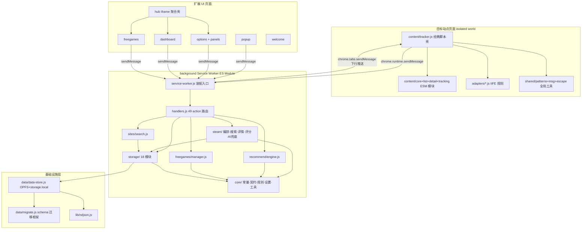
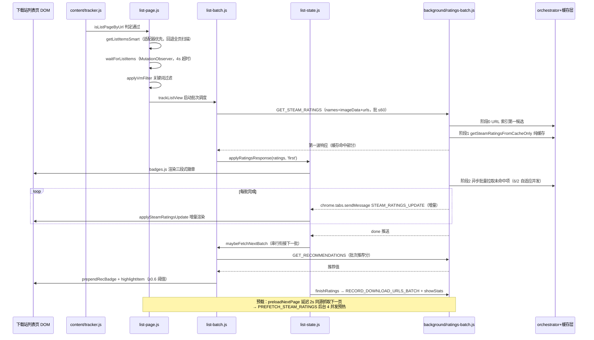
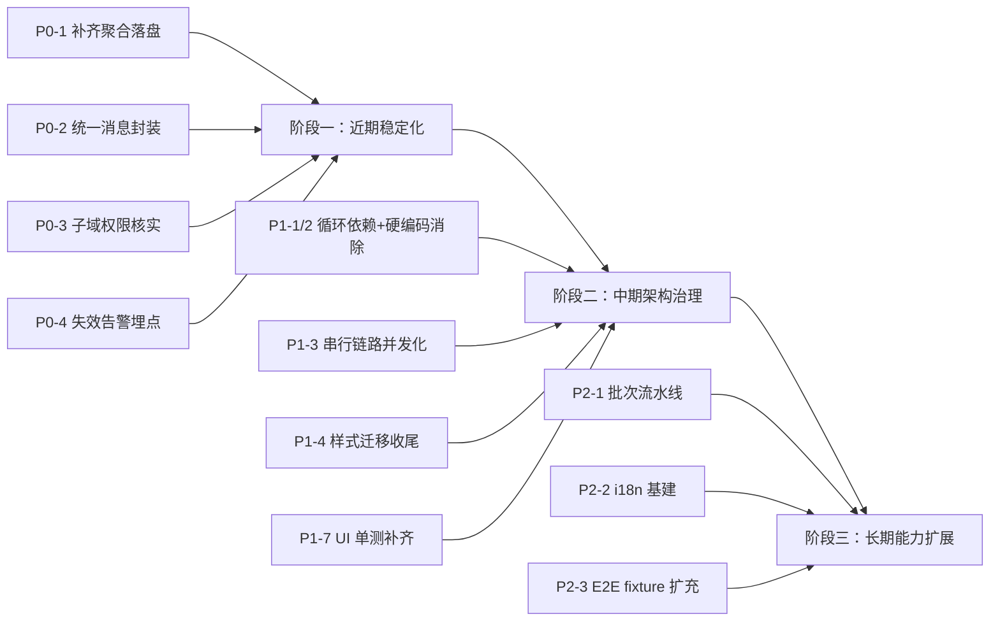

# 游戏雷达 Game Radar —— 项目深度报告

> **生成日期**：2026-08-16（最终版，覆盖式重写）
> **项目版本**：v9.2.0（Chrome MV3 浏览器扩展，纯 JavaScript + JSDoc、无构建步骤）
> **报告性质**：基于三份独立源码级调研报告（① 后台架构/存储/消息/权限；② 内容脚本/站点适配器/UI 页面；③ 关键业务流程/质量保障体系）的综合分析，已经过 QA 事实校验与数据修正。全部结论均可追溯到调研事实；信息不足之处均明确标注"待确认"。

---

## 目录

1. [执行摘要](#1-执行摘要)
2. [项目定位与核心功能概览](#2-项目定位与核心功能概览)
3. [整体架构与目录组织说明](#3-整体架构与目录组织说明)
4. [职责划分与协作关系](#4-职责划分与协作关系)
5. [关键业务流程梳理](#5-关键业务流程梳理)
6. [数据存储、配置管理、消息通信与权限边界](#6-数据存储配置管理消息通信与权限边界)
7. [质量保障体系](#7-质量保障体系)
8. [风险与问题分析](#8-风险与问题分析)
9. [待确认事项清单](#9-待确认事项清单)
10. [改进建议与实施路线](#10-改进建议与实施路线)
11. [附录：关键文件索引](#11-附录关键文件索引)

---

## 1. 执行摘要

**一句话定位**：游戏雷达是一款运行于中文游戏下载站与 Steam 商店之上的 Chrome MV3 扩展——它在用户浏览下载站列表/详情页时，自动反查 Steam 官方数据（好评率、中文支持、热度），叠加用户行为学习输出个性化推荐，并提供下载站反查、限免监控、规则驱动站点适配等配套能力，全部数据本地化存储。

**成熟度判断**：项目处于**功能完备、工程化程度较高的中后期成熟阶段**。证据链：

- 功能面：七大核心能力全部落地并经历多轮版本迭代（代码注释中可见 v3.1.2 → v9.2.0 的演进痕迹）；
- 工程面：18 个 Vitest 测试套件（约 615 项用例）、E2E 冒烟、视觉回归、覆盖率门禁、CI 6 job、Git 三钩子、ESLint + 三 tsconfig + Prettier 静态检查齐备；
- 数据面：OPFS 优先的统一持久层 + 18 个存储模块 + schema 迁移框架（已就位未启用）+ 模块化备份体系。

**核心亮点速览**：

1. **纯本地化、权限刻意收窄**：仅 5 项 permissions 且无 tabs/history 等敏感项，后台仅通过消息上下文 `sender.tab.url` 获取页面网址；出站请求有 SSRF 防护（`isSafeFetchUrl`）与环形审计 + 每主机限速。
2. **缓存体系精细**：Steam 缓存模块化（meta/rating/detail/spy 四模块独立 TTL、部分刷新）、名称索引负缓存、URL→appId 索引统一两条匹配路径、命中率统计与 LRU 淘汰齐备。
3. **两波好评率渲染**：列表页第一波纯缓存秒出徽章，第二波后台批量拉取经 `STEAM_RATINGS_UPDATE` 增量推送，体验与网络压力兼顾。
4. **规则驱动可扩展**：内置 6 站 IIFE 规则 + 用户自定义 JSON 规则双层来源、双端一致消费，后台统一校验（含 ReDoS 启发式防护）。
5. **质量门禁成体系**：CI 分片测试、新增文件覆盖率 ≥50% 门禁、测试耗时预算 90s、npm audit + gitleaks 安全扫描、Conventional Commits 钩子。

**核心风险速览**：

1. **MV3 Service Worker 生命周期**：大量内存态（2s 防抖未落盘窗口、api-monitor/outbound-audit 统计）依赖保活 hack 与显式 flush 补救，SW 被终止时存在数据丢失窗口；
2. **通信双轨制**：`shared/msg.js` 超时封装与裸 `chrome.runtime.sendMessage` 并存，options/dashboard/detail-page 等多处无超时兜底；
3. **性能长尾**：单游戏最坏 5–6 个串行 Steam 请求、批次串行衔接、`fetchSteamTagRecommendations` 约 15 次顺序请求、下载站搜索全串行；
4. **耦合与技术债**：debug.js↔status-bar.js 循环依赖、硬编码站点映射第二事实来源、样式半迁移（行内 style 与类化并存）、主题清单三份手工维护、全量序列化写放大；
5. **测试盲区**：LLM 评分路径、UI 页面逻辑、限免通知/ITAD 链路、非 Steam 数据源 E2E fixture 均缺乏直接覆盖；全局分支覆盖仅 56.1%，门禁只卡新增文件。

**关键数据速览**（供图表化引用）：

| 维度 | 数据 |
|---|---|
| 测试覆盖率 | 语句 63.3% / 分支 56.1% / 函数 65.3% / 行 66.0% |
| 测试套件分布 | 单元 14 + 集成 4 + content-sim + E2E 冒烟 + 视觉回归（Vitest 共 18 套件，约 615 用例） |
| 消息契约 | 49 个 action（9 个领域），46 个进契约 RULES 表 |
| 存储模块 | 18 个（dataStore OPFS 分文件 + storage.local 降级） |
| 内置适配站点 | 6 个下载站 + Steam 商店页 |
| 限免数据源 | 4 个（Epic/GOG/Steam/GamerPower） |
| host_permissions | 28 条条目，覆盖 17 个不同主机 |
| 风险条目 | 5 大类 21 条（详见第 8 章） |
| 改进项 | P0×4 / P1×8 / P2×6（详见第 10 章） |
| CI 流水线 | 6 job（分片测试×2/覆盖率门禁/耗时预算/E2E/安全） |

---

## 2. 项目定位与核心功能概览

游戏雷达解决的核心问题是：**中文游戏下载站缺乏官方评价数据，用户难以在下载前判断游戏质量与中文支持情况；同时 Steam 商店与下载站是两个割裂的信息世界**。扩展把两个世界缝合起来，具体通过七大能力：

| # | 能力 | 说明 | 主要载体 |
|---|---|---|---|
| 1 | **智能推荐** | 六信号加权（点击/下载/关键词/Steam 评分/时长/热度）+ 行为学习画像，输出 0–1 推荐分；支持 LLM 模式替代内置算法 | `background/recommend/engine.js`、`background/storage/behavior.js` |
| 2 | **Steam 信息集成** | 在详情页/Steam 商店页注入信息浮窗：头图、四重评价区（总体/近 30 天/简体中文/SteamSpy）、综合推荐分、标签、SteamDB、中文评测 | `content/detail/detail-page.js`、`detail-templates.js`、`background/steam/*` |
| 3 | **好评率徽章与过滤** | 列表页每个游戏项注入三段式徽章（近 30 天好评率/全部好评率/最近更新），支持按阈值过滤低分游戏并可一键恢复 | `content/list/*`、`background/steam/ratings-batch.js` |
| 4 | **下载站反查** | 在 Steam 商店页反查内置/自定义下载站的资源链接，含网盘链接与提取码提取 | `background/sites/search.js`、`content/detail/detail-page.js` |
| 5 | **限免监控** | 4 数据源（Epic/GOG/Steam/GamerPower）每日聚合，区分限时/免费周末/永久免费，ITAD 二次校验，桌面通知 + 角标 | `background/freegames/manager.js`、`freegames/` UI |
| 6 | **规则驱动适配** | 站点列表项提取、详情页判定、站内搜索 URL 全部由 JSON 规则描述；用户可在 options 面板自定义新站点规则 | `adapters/*`、`background/core/rules.js`、`content/adapters/builder.js` |
| 7 | **数据本地化** | 全部用户数据存于本地：OPFS 优先 + storage.local 降级，18 个数据模块可导出/导入/备份/恢复 | `data/data-store.js`、`background/storage/*` |

辅助能力还包括：右键菜单"选中文本搜 Steam"、快捷键 `Alt+Shift+G` 强制刷新、扩展更新 toast、行为趋势图表（dashboard）、出站请求审计查看器等。

---

## 3. 整体架构与目录组织说明

### 3.1 分层架构总览

项目为三层结构：**注入层（content/adapters/shared）→ 后台层（background）→ 基础设施层（data/lib）**，另有独立 UI 页面层与样式层。



### 3.2 目录组织与依赖方向约定

| 目录 | 定位 | 说明 |
|---|---|---|
| `background/service-worker.js` | SW 装配入口 | 只做装配不含业务逻辑（文件头注释明确声明）：副作用导入适配规则 → 消息监听 → 初始化 → 事件注册 → 存储预热 → Alarms → 启动副作用 |
| `background/core/` | 核心基础层 | 常量中枢（`constants.js` 刻意零依赖）、消息契约校验、规则管理、设置、API 监测、趋势聚合、标题解析、出站审计、动态脚本注册、安全 fetch 工具、JSDoc 类型 |
| `background/handlers/` | 领域 handler | steam/cache-manager/data-modules/stats/download-sites 五个子模块按领域导出函数，聚合进 `handlers.js` 的 `MESSAGE_HANDLERS` 静态表 |
| `background/steam/` | Steam 数据域 | `api.js` 仅为 barrel（16 行），实现按职能拆为 orchestrator/api-search/api-details/api-reviews/api-supplement/api-assemble/api-registry-heal/ratings-batch/ai-fallback（v5.0.0 由 858 行单文件拆分） |
| `background/storage/` | 存储模块层 | 18 个模块统一模式：内存缓存 + 惰性加载 + 防抖批量落盘 + dirty 标志 + reset/warmup |
| `content/` | 内容脚本 | tracker.js 入口壳 + core（基础设施四件套）/list（徽章与批次）/detail（详情页）/tracking（下载行为）/adapters（规则构建器） |
| `adapters/` | 内置站点规则 | IIFE 挂全局变量，manifest 声明顺序敏感：default → sites → index |
| `shared/` | 双端共享工具 | msg.js（消息封装）、patterns.js（噪声正则与好评率分级色单源）、escape.js（XSS 转义）、settings-utils.js（补丁保存/主题/跳转） |
| `data/`、`lib/` | 持久层与编解码 | data-store.js 单例（OPFS 优先）、migrate.js schema 迁移框架、ndjson.js |
| `popup/options/dashboard/hub/freegames/welcome/` | UI 页面 | 各自 html+css+js；hub 以 iframe 聚合 options/dashboard/freegames 三个重页面 |
| `styles/` | 三层样式体系 | content.css（内容侧）、ui-theme.css（扩展页设计系统）、themes.css（扩展页皮肤） |

**依赖方向约定**（由 `site-scripts.js` 注释确认）：

- **core 层不依赖 storage 层**；
- 实际方向为 `core → data/（data-store）`，`storage → core + data`，`handlers/steam/sites/freegames → storage + core`；
- 单向依赖由集成测试 `tests/integration/test-integrity.mjs` 做静态校验（依赖分层单向校验、TDZ/噪声双源/语法扫描、manifest 引用与版本一致性）。

### 3.3 模块装配方式与混合注入模式

**后台侧**：`service-worker.js`（178 行，ES Module，manifest `background.type = "module"`）按固定顺序装配：

1. 副作用导入适配规则链（`adapters/default.js` → `adapters/sites/*.js` → `adapters/index.js`，聚合挂 `globalThis.__GAME_RECOMMENDER_SITES__`）；
2. 唯一 `chrome.runtime.onMessage.addListener`，委托 `handleMessage`，`.then(sendResponse)` + `return true` 保持异步通道；
3. `initStorage()` 初始化 + 冷启动耗时日志 + `syncSiteScripts()` 动态注册自定义站点内容脚本；
4. 事件注册：`onInstalled`（打开 welcome 页）、`notifications.onClicked`（限免通知）、右键菜单 `gr-search-steam`、commands `gr-force-refresh`；
5. `Promise.allSettled` 并行预热 8 个存储模块（steam-cache/name-index/registry/wrong-reports/learned-noise/url-index/behavior/download-urls）；
6. `ensureAlarm()` 幂等创建两个 alarm：`refreshFreeGames`（24h）与 `autoBackup`（默认 24h，取自设置）。注释记录了 v3.4.1 修复：`alarms.create` 会替换同名 alarm 重启周期，盲目重建会让 24h 任务永不触发；
7. 启动即 `refreshFreeGames(false)` 并打印版本号。

生命周期特点：**没有 `chrome.runtime.onStartup` 监听器**——所有初始化在顶层代码完成，依赖 MV3"每次冷启动重跑顶层"语义。这是刻意设计（配合幂等 alarm 与惰性加载兜底），代价是每次唤醒都重新执行规则导入、预热与限免刷新调用。

**内容侧——混合注入模式"经典脚本壳 + 动态 import ESM"**：

- manifest `content_scripts` 声明式注入，`run_at: document_start`，**默认 isolated world**（未配置 `world: "MAIN"`）；
- 注入 12 个经典脚本（顺序即依赖）：`shared/patterns.js` → `shared/msg.js` → `shared/escape.js` → `adapters/default.js` → `adapters/sites/*`（6 个）→ `adapters/index.js` → `content/tracker.js`，外加 `styles/content.css`；
- `tracker.js` 本体是经典脚本，但通过 `chrome.runtime.getURL('content/*.js')` + `Promise.all([import(...)])` **动态 import 12 个 ESM 模块**（core/list/detail/tracking/adapters 下的文件），依赖 `web_accessible_resources` 暴露的 `content/*.js`；
- 选择该模式的原因（代码注释说明）：**MV3 Service Worker 禁止顶层动态 import，而 content script 允许**；经典脚本壳保证 document_start 时机，ESM 模块保证依赖清晰；
- `ensureModules()` 任一模块加载失败即整体放弃注入；`bootPromise` 在模块加载前即发出 `GET_SETTINGS`、`builder.loadSiteRules()`、`LOG_PERF`，实现顶层预热。

---

## 4. 职责划分与协作关系

### 4.1 各角色职责

| 角色 | 核心职责 | 关键文件 |
|---|---|---|
| **后台 Service Worker** | 唯一的消息路由与业务中枢：49 个 action 的注册与分发、Steam 数据编排、推荐计算、限免监控、站点搜索、全部持久化 | `background/service-worker.js`、`handlers.js`、`handlers/*.js` |
| **内容脚本** | 页面识别、列表项提取、徽章/浮窗注入、行为埋点、下载行为采集；不含业务计算，全部数据经消息向后台索取 | `content/tracker.js` 及 `content/{core,list,detail,tracking,adapters}` |
| **站点适配器** | 以声明式 JSON 规则描述"列表项在哪、详情页长什么样、站内搜索怎么拼"，内容侧 `builder.js` 与后台 `rules.js` 双端消费同一数据源 | `adapters/*`、`background/core/rules.js`、`content/adapters/builder.js` |
| **popup** | 全量快捷设置面板（8 个折叠区）+ 统计/限免数速览 + 向当前标签发刷新指令 | `popup/popup.js`（426 行） |
| **options** | 重设置中心：7 个面板（general/filters/recommend/sites/rules/cache/logging）+ 数据管理 + ITAD 配置 + 运行日志查看 | `options/options.js`（765 行）+ `panels/*` |
| **dashboard** | 数据驾驶舱：14 卡概览、趋势图、标签云、Steam 推荐、行为/运行日志、出站审计、备份管理 | `dashboard/dashboard.js`（792 行） |
| **hub** | iframe 聚合壳：左侧导航 + hash 路由 `#page=`，统一包装 options/dashboard/freegames（`?hub=1` 内嵌模式），监听 `GR_HUB_SWITCH` postMessage 实现子页面间跳转 | `hub/hub.js` |
| **freegames** | 限免列表页：平台 + 领取方式双层过滤、领取标记、safeUrl 防 `javascript:` 注入 | `freegames/freegames.js`（225 行） |
| **welcome** | 安装/更新引导页：`?source=install|update` 切换功能导览/changelog | `welcome/welcome.js`（30 行） |

### 4.2 消息协作关系

**传输层结构**：

- 后台侧：单一 `onMessage` 监听 + `handleMessage(message, sender)` 分发；缺 action → `{error}`，契约校验不过 → `{error:'invalid-message: ...'}`，未注册 action → `{error:'Unknown action'}`，handler 异常被捕获后回 `{error: err.message}`；
- 发送侧封装 `shared/msg.js`：挂 `window.__GR_MSG__.sendMessage(action, payload, {timeout})`，默认 10s 超时 race 兜底 + 错误归一。**注意不一致点**：`content/tracker.js` 与 `popup/popup.js` 使用该封装，而 `options/options.js`、`dashboard/dashboard.js`、`content/detail/detail-page.js` 等多处直接调用裸 `chrome.runtime.sendMessage`，无超时保护；
- 请求格式 `{action: string, ...payload}`（payload 类型定义于 `core/types.js#MessagePayload`）；**响应无统一信封**——各 handler 自由返回 `{success}`/`{error}`/`{data, cachedAt}`/`{results}`/`{sites}` 等。

**三类消息方向**：

1. **UI/content → 后台**（49 个上行 action，经 `handleMessage`）；
2. **后台/popup → content**（`chrome.tabs.sendMessage` 下行）：`STEAM_RATINGS_UPDATE`（第二波增量推送）、`REFRESH_RECOMMENDATIONS`（popup 触发重跑列表流程）、`SHOW_LAST_STATS`（显示状态浮窗）、`FORCE_REFRESH_PAGE`（快捷键触发，先清缓存再 reload）；
3. **UI 页面 ↔ hub**（`window.postMessage`）：`GR_HUB_SWITCH` 面板切换。

**消息全景表**（内容侧视角）：

| Action | 方向 | 说明 |
|---|---|---|
| GET_SETTINGS / SAVE_SETTINGS | 内容/UI→后台 | 设置读写，全端共用 |
| LOG_PERF | 内容→后台 | 注入启动耗时上报 |
| GET_STEAM_RATINGS | 内容→后台 | 第一波批量评分（缓存命中即时返回） |
| STEAM_RATINGS_UPDATE | 后台→内容 | 第二波增量推送（含 done 标志） |
| PREFETCH_STEAM_RATINGS | 内容→后台 | 下一页预取预热 |
| GET_RECOMMENDATIONS | 内容→后台 | 批次推荐分 |
| RECORD_DOWNLOAD_URLS_BATCH / TRACK_DOWNLOAD / TRACK_EVENT / TRACK_DOWNLOAD_SITE_VISIT | 内容→后台 | 行为采集 |
| GET_STEAM_BY_APPID / SEARCH_STEAM / REPORT_WRONG_APPID / SAVE_MANUAL_MAPPING | 内容→后台 | 详情页 Steam 匹配链与纠错闭环 |
| SEARCH_DOWNLOAD_SITES | 内容→后台 | Steam 页反查下载站 |
| GET_DOWNLOAD_HISTORY | 内容→后台 | 下载历史面板 |
| CACHE_STEAM_PAGE / CLEAR_CACHE_FOR_PAGE | 内容→后台 | Steam 页缓存预取 / 强刷前清缓存 |
| REFRESH_RECOMMENDATIONS / SHOW_LAST_STATS / FORCE_REFRESH_PAGE | 后台/popup→内容 | 下行指令 |

完整 49 个 action 分域分布见第 6.3 节。

### 4.3 协作关系要点

- **内容脚本零业务逻辑**：列表页徽章数据、详情页 Steam 信息、推荐分全部由后台计算，内容侧只做 DOM 读写与渲染；
- **后台是唯一持久化入口**：所有存储模块仅在 SW 内被访问，UI 页面通过数据治理类 action（EXPORT_DATA/IMPORT_DATA/备份四件套等）间接操作；
- **popup 与 content 的横向联动**：popup 的刷新按钮经 `chrome.tabs.sendMessage` 直达当前标签内容脚本，不绕道后台业务逻辑；
- **hub 是三个重页面的统一外壳**：options/dashboard/freegames 既可独立打开也可被 iframe 内嵌（`?hub=1` 时隐藏自身导航），`shared/settings-utils.js#goHub` 实现双模式跳转。

---

## 5. 关键业务流程梳理

### 5.1 Steam 数据获取

**模块分工**（`background/steam/`）：

| 文件 | 职责 |
|---|---|
| `orchestrator.js`（452 行） | 编排入口：`searchSteamGame`（详情页全量）、`getSteamRatingsFromCacheOnly`（列表页第一波零网络）、`getSteamPositiveRate`（列表页轻量好评率） |
| `api-search.js` | `searchSteamAppId`：storesearch 中/英搜索 + 名称相关性多候选打分（`nameMatchesSearch`/`matchCandidateScore`）+ 删词变体扩展 + 噪声词自学习 + 版本后缀变体（`findVersionVariant`） |
| `api-details.js` | `fetchSteamAppDetails`（中英文）、`fetchStorePageHtml`、`parseChineseLanguageSupport`、`parseUserTags`、`baseAppIdFromDetails`（DLC/Demo→本体解析） |
| `api-reviews.js` | `fetchReviewSummary`（一次请求同取全时段 query_summary 与最近 100 条 → 本地统计 30 天窗口）、`fetchChineseReviews`、`fetchLastUpdate`（GetNewsForApp 近似"最近更新"）、重试冷却常量（5 分钟/1 小时） |
| `api-supplement.js` | `fetchSteamSpyInfo`（ccu/owners/average_forever）；SteamDB 网页抓取已于 v6.2.1 移除，改为模板拼链接 |
| `api-assemble.js` | `fetchSteamFullDetailsByAppId`：并行中英文 appdetails → 本体校验 → 商店页 HTML →（语言/标签/评测）并行 →（SteamSpy + lastUpdate）并行 → `buildSteamResult`；支持 `settings.steamApiModules` 模块开关 |
| `api-registry-heal.js` | 注册表自愈：`ensureRegistryEntry`/`healRegistryNames`/`scanAndHealRegistry`（每批 3 并发，默认限 20 条） |
| `ratings-batch.js` | 列表页批量好评率两阶段调度 + 下一页预载 |
| `ai-fallback.js` | `webSearchFallback`（Bing 搜索 → 提取 Steam 链接 → appdetails 官方名校验）与 `llmMatchGame`（用户配置 Ollama/OpenAI 兼容接口，二次校验防幻觉）；成功缓存 7 天、失败 24 小时 |

**详情页查询链（`searchSteamGame` 端到端）**：

```
名称索引 lookup → 人工纠错知识库（wrong-reports：用户确认优先、黑名单排除错误 appId）
  → Steam 动态缓存（模块化 meta/rating/detail/spy；命中须满足完整性 isCompleteCacheData
    + namesRelated 标题相关性校验 + 非"失败固化"）
  → Demo 自愈（Demo 版无好评率 → 清缓存重搜完整版）
  → 负缓存拦截
  → storesearch（失败进 Bing → LLM 兜底）
  → fetchSteamFullDetailsByAppId
  → 三层缓存写入：Steam 动态缓存（24h）+ 游戏注册表（永久）+ 名称索引
```

好评率失败计 `ratingFailCount`：重试上限 3 次后转 1 小时长冷却，防止失败结果永久固化。

**数据源**：`store.steampowered.com`（storesearch/appdetails/appreviews/featuredcategories）、`api.steampowered.com`（GetNewsForApp）、`steamspy.com`、`cn.bing.com`（兜底）、可选用户配置 LLM endpoint、`cdn.akamai.steamstatic.com`（封面拼接，无请求）。

**限流/重试体系（三级）**：

1. **单请求级**：`fetchWithTimeout`（15s 超时、`redirect:'manual'` 逐跳重校验、最多 5 跳、限速 + 审计）；搜索网络失败整体重试 1 次、`fetchReviewSummary` 内部重试 1 次、storesearch 单词重试 2 次；
2. **批级**（`ratings-batch.js`）：正常 6 并发，异常降 2；`core/api-monitor.js` 滑动窗口（5 分钟、≥8 样本、失败率 >40% 判 anomaly）→ 批次间隔 5s、连续异常暂停 30s；失败/限流游戏自动进重试队列（最多一轮）；
3. **SW 保活**：批处理期间每 10s 调 `chrome.runtime.getPlatformInfo()` 防 MV3 30s 空闲休眠；落盘降频每 5 批 `flushAllCaches()` 一次。

### 5.2 列表页徽章注入（两波好评率 + 推荐徽章）



**关键实现细节**：

- `list-page.js`：`isDetailPageByUrl`（`/\d+\.html` 或 `/game/\d+\.html`）/`isListPageByUrl` 页面判定；`waitForListItems` MutationObserver 等待 AJAX 渲染；`preloadNextPage` **有同源校验** + 15s AbortController 超时；
- `list-batch.js`：`RATINGS_BATCH_SIZE=60`，inflight 门控保证批间串行（done 推送驱动下一批）；`startListScan` MutationObserver 增量发现 + IntersectionObserver 底部哨兵（`rootMargin: 400px`）滚动触发；
- `list-state.js`（v7.3.0 拆出以打破 list-page↔list-batch 循环依赖）：单一状态容器 `_state = { ratingsJob, batchState }`；`ratingFilterPass` 好评率过滤纯函数（and/or/not/hybrid 四模式）；`finishRatings` 收尾统计行含可点击"恢复被过滤游戏"；`scheduleFallbacks` 45s 强制收尾兜底定时器；
- `badges.js`：三段式徽章受 `badgeVisibility` 逐项开关控制；颜色统一取自 `globalThis.__GR_PATTERNS__.ratingColorFor/ratingBgFor` 单源（≥80 → #66c0f4，≥60 → #a3cf06，<60 → #ff7b00）；推荐徽章 hover tooltip 展示六信号 breakdown，附"不感兴趣"按钮（发 `TRACK_EVENT { type: 'dislike_game' }`）。

### 5.3 详情页处理

**调用链**（`content/detail/detail-page.js`，643 行）：

1. **游戏名识别 `detectGameName`**（多级提取）：移除 h1 徽章节点 → 取英文子元素 → 用 `new RegExp(globalThis.__GR_PATTERNS__.noisePatternSource, 'gi')` 剔除噪声词分段 → Steam 图片 alt "X on Steam" 提取 → `document.title` 回退；汇总/索引页跳过；
2. **appId 提取 `injectSteamButton`**：在**主内容区限定选择器**（`article, .entry-content, .post-content` 等）内找图片提取 Steam appId——防侧边推荐图误取（E2E 冒烟复刻过 16598 误配场景）；
3. **匹配链**：`GET_STEAM_BY_APPID` 直取（封面直取 + `namesRelated` 名称相关性校验 + `findVersionVariant` 版本后缀补搜）→ 未命中回退 `SEARCH_STEAM`（即 5.1 的 `searchSteamGame` 全链）→ 仍未命中 `renderManualSelectPanel`（`SEARCH_STEAM_CANDIDATES` 候选手选）；
4. **纠错闭环**：报错按钮 → `REPORT_WRONG_APPID`（写 wrong-reports 知识库、清错误映射、保注册表）→ 重检索；仍同 appId 或未找到 → 手动选择面板 → `SAVE_MANUAL_MAPPING` 固化（同时写 name-index + registry + wrong-reports 纠正知识）；手动刷新走 `REFRESH_STEAM_CACHE`；
5. **渲染**：数据就绪 → `renderSteamSidebar`（`detail-templates.js` 仿 Steam 信息栏：头图、四重评价区、综合推荐分——好评率 70% + 中文支持 30% 口径 + 热度/时长因子，注释声明与推荐引擎同源）经 `content/core/floats.js` 统一浮窗渲染；同时下载历史浮窗（`GET_DOWNLOAD_HISTORY`）、Steam 标签回写（`TRACK_EVENT steam_tags_update`）。

**Steam 商店页分支**：在 store.steampowered.com 上执行 `injectDownloadSitePanel` 反查下载站（先 `SEARCH_DOWNLOAD_SITES cacheOnly` 立即渲染缓存，再完整搜索补全），并并发 `CACHE_STEAM_PAGE` 预取当前页数据。

### 5.4 站点适配机制

**双层规则来源，双端一致消费**：

- **内置规则**（`adapters/`）：6 个站点规则文件为 IIFE，挂全局 `window.__GAME_RECOMMENDER_SITE_XDGAME__` 等；`index.js` 最后执行，与 `defaults` 浅合并聚合为 `window.__GAME_RECOMMENDER_SITES__ = { version: 1, sites: {...} }`。依赖 manifest 声明的脚本顺序（sites 先于 index，index 先于 tracker）；
- **用户自定义规则**：存 `storage.adapterRules`，经 options rules 面板编辑（前端 JSON.parse 预校验 + 后台 `validateAdapterRules` 二次校验，双层防御）；
- **一致性约定**：内容侧 `builder.loadSiteRules()` 与后台 `rules.getSiteRules()` 均遵循"**storage.adapterRules 用户规则优先，否则内置聚合**"——两端读同一事实来源。

**六站规则特征**：

| 站点 | 关键规则特征 |
|---|---|
| xdgame | `searchUrl: 'https://xdgame.com/so/{q}.html'`；`titleLink: 'a.tit'`；`minDetailLinks: 5` |
| xianyudanji | `searchUrl` 带 `?s={q}`；`detailPatterns` 含一级路径 `/[^/]+/?$`（详情 URL 无数字特征） |
| gamer520 | 列表封面即 Steam CDN 图，可 appId 直取（`imageAppId` 路径） |
| 3dmgame | `searchUrl` 为空 = 无站内搜索，仅行为追踪与徽章；selectors 式列表 |
| ali213 | 同 3dm：无 searchUrl，`detailUrlPatterns` 空数组 → 回退 default |
| gamersky | 同上：无 searchUrl，selectors 式列表 |

**内容侧构建器**（`content/adapters/builder.js`，345 行）：`buildAdapter(rule)` 按三策略生成 `getListItems`——① `titleLink` 直取；② 容器内找详情链接；③ `fallbackLinks` 全页扫描；`DEFAULT_ADAPTER` 含泛化详情路径 `GENERIC_DETAIL_PATHS = ['/game/','/down/','/soft/']`；`getAdapter(domain)` 域名段匹配可覆盖子域；`extractSteamImageInfo` 图片懒加载属性优先（`data-src/data-lazy-src/data-original`），URL 正则 `/\/steam\/apps\/(\d+)\//` 提取 appId；`SCAN_LIMIT` 默认 500。

**校验与 ReDoS 防护**（`background/core/rules.js`）：`validateAdapterRules()` 字段类型白名单 `SITE_FIELD_TYPES` + 规模上限 `RULE_LIMITS` + 正则逐个试编译 + 单条长度 >200 拒绝；**`hasReDoSRisk`（v7.0.5）启发式拒绝嵌套量词/交替分组/超长正则**；`sanitizeImportedModule`（导入/恢复共用白名单：settings 密钥清空、endpoint 仅 http(s)、单模块 16MB/总量 64MB 上限）。

**动态注册**（`background/core/site-scripts.js`）：`syncSiteScripts` 为自定义站点动态注册与内置同等清单的 content script（MV3 持久化），幂等 + 单飞锁；移除站点不 unregister，由 tracker 早退兜底。`BUILTIN_DOMAINS`（6 个内置域）与 manifest 的一致性由集成测试断言。

### 5.5 推荐逻辑

**六信号加权**（`background/recommend/engine.js`，v3.2.8 起为 appId 维度个性化概率预测；`computeGameScore` 纯函数）。默认权重如下表（供图表化引用，权重合计 1.0）：

| 信号 | 计算方式 | 默认权重 | 缺省值策略 |
|---|---|---|---|
| clickScore | 该游戏 views / 全站 maxViews（归一化饱和） | 0.15（clickRate） | 无浏览记录为 0 |
| downloadScore | downloads / 全站 maxDownloads | 0.30（downloadRate） | 无下载记录为 0 |
| keywordScore | Steam 官方标签 vs 用户偏好关键词权重（`calculateKeywordScore`） | 0.20（keywordMatch） | 无标签给中性 0.3 |
| steamScore | 好评率×0.7 + 中文支持×0.3 | 0.15（steamRating） | 未知给中性 0.4 |
| playTimeScore | SteamSpy 时长 /600 分钟封顶 | 0.10（playTime） | 缺数据中性 0.3 |
| heatScore | SteamSpy owners 中点 log10/7 | 0.10（heat） | 缺数据中性 0.3 |

权重和 >1 时自动归一化；**负信号优先**：`profile.disliked` → 直接 0 分。用户可在设置中自定义全部权重。

**行为学习**（`background/storage/behavior.js`）：内容脚本 `TRACK_EVENT` → `handleTrackEvent` → `addBehaviorLog`（NDJSON 追加，超 `maxBehaviorLog` 500 条裁剪重写）+ `updateGameProfile`（views/downloads/disliked/keywords/steamAppId）+ `maybeUpdatePreferences`（60s 节流，下载事件强制；关键词权重 = pos/(pos+neg+1)，下载+2/仅浏览+1）。画像匹配 `findProfile`：精确名 → 清洗名 → 注册表名称变体 → 模糊包含（取行为量最高）。

**趋势聚合**（`background/core/trends.js`）：纯函数 `aggregateTrends(log, 'day'|'week')` 按天/周分桶输出 `[{date,views,downloads,rate}]` 供 dashboard 趋势图。

**LLM 模式**：`settings.useLLM` 开启时 `calculateWithLLM` 输出 0–1 评分，结果缓存 7 天（llm-cache），失败回退内置算法。

### 5.6 限免监控

**4 数据源并行拉取**（`background/freegames/manager.js`）：

| 数据源 | 端点与判定 |
|---|---|
| Epic | `store-site-backend-official.ak.epicgames.com/freeGamesPromotions`（官方直连，按促销时间窗过滤） |
| GOG | `gog.com/games/ajax/filtered?price=free`（原价>0 现价 0 = 限时；原价 0 = 永免） |
| Steam | `store.steampowered.com/api/featuredcategories` 的 specials（final_price=0 或 -100%） |
| GamerPower | `gamerpower.com/api/giveaways`（平台归类 + `classifyGamerPowerGiveaway` 过滤第三方 key 活动） |

**刷新与分类机制**：

- `refreshFreeGames` 每日节流（`ONE_DAY`，非强制刷新直接返回存储数据）；由 SW 启动副作用与 24h alarm 双触发；
- 按 id 合并保留 claimed/firstSeen 状态；名称规范化去重；url/image 协议白名单清洗（`sanitizeGameUrl` 仅 http(s)）；当天新增数写工具栏 badge；
- **分类**：新游戏触发聚合通知（仅 limited 类）。Steam 平台候选经 **ITAD 二次校验**（可选 API key，`activeItadKey` 多配置）+ Steam 官方判定 `determineSteamFreeType`（is_free→f2p；原价>0 现价 0→商店页按钮复核 Play Now/Add to Cart 区分 weekend/limited；内存缓存 12h）。四类处置：**limited 入库推送 / weekend 不入库 / f2p 不推送 / key 过滤**；
- **通知**：`chrome.notifications` 聚合通知（id `gr-free-games`），点击打开商店页（SW 的 `notifications.onClicked` 处理）；
- **领取**：`claimFreeGame` 写回 OPFS（CLAIM_FREE_GAME action），freegames 页更新角标。

### 5.7 缓存与索引机制

**steam-cache 模块化**（`background/storage/steam-cache.js`）：条目结构 `{modules: {meta|rating|detail|spy: {data, ts}}}`；字段按 `FIELD_MODULES` 映射路由（未知字段默认 detail）；每模块独立 TTL、部分刷新；旧平铺结构 `migrateEntry` 加载时迁移；内存 Map 上限 1200（LRU 按 `latestModuleTs` 淘汰，仅删全模块过期条目）；命中率统计 `getCacheStats`（全局 + 分模块）。防抖 2s、`STEAM_CACHE_VERSION=6`。

**其他缓存/索引模块**：

| 模块 | 机制 |
|---|---|
| `name-index.js` | 游戏名(小写)→appId 反查；正缓存附 `cleanGameName` 清洗名键（跨站变体命中）；**负缓存**（appId=null，TTL=`negativeCache` 默认 2h）；正缓存上限 5000（LRU by lastSearched） |
| `url-index.js`（v7.0.2） | 详情页 URL→appId 索引，统一列表页/详情页两条匹配路径的"第一候选"；URL 规范化去 hash/query；上限 5000（按插入序淘汰） |
| `search-cache.js`（v6.4.3） | 下载站搜索结果缓存，24h TTL、上限 200、siteKeys 变更即失效、**写穿持久化**（防 SW 休眠丢失） |
| `llm-cache.js`（v6.4.3） | LLM 评分缓存（7d TTL）+ AI 匹配兜底（`match:` 前缀，成功 7d/失败 24h）+ 搜索引擎兜底（`web:` 前缀），同 Map 复用、上限 300、写穿 |
| `registry.js` | 游戏注册表（appId → cnName/enName/names[]/tags(≤20)/coverImage/type/firstSeen/lastConfirmed），永久保留 + 30 天重确认；上限 10000（v8.2.0，按 lastConfirmed 最旧淘汰） |
| `download-urls.js` | 下载站网址缓存 `{v:2, sites: {siteKey: {appId: entry}}}`；`withStoreLock` 读-改-写串行锁；URL 经 `isSafeFetchUrl` 校验（SSRF 纵深防御） |

**统一持久层与防抖落盘**：全部模块走 `data/data-store.js` 单例（OPFS 优先、storage.local 降级）；统一模式 = 内存缓存 + 惰性加载 + 防抖批量落盘（`debounced-store.js` 工厂，多数防抖 2s）+ dirty 标志 + `reset*`/`warmup*`。聚合编排：`flush.js#flushAllCaches`（steam/name-index/registry 三连落盘）、`reset.js#resetInMemoryCaches`（14 个 reset 聚合）。**注意**：`flushAllCaches` 仅覆盖三层，download-urls/wrong-reports/url-index/learned-noise/logBuffer 不在聚合落盘范围（部分各自即时写）。

### 5.8 站点搜索（下载站反查）补充细节

`searchDownloadSites(gameName, appId, siteKeys)` 完整流程（`background/sites/search.js`）：

1. 24h 搜索结果缓存（`storage/search-cache.js`）命中即返回；
2. 站点列表来自 JSON 规则（`getDownloadSites`，含内置 6 站与用户自定义）；
3. 多搜索词生成（清洗主名→`parseGameTitle` 候选→原始名），对每站**逐词串行**请求站内搜索页；
4. 正则提取候选详情链接（含 title 属性回退），按 `calcLinkMatchScore`（0-100：全等 100/包含 85/分段/跨语言中英独立比较，含续作数字保护）选最优；≥80 提前终止换词循环；≥60 判 found；
5. 详情链接同域白名单校验（防恶意规则注入外站/伪协议）；
6. ≥80 分写入 `storage/download-urls.js`（appId 键，30 天）并抓详情页 `extractDetailMeta`（更新日期/版本/大小/网盘链接+提取码，百度/阿里/115/夸克/微云），百度网盘自动拼 `?pwd=`（仅允许 pan.baidu.com 域）；
7. 结果整体写 24h 缓存。

---

## 6. 数据存储、配置管理、消息通信与权限边界

### 6.1 数据存储：OPFS 优先 + storage.local 降级

**`data/data-store.js`（单例 `dataStore`）**是整个项目的统一持久层：

- **OPFS 分文件存储**（`navigator.storage.getDirectory()`），突破 storage.local 5MB 配额；`MODULE_FILES` 映射 18 个模块 → 文件名与格式；日志类（behaviorLog/runtimeLog）用 NDJSON（`lib/ndjson.js` 编解码，decode 跳过损坏行），其余 JSON；
- **API**：`init`（幂等 + 首次从 storage.local 自动迁移）、`readModule`（OPFS 优先；文件缺失时先 `<name>.tmp` 救援——v6.4.14 修复历史 move() bug 遗留数据，再回退 storage.local）、`writeModule`、`appendModule`（仅 NDJSON，定位追加）、`removeModule`（双删）；
- **写串行**：`_serialize(moduleKey, task)` 每模块队列；
- **损坏恢复**：JSON.parse 失败 → 备份为 `<name>.corrupt-<ts>` → 重置为空；NDJSON 靠逐行容错。

**重要历史教训**（文件注释记载）：v3.4.1 曾用"临时文件 + move() 原子替换"，实测 Chromium 的 move() 对已存在目标**静默不替换**，导致写入从未真正落盘（被内存缓存掩盖）；v6.4.14 改为直接截断覆盖——代价是崩溃时可能留半截文件，由读取侧 corrupt 备份兜底。**备份机制是唯一的数据安全网**。

**schema 迁移框架**（`data/migrate.js`，v8.2.0）：`registerMigration(key, from, to, fn)`（版本必须连续）+ `migrateModuleIfNeeded(key)`（读时链式迁移、幂等、失败不阻断）。当前**无任何迁移注册**——既有兼容逻辑内嵌在各模块，框架服务未来升级，即迁移机制已就位但尚未启用。

### 6.2 配置管理

- **`background/core/constants.js`**：全局常量中枢，刻意零依赖（TDZ 免疫）。含 `DB_KEYS`（19 个存储键）、`DEFAULT_SETTINGS`（完整默认设置：weights/llmConfig/cacheTtls/dataSources/steamApiModules/filterRules 等）、TTL 体系（`setTtlConfig`/`resolveTtlMs`，0=永久→Infinity）、`DATA_MODULES`（17 个可备份/导入导出模块注册表）、`EXPORT_FORMAT/EXPORT_VERSION`；
- **`background/core/settings.js`**：设置读取（5s 内存缓存）/保存/初始化；`initStorage`（dataStore.init + 写默认设置 + refreshTtlConfig）、`deepMergeSettings`（深合并补默认值、类型不符回退默认）；
- **UI 侧保存机制**：popup 采用 `saveSettingsPatch` **串行队列**（GET_SETTINGS → `applyPatch` → SAVE_SETTINGS，防并发快照互相覆盖）；options 采用 800ms 防抖 `scheduleAutoSave` + `saveQueue` 串行 + `pagehide` 兜底落盘。

### 6.3 消息通信契约（49 个 action）

**契约校验**（`background/core/message-contract.js`）：`validateMessage(action, msg)` 纯函数；`RULES` 表覆盖约 46 个 action（分四批演进：v4.0.0 高风险 9 个 → v6.3.0 100% 覆盖）。校验要点：appId 统一正则 `/^\d{1,10}$/`；gameName ≤200 字符；TRACK_EVENT 的 type 白名单 6 种；moduleKeys 字符串数组；limit 区间（日志/审计 1–500，自愈 1–50）。**当前仅 `OPEN_HUB` 与 `LOG_PERF` 未进 RULES 表**（未契约化 action 默认放行）。

**完整 action 分域分布**（`MESSAGE_HANDLERS` 全量 49 个，供图表化引用）：

| 领域 | 数量 | Action |
|---|---|---|
| 行为与推荐 | 2 | TRACK_EVENT、GET_RECOMMENDATIONS |
| Steam 查询 | 11 | SEARCH_STEAM、REFRESH_STEAM_CACHE、GET_STEAM_BY_APPID、SAVE_MANUAL_MAPPING、SEARCH_STEAM_CANDIDATES、GET_STEAM_RATINGS、PREFETCH_STEAM_RATINGS、CACHE_STEAM_PAGE、CLEAR_CACHE_FOR_PAGE、REPORT_WRONG_APPID、HEAL_REGISTRY_NAMES |
| 设置/规则 | 6 | GET_SETTINGS、SAVE_SETTINGS、RESET_SETTINGS、GET_ADAPTER_RULES、SAVE_ADAPTER_RULES、DELETE_ADAPTER_RULES |
| 统计 | 3 | GET_STATS、GET_TRENDS、GET_STEAM_RECOMMENDATIONS |
| 数据治理 | 8 | CLEAR_DATA、GET_DATA_MODULES、EXPORT_DATA、IMPORT_DATA、CREATE_BACKUP、GET_BACKUPS、RESTORE_BACKUP、DELETE_BACKUP |
| 下载站 | 4 | SEARCH_DOWNLOAD_SITES、GET_DOWNLOAD_HISTORY、TRACK_DOWNLOAD_SITE_VISIT、RECORD_DOWNLOAD_URLS_BATCH |
| 缓存管理 | 5 | GET_GAME_CACHE_LIST、DELETE_GAME_CACHE_ENTRY、CLEAR_GAME_CACHE、REFRESH_GAME_CACHE_ENTRY、CLEAN_EXPIRED_CACHE |
| 限免 | 2 | GET_FREE_GAMES、CLAIM_FREE_GAME |
| 日志/诊断 | 8 | GET_RUNTIME_LOGS、CLEAR_RUNTIME_LOGS、EXPORT_LOGS、GET_API_STATUS、GET_OUTBOUND_AUDIT、CLEAR_OUTBOUND_AUDIT、LOG_PERF、OPEN_HUB |
| **合计** | **49** | 2+11+6+3+8+4+5+2+8 |

另有 tab→content 下行消息：`FORCE_REFRESH_PAGE`（快捷键触发）与 `STEAM_RATINGS_UPDATE`/`REFRESH_RECOMMENDATIONS`/`SHOW_LAST_STATS`。

### 6.4 权限边界设计（manifest.json）

**permissions（5 项，无敏感项，刻意收窄）**：`storage`、`alarms`、`notifications`、`scripting`（动态注册自定义站点脚本）、`contextMenus`。**未申请 tabs/history/webNavigation/cookies**——后台仅通过 `sender.tab.url`（消息上下文）获取页面网址，是刻意收窄的隐私设计。

**host_permissions（共 28 条条目，覆盖 17 个不同主机）**：3dmgame/ali213/gamersky/yystv/fitgirl/rutracker/gamer520/xianyudanji/xdgame 等下载/游戏站 + Steam（store/api）+ steamspy + Epic 限免 API + GOG + GamerPower + `cn.bing.com`（appId 匹配兜底）+ `localhost/127.0.0.1`（本地 LLM/Ollama）。注意**绝大多数为顶级域条目**（gog、gamerpower 为 www 子域条目，均无 `*.` 通配）——对 www 等子域后台 fetch 的实际覆盖情况**待确认**（见第 9 节）。

**optional_host_permissions**：`http://*/*`、`https://*/*`——为用户自定义/导入适配规则的任意站点预留（运行时授权）。调研未检索到调用 `chrome.permissions.request` 的 UI 代码位置（**待确认**）。

**其他关键条目**：

- CSP：`extension_pages: script-src 'self'; object-src 'self'`（MV3 默认值，无放宽）；
- content_scripts：静态注入 6 个内置下载站 + `*.steampowered.com`；`run_at: document_start`；12 个经典脚本 + `styles/content.css`；
- web_accessible_resources：`content/*.js` 仅对上述站点域开放——支撑 tracker.js 动态加载 ESM 子模块；
- `minimum_chrome_version: 109`；command `gr-force-refresh`（Alt+Shift+G）；`default_locale: zh_CN`。

### 6.5 SSRF 防护与出站审计

- **`core/utils.js#isSafeFetchUrl`**：拒绝 localhost/私有 IPv4/完整 IPv6 解析（含 6to4/Teredo/ULA/尾点绕过）；`fetchWithTimeout` 15s 超时、`redirect:'manual'` 逐跳重校验（最多 5 跳）、限速 + 审计；`allowPrivateHosts` 仅供本地 LLM 端点放行；
- **`core/outbound-audit.js`**：出站请求环形审计（300 条）+ 每主机滑动窗口限速（10s/100 次），dashboard 提供查看/清空入口；
- **纵深防御**：`download-urls.js` 写入的 URL 亦经 `isSafeFetchUrl` 校验；freegames 的 `safeUrl` 仅允许 http(s) 防 `javascript:` 伪协议；站点搜索的详情链接有同域白名单校验（防恶意规则注入外站）。

---

## 7. 质量保障体系

### 7.1 测试金字塔

**Vitest 收集 18 个套件**（`vitest.config.js` 显式 include；pool=forks、isolate、fileParallelism=false 串行求稳定、testTimeout 120s），约 615 项用例。套件分布（供图表化引用）：

| 层级 | 数量 | 套件 |
|---|---|---|
| 单元测试 | 14 | title-parser/engine/api-pure/contract/freegames/sites/trends/storage/backups/migrate/security/outbound/rules-cleanup/properties |
| 集成测试 | 4 | content-sim/orchestrator/handlers/integrity |
| E2E 冒烟 | 1 | e2e-smoke.mjs（playwright-core，录制/离线回放双模式） |
| 视觉回归 | 1 | visual-regression.mjs（pixelmatch 0.5% 阈值） |

**单元 14 个套件覆盖明细**（tests/unit/）：

| 套件 | 覆盖 |
|---|---|
| `test-title-parser.mjs` | 标题解析/搜索变体/噪声词提取 |
| `test-engine.mjs` | 推荐引擎纯函数（calculateKeywordScore/findProfile/steamspyScores/computeGameScore） |
| `test-api-pure.mjs`（30KB，最大） | steam api 全部纯函数（nameMatchesSearch/summarizeRecentReviews/needsRatingRefetch/isCompleteCacheData/parseBingSearchAppIds/parseLlmMatchResponse 等） |
| `test-contract.mjs` | 消息契约形状校验 |
| `test-freegames.mjs` | 限免分类纯函数（classifyFreeType/classifyGamerPowerGiveaway/activeItadKey） |
| `test-sites.mjs` | calcLinkMatchScore/extractDetailMeta/buildBaiduPanUrlWithPwd |
| `test-trends.mjs` / `test-storage.mjs` / `test-backups.mjs` / `test-migrate.mjs` | 趋势聚合 / 存储模块 / 备份 / 数据迁移 |
| `test-security.mjs` | SSRF/XSS/协议白名单（并断言 title-parser 与 shared/patterns 噪声正则双源一致，防漂移） |
| `test-outbound.mjs` | 出站审计 |
| `test-rules-cleanup.mjs` / `test-properties.mjs` | 规则清洗 / fast-check 属性测试 |

**集成 4 个套件职责**（tests/integration/）：

| 套件 | 覆盖 |
|---|---|
| `test-content-sim.mjs`（1165 行） | Node 模拟 window/document/chrome，按 manifest 顺序加载全部内容脚本，验证 document_start 预热、两波好评率流程、AJAX 等待 |
| `test-orchestrator.mjs` | mock fetch+storage 驱动 `getSteamRatingsFromCacheOnly`/`getSteamPositiveRate` 真实后台链路 |
| `test-handlers.mjs` | handleMessage → 领域 handler → 存储写入的完整消息管线 |
| `test-integrity.mjs` | 依赖分层单向校验、TDZ/噪声双源/语法静态扫描、manifest 引用与版本一致性 |

**helpers 与 fixtures**：`fetch-mock.mjs`（URL 路由 fetch mock + 调用追踪）、`storage-mock.mjs`（chrome.storage.local 内存 Map mock，统一了此前 3 份重复实现）；`tests/fixtures/http/store.steampowered.com/` 下 80 个录制响应（E2E 离线回放）+ `list-page.html`。

**E2E 冒烟**（`tests/e2e-smoke.mjs`，779 行，playwright-core + 系统 Chrome/Edge）：扩展可加载、popup 无 console error、fixture 列表页徽章注入、详情页 appId 主内容区限定（复刻 16598 误配场景）；`E2E_RECORD=1` 录制 / `E2E_MOCK=1` 离线回放（未命中返回 404 使断言可见失败），CI 全离线。

**视觉回归**（`tests/visual-regression.mjs`）：popup（展开态）/options（steam/win95/win10 三主题+过滤面板）/dashboard 截图与基线 pixelmatch 对比，阈值 0.5% 像素差；freegames 页因动态数据被显式排除。

### 7.2 覆盖率现状与门禁策略

**当前覆盖率**（最近一次 `npm run coverage` 产物，供图表化引用）：

| 指标 | 覆盖数 | 百分比 |
|---|---|---|
| Statements（语句） | 3303/5216 | **63.3%** |
| Branches（分支） | 2778/4956 | **56.1%** |
| Functions（函数） | 553/847 | **65.3%** |
| Lines（行） | 2953/4477 | **66.0%** |

**门禁策略**（`scripts/coverage-gate.mjs`）：**精准增量门禁**——只对相对 origin/main **新增**的业务文件（background/content/adapters/data/shared 下 A 状态 .js/.mjs）跑覆盖率，要求**行覆盖 ≥50%**（COVERAGE_MIN_LINES 可调）；无 origin/main 回退 HEAD~1，无新增文件直接通过。**非全局硬门槛**——存量代码无下限约束。

### 7.3 静态检查

- **eslint.config.js**（flat config）：ecmaVersion 2022 + module，完整浏览器/chrome/内容脚本全局声明；规则聚焦正确性（no-undef/no-dupe-keys/no-unreachable + no-unused-vars 升 error，`_` 前缀豁免 + eqeqeq(smart)/no-var/prefer-const）；curly 显式不启用（约 196 处单行花括号历史现状）；tests 单独块豁免；
- **三 tsconfig 分工**（均 allowJs+checkJs+noEmit+strict，noImplicitAny:false，moduleResolution bundler）：
  - `tsconfig.json`：background/** + data/** + lib/** + *.d.ts（全 strict）；
  - `tsconfig.ui.json`：content/options/popup/dashboard/freegames/adapters/shared，**strictNullChecks:false**（UI 层放宽）；
  - `tsconfig.content.json`：仅 content/** + globals.d.ts（全 strict）。注意 **content 目录被 ui 与 content 两个配置重复检查**（宽严不同），typecheck 脚本串行跑三遍；
- **.prettierrc**：semi、singleQuote、printWidth 120、trailingComma none、tabWidth 2、LF；**.editorconfig**：utf-8、LF（bat/ps1 为 CRLF）、2 空格缩进。

### 7.4 CI 流水线与 Git 钩子

**.github/workflows/ci.yml（6 job）**：

1. `test`：checkout 全历史 → Node 20 + npm ci → lint → typecheck → vitest shard 1/2；
2. `test-2`：vitest shard 2/2（分片并行减墙钟）；
3. `coverage-gate`：新增文件覆盖率门禁；
4. `perf`：测试耗时预算 `test:timed --budget 90`（90s 超预算拒绝）；
5. `e2e`：xvfb 非无头，E2E_MOCK=1 离线回放全量 + 视觉回归；
6. `security`：npm audit（high）+ gitleaks Secret 扫描；concurrency 自动取消旧运行。

**.githooks/**（`scripts/install-hooks.sh` 设 `core.hooksPath=.githooks`）：

| 钩子 | 内容 |
|---|---|
| `pre-commit` | 仅暂存文件三层快检：node --check 语法 → eslint → prettier --check |
| `commit-msg` | Conventional Commits 前缀校验（feat\|fix\|refactor\|docs\|chore\|test\|style\|perf\|build\|ci），Merge/Revert 豁免 |
| `pre-push` | 完整 `npm run check`（lint+typecheck+vitest），失败输出 tail -40 日志 |

---

## 8. 风险与问题分析

风险总览（5 大类 21 条，供图表化引用）：

| 类别 | 条目数 | 编号 |
|---|---|---|
| MV3 生命周期与数据持久化 | 5 | R1-1 ~ R1-5 |
| 性能隐患 | 6 | R2-1 ~ R2-6 |
| 耦合与技术债 | 6 | R3-1 ~ R3-6 |
| 兼容性与安全边界 | 4 | R4-1 ~ R4-4 |
| 可维护性 | 6 | R5-1 ~ R5-6（其中 R5-5 测试盲区含 8 个子项） |

以下逐条说明现象、成因与影响，全部引用调研中发现的具体证据。

### 8.1 MV3 生命周期与数据持久化风险

**R1-1 SW 休眠与内存态丢失（最关键）**

- 现象/成因：大量状态常驻内存——api-monitor/outbound-audit 统计、settings 5s 缓存、各 storage 模块内存 Map + **2s 防抖未落盘窗口**。MV3 SW 空闲约 30s 即被终止；若终止发生在防抖窗口内，未 flush 的写入丢失。search-cache/llm-cache 因此采用写穿；steam-cache 等靠 handler 显式 `flushAllCaches` 补救；
- 影响：`flushAllCaches` 仅覆盖 steam/name-index/registry 三层，**download-urls、wrong-reports、url-index、learned-noise、logBuffer 不在聚合落盘范围**（部分各自即时写，日志 2s 缓冲有丢失窗口）。

**R1-2 保活 hack 的脆弱性**

- 现象/成因：`ratings-batch.js` 批处理期间 setInterval 每 10s 调 `chrome.runtime.getPlatformInfo()` 对抗 30s 空闲休眠；限流降速分支单次 sleep 30s；
- 影响：若保活调用被 Chrome 节流，存在批次中断风险（实际表现待确认）。

**R1-3 截断式写入的崩溃窗口**

- 现象/成因：v6.4.14 放弃 move() 原子替换后，写中途崩溃会产生半截文件；JSON 模块靠 corrupt 备份 + 重置恢复（**该模块数据即丢失**），NDJSON 靠逐行容错；
- 影响：备份机制（默认 7 份 FIFO，恢复前自动安全网备份）是唯一数据安全网；一旦备份也缺失则不可恢复。

**R1-4 预热未 await**

- 现象/成因：SW 顶层 `Promise.allSettled([...warmup])` 不等待完成；SW 若很快休眠，预热效果落空（各模块均有惰性加载兜底，属已注明的设计取舍）。

**R1-5 TTL 配置竞态**

- 现象/成因：`TTL_CONFIG` 是 constants.js 内可变模块状态（`let`，由 settings 调 `setTtlConfig` 刷新）。SW 冷启动若未走完 `initStorage→refreshTtlConfig` 前就有缓存判定调用，理论上会短暂使用默认 TTL（实际调用顺序上 initStorage 在顶层最先发起，风险低，待确认）。

### 8.2 性能隐患

**R2-1 单游戏请求链偏长**：`getSteamPositiveRate` 最坏路径 = storesearch + 可选 DLC 校验 appdetails + appreviews + 0 评测时 2 个 appdetails + GetNewsForApp，单游戏最多 5–6 个串行请求；60 项批次叠加后对 store.steampowered.com 同域配额压力大。已有并发 6/2 自适应 + api-monitor 降速 + 按需 DLC 校验省约 20% 请求（属有意识治理），但中国网络下仍可能长尾挂起。

**R2-2 批次串行衔接**：list-batch 批间必须等 done 推送才发下一批（inflight 门控），大列表后段徽章延迟明显（代码注释自述 3 并发时 50 游戏约 1 分钟）。

**R2-3 fetchSteamTagRecommendations 串行瓶颈**（api-search.js 第 82–120 行）：最多 3 标签 × 4 条目的 storesearch+appdetails 全部 `await` 串行，最多约 15 次顺序请求，无并发/缓存。

**R2-4 searchDownloadSites 全串行**：站点间串行、搜索词间串行、再加详情页 meta 抓取——N 站 × M 词最坏请求数随规则配置线性增长，仅靠 24h 缓存缓解。

**R2-5 全量序列化写放大**：steam-cache（≤1200 条模块化条目）、registry（≤10000 条）每次 flush 全量 JSON 序列化整文件；备份默认 7 份全量快照存于 `backups.json`，存储体积倍数放大——备份文件可能成为 OPFS 中最大单体（具体体积待确认）。

**R2-6 fire-and-forget 无显式取消**：`handleGetSteamRatings` 阶段 2 为异步闭包，标签页提前关闭仅靠 sendMessage 的 catch 兜底（可接受但无显式取消机制）。

### 8.3 耦合与技术债

**R3-1 循环依赖**：`content/core/debug.js ↔ status-bar.js` 互相 import，使初始化顺序敏感、难以单独测试。先例：list-page↔list-batch 曾有同样问题，v7.3.0 拆出 `list-state.js` 解决——同一手法可复用。

**R3-2 通信双轨制**：`__GR_MSG__` 超时封装与裸 `chrome.runtime.sendMessage` 并存（options/dashboard/detail-page/list-batch 多处裸调用）。SW 休眠时挂起的 handler 会让 sendResponse 永不触发，客户端侧超时成为唯一防线——裸调用者无此防线；长耗时请求（SEARCH_STEAM）挂起时内容侧无感知。另响应信封不统一（有的 `{success}` 有的 `{data}`），调用方各自解析。

**R3-3 globalThis 副作用耦合**：适配规则经副作用 import 挂全局变量，依赖加载顺序（default → sites → index）；`badges.js` 颜色优先取 `__GR_PATTERNS__`，若全局未就绪走本地回退（依赖脚本注入顺序的隐性契约）；options.html 仅为读 `__GAME_RECOMMENDER_SITES__` 一个常量而注入 8 个脚本（后台已有 `getAllRules()` API 可替代）。

**R3-4 硬编码站点映射第二事实来源**：`detail-page.js#renderDownloadSitePanel` 内硬编码 `{xdgame, xianyudanji, gamer520}` 中文名映射，与 adapters/ 站点清单脱节；`history.js#inferSiteFromDomain` 同样硬编码仅识别这三站——自定义站点的下载访问会被记为 `unknown` 而丢弃（`TRACK_DOWNLOAD_SITE_VISIT`/`RECORD_DOWNLOAD_URLS_BATCH` 早退）。新增站点需多处同步修改。

**R3-5 噪声正则双源副本**：`title-parser.js` 的噪声正则与 `shared/patterns.js` 是两份副本（靠 test-security.mjs 断言防漂移）——已知且受测试约束的技术债。

**R3-6 历史耦合残留**：`handleClearGameCache`/`handleClearData` 直接操作 `chrome.storage.local` 删 `manualMappings`（旧版遗留键），绕开 dataStore 抽象。

### 8.4 兼容性与安全边界

**R4-1 host_permissions 顶级域条目与子域**：manifest 绝大多数为顶级域条目（如 `http://3dmgame.com/*`，无 `*.` 通配；gog、gamerpower 为 www 子域条目）。Chrome match pattern 无通配时不匹配子域；若实际站点在子域，后台请求可能依赖 optional 授权或失败降级（待实测验证）。

**R4-2 isolated world 的作用域限制**：`download-tracking.js` 的 `window.open` 包裹与 click capture 仅能影响隔离世界可见的调用路径，页面自身脚本发起的下载窗口可能绕过追踪（覆盖率待运行时确认）；全覆盖须改用 MAIN world 注入（代价：与页面 JS 冲突及安全面扩大）。

**R4-3 DOM 选择器脆弱性**：六站适配器的容器/标题选择器（如 `a.tit`、`article`、`.post`）完全依赖目标站 DOM，站点改版即静默失效；缓解手段已存在（`getListItemsSmart` 全页回退扫描、用户自定义 rules），但**无失效告警机制**（后台有运行日志，是否已有失效埋点待确认）。

**R4-4 i18n 缺位**：`_locales/zh_CN/messages.json` 仅 2 条消息（extName/extDescription），全仓 `chrome.i18n` 调用为 0 处，所有 UI 文案硬编码中文——新增语言需全量重写页面文案。

### 8.5 可维护性问题

**R5-1 样式体系半迁移**：v8.1.0 类化只完成一半——`detail-templates.js` 与 `detail-page.js` 仍大量行内 style（评价区分级色三元表达式、按钮渐变等写死十六进制色值），与 content.css 的 `.gr-detail-*` 类及 `--gr-float-*` 变量并存，主题切换时行内样式无法跟随皮肤。

**R5-2 主题清单三份手工维护**：content.css 末尾 `[data-theme=...]` 覆盖块（ios6/ios17/nordic/neumorph/morandi/netscape 等）与 settings-utils `VALID_THEMES`、themes.css 的 `body[data-theme]`（vista/win31–win11 系列）是三份需手工对齐的清单，且两侧主题集合不完全相同（完整对应关系待确认）。

**R5-3 陈旧注释**：`content/core/common.js` 文件头自称"经典脚本非 module"，实际是 ESM export，误导后续维护者。

**R5-4 数据管理入口重复**：options data-manage 面板与 dashboard 备份区功能高度重叠（同一组 action），逻辑分别实现在两处，存在行为漂移风险。

**R5-5 测试盲区**（8 个子项）：① LLM 评分路径（`calculateWithLLM`/`buildLLMPrompt`/`parseLLMResponse` 私有未导出，未见直接单测，待确认）；② UI 页面逻辑无单测；③ E2E fixture 仅录制 store.steampowered.com（SteamSpy/Bing/Epic/GOG/GamerPower/下载站 HTML 均无回放）；④ 通知/ITAD/商店页按钮复核未见针对性测试；⑤ content-sim 是 Node 模拟而非真实浏览器（CSS 注入、IntersectionObserver 滚动批次只能靠 E2E 间接覆盖）；⑥ 预载与 URL 索引第一候选等较新链路在 content-sim 中覆盖深度有限（待确认）；⑦ 门禁只卡新增文件，存量无下限；⑧ 全局分支覆盖仅 56.1%。

**R5-6 content 双 tsconfig 重复检查**：content 目录被 tsconfig.ui.json（strictNullChecks:false）与 tsconfig.content.json（全 strict）重复检查，typecheck 串行跑三遍，宽严不同易造成困惑。

---

## 9. 待确认事项清单

汇总三份调研中所有未能在只读代码调研中证实的事项（14 项），逐条给出建议的核实方式：

| # | 待确认事项 | 来源 | 建议核实方式 |
|---|---|---|---|
| 1 | host_permissions 顶级域条目对 www 等子域后台请求的实际覆盖情况 | 报告 1 | 浏览器实测：加载扩展后用 `chrome.permissions.contains` 验证，或在子域页面观察后台 fetch 是否成功 |
| 2 | `optional_host_permissions` 的运行时授权入口（何处调用 `chrome.permissions.request`） | 报告 1 | 全仓 grep `permissions.request`；若确无调用，确认自定义站点是否仅靠动态 content script 注入 |
| 3 | 备份/OPFS 实际体积占用 | 报告 1 | 运行时采样：重度使用一段时间后检查 OPFS 目录大小与 backups.json 体积 |
| 4 | TTL_CONFIG 冷启动竞态（initStorage 完成前是否有缓存判定调用） | 报告 1 | 阅读启动时序 + 补充针对冷启动顺序的集成用例 |
| 5 | SW 保活调用（getPlatformInfo setInterval）是否会被 Chrome 节流导致批次中断 | 报告 3 | 真实浏览器长时间批处理实验，观察批次中断日志 |
| 6 | LLM 评分路径（calculateWithLLM/buildLLMPrompt/parseLLMResponse）是否有直接单测 | 报告 3 | 检查测试文件 import 清单；若无，补充针对导出化后的单测 |
| 7 | 限免通知/ITAD/商店页按钮复核（notifyNewFreeGames/verifyStorePageButtons）是否有针对性测试 | 报告 3 | 同上，grep 测试文件中的函数引用 |
| 8 | 预载下一页（preloadNextPage）与 URL 索引第一候选（v7.0.2）在 content-sim 中的覆盖深度 | 报告 3 | 审查 test-content-sim.mjs 用例清单，必要时补充用例 |
| 9 | `window.open` 拦截在 isolated world 下的实际覆盖率 | 报告 2 | 运行时验证：在真实下载站点击下载，观察 TRACK_DOWNLOAD 是否触发 |
| 10 | 站点规则失效是否有后台日志埋点与告警 | 报告 2 | grep `Logger.warn` 在 builder/list-page 中的调用；若无，列入改进项 |
| 11 | content.css 浮窗主题块与 themes.css 扩展页皮肤的完整对应关系，VALID_THEMES 哪些主题同时覆盖两侧 | 报告 2 | 人工比对三份主题清单，输出对照表 |
| 12 | `lib/ndjson.js` 是否仅后台消费 | 报告 2 | grep 内容侧引用；预期仅后台静态 import |
| 13 | dashboard.js 个别图表渲染函数未逐行核对 | 报告 2 | 后续针对性代码审查 |
| 14 | freegames 页渲染是否有特殊逻辑 | 报告 3 | 已通读 freegames.js（225 行，消息驱动渲染），风险低，可结合 UI 单测补齐 |

---

## 10. 改进建议与实施路线

改进项总览（P0×4 / P1×8 / P2×6，供图表化引用）：

| 优先级 | 数量 | 主题 | 建议周期 |
|---|---|---|---|
| P0 高 | 4 | 数据安全与正确性 | 近期 1–2 周 |
| P1 中 | 8 | 架构治理与性能 | 中期 1–2 月 |
| P2 低 | 6 | 能力扩展与体验 | 按需求排期 |

### 10.1 改进项清单（按优先级）

#### P0 高优先级（数据安全与正确性）

| # | 改进项 | 目标 | 涉及文件/模块 | 建议做法 | 预期收益 |
|---|---|---|---|---|---|
| P0-1 | 补齐聚合落盘范围 | 消除 SW 休眠导致的未落盘丢失窗口（对应 R1-1） | `background/storage/flush.js` 及 download-urls/wrong-reports/url-index/learned-noise/logger | 将缺失模块纳入 `flushAllCaches`；或对这些模块改用写穿/更短防抖；在 SW 终止前事件（如 idle 检测）触发 flush | 消除高频行为数据的丢失窗口 |
| P0-2 | 统一消息封装 | 消除通信双轨制（对应 R3-2） | `options/options.js`、`dashboard/dashboard.js`、`content/detail/detail-page.js`、`content/list/list-batch.js` | 全部改走 `shared/msg.js` 的 `__GR_MSG__.sendMessage`（扩展页可以 `<script src>` 引入或静态 import）；同步考虑统一响应信封 `{ok, data, error}` | SW 挂起时全部调用方有超时兜底；错误处理一致 |
| P0-3 | 核实并修复 host_permissions 子域覆盖 | 保证子域站点后台请求可用（对应 R4-1、待确认 #1） | `manifest.json` | 实测确认后，必要时改为 `*://*.domain.com/*` 形式 | 避免子域站点功能静默失效 |
| P0-4 | 站点规则失效告警 | 消除选择器静默失效（对应 R4-3） | `content/adapters/builder.js`、`content/list/list-page.js`、`background/storage/logger.js` | 列表项提取数为 0 且回退扫描也为 0 时发 LOG_PERF/Logger.warn 埋点；dashboard 或 popup 展示告警 | 站点改版时用户/维护者可感知 |

#### P1 中优先级（架构治理与性能）

| # | 改进项 | 目标 | 涉及文件/模块 | 建议做法 | 预期收益 |
|---|---|---|---|---|---|
| P1-1 | 打破 debug↔status-bar 循环依赖 | 消除初始化顺序敏感（对应 R3-1） | `content/core/debug.js`、`status-bar.js` | 复用 list-state.js 手法：抽出共享状态/工具到第三个模块 | 可单独测试、依赖清晰 |
| P1-2 | 消除硬编码站点映射 | 单一事实来源（对应 R3-4） | `content/detail/detail-page.js`、`background/storage/history.js`、`background/core/rules.js` | 站点中文名改由规则携带（新增 `displayName` 字段）；`inferSiteFromDomain` 改读规则清单 | 新增站点只需一处配置；自定义站点下载行为不再丢失 |
| P1-3 | 串行链路并发化 | 缩短长尾耗时（对应 R2-3/R2-4） | `background/steam/api-search.js`（fetchSteamTagRecommendations）、`background/sites/search.js` | 标签推荐改受控并发（复用 6/2 自适应模式）；站点搜索站点间并发、词间保持串行 | 统计/反查耗时大幅下降 |
| P1-4 | 样式迁移收尾 | 主题可全量跟随（对应 R5-1/R5-2） | `content/detail/detail-templates.js`、`detail-page.js`、`styles/content.css` | 行内 style 全部类化到 `.gr-detail-*` + `--gr-float-*` 变量；输出三份主题清单对照表并收敛为单源生成 | 主题切换无死角；维护成本下降 |
| P1-5 | options.html 去脚本注入 | 减轻耦合（对应 R3-3） | `options/options.html`、`options/panels/settings.js` | 改为经消息调后台 `getAllRules()` 取内置规则 | 移除 8 个脚本注入；页面加载更轻 |
| P1-6 | 备份瘦身/增量备份 | 缓解写放大与体积膨胀（对应 R2-5） | `background/storage/backups.js` | 备份改只含高价值模块（registry/wrong-reports/behavior/settings）或压缩；监控 backups.json 体积并告警 | OPFS 占用显著下降 |
| P1-7 | UI 页面单测补齐 | 消除测试盲区（对应 R5-5） | `popup/`、`freegames/`、`hub/` 等 | 优先抽取纯函数（如过滤逻辑、safeUrl、串行保存队列）做单测；LLM 路径函数导出化后补测 | 回归风险下降；覆盖率提升 |
| P1-8 | tsconfig 去重 | 消除 content 双检查困惑（对应 R5-6） | `tsconfig.ui.json`、`tsconfig.content.json` | 从 ui 配置排除 content，或统一宽严后合并 | typecheck 提速约三分之一；语义清晰 |

#### P2 低优先级（能力扩展与体验）

| # | 改进项 | 目标 | 涉及文件/模块 | 建议做法 | 预期收益 |
|---|---|---|---|---|---|
| P2-1 | 批次流水线化 | 大列表后段徽章提速（对应 R2-2） | `content/list/list-batch.js`、`background/steam/ratings-batch.js` | 在保活可靠前提下允许 2 批流水线（前批 done 前预发下一批缓存波） | 大列表整体耗时下降 |
| P2-2 | i18n 基建 | 为多语言预留（对应 R4-4） | `_locales/`、全部 UI 页面 | 新增文案先进 messages.json，存量逐步替换；短期无多语言需求可暂缓 | 具备国际化扩展性 |
| P2-3 | E2E fixture 扩充 | 补齐非 Steam 数据源回放（对应 R5-5） | `tests/fixtures/http/` | 录制 Epic/GOG/GamerPower/steamspy/下载站响应，扩充 e2e-smoke 场景 | 限免/反查链路有浏览器级保障 |
| P2-4 | optional 权限入口落地 | 自定义站点体验闭环（对应待确认 #2） | `options/panels/rules.js` | 若确认无 `chrome.permissions.request` 调用，在自定义站点保存时引导授权 | 自定义站点后台能力完整 |
| P2-5 | 数据管理入口收敛 | 消除行为漂移风险（对应 R5-4） | `options/panels/data-manage.js`、`dashboard/dashboard.js` | 提取共享渲染逻辑到 shared 或统一指向一处 | 单一实现，降低维护成本 |
| P2-6 | 陈旧注释清理 | 降低误导（对应 R5-3） | `content/core/common.js` 等 | 修正文件头注释；顺手清理其他陈旧注释 | 可读性提升 |

### 10.2 分阶段实施路线



**阶段一：近期稳定化（建议 1–2 周）**

- 目标：消除数据丢失窗口与静默失效，不动大结构；
- 内容：P0-1～P0-4 + 完成第 9 节待确认事项的运行时核实（尤其 #1/#2/#5/#9）；
- 验收：新增/修改文件过 ≥50% 行覆盖门禁；`npm run check` 全绿；实测 SW 休眠后数据无丢失。

**阶段二：中期架构治理（建议 1–2 个月）**

- 目标：清偿主要技术债，提升可维护性与性能；
- 内容：P1-1～P1-8，按"先解耦（P1-1/P1-2/P1-5）→ 再提速（P1-3）→ 后收尾样式与测试（P1-4/P1-7）"顺序推进；
- 验收：主题切换在详情页浮窗全量生效；`fetchSteamTagRecommendations` 耗时明显下降（可用 LOG_PERF 数据对比）；全局行覆盖向 70%+ 迈进。

**阶段三：长期能力扩展（按需求排期）**

- 目标：体验与能力边界扩展；
- 内容：P2-1～P2-6；另可视情况启用 `data/migrate.js` 迁移框架承接 schema 变更、评估 MAIN world 注入对下载追踪覆盖率的收益与代价；
- 验收：新能力均带测试与门禁，不回退既有质量水平。

### 10.3 实施注意事项

1. **MV3 约束不可破**：SW 仍禁止顶层动态 import；内容侧混合注入模式（经典壳 + 动态 import ESM）是当前约束下的最优解，重构时应保持；任何新增后台定时能力必须走 alarms（注意 `ensureAlarm` 幂等语义，勿盲目重建同名 alarm）；
2. **不破坏双端规则一致性**："storage.adapterRules 优先、内置聚合兜底"是内容侧与后台的共同约定，修改 `rules.js`/`builder.js` 时两端必须同步；`BUILTIN_DOMAINS` 与 manifest 的一致性有集成测试断言，改站点清单时需同步更新；
3. **保持测试门禁**：新增业务文件必须过 ≥50% 行覆盖门禁与 90s 耗时预算；E2E 依赖离线 fixture，新增外部请求链路应同步补录制；
4. **数据兼容**：任何存储结构变更应使用 `data/migrate.js` 注册连续版本迁移，而非内嵌兼容逻辑；导入/恢复必须走 `sanitizeImportedModule` 白名单；
5. **安全红线**：所有新增外部请求必须走 `fetchWithTimeout`（自带 SSRF 校验/限速/审计）；用户可输入 URL 处坚持 http(s) 白名单；新增正则必须过 `hasReDoSRisk` 校验；
6. **消息契约同步**：新增 action 必须同时更新 `MESSAGE_HANDLERS` 与 `message-contract.js` RULES 表（当前仅剩 OPEN_HUB/LOG_PERF 未契约化，建议新增时一并补齐而非继续欠账）；
7. **渐进式重构**：项目已有成功先例（list-state.js 拆分解循环依赖、api.js 拆分为 6 子模块），同类手法优先于推倒重写；每次重构后跑全量 `npm run check` + E2E 冒烟。

---

## 11. 附录：关键文件索引

按目录分组列出核心文件及其一句话职责。

### 11.1 background/（后台）

| 文件 | 职责 |
|---|---|
| `background/service-worker.js` | SW 装配入口：规则导入/消息监听/初始化/事件/预热/alarms，不含业务逻辑 |
| `background/handlers.js` | 49 个 action 的静态路由表与统一分发入口 `handleMessage` |
| `background/core/constants.js` | 全局常量中枢：DB_KEYS/DEFAULT_SETTINGS/TTL 体系/DATA_MODULES |
| `background/core/message-contract.js` | 消息入参契约校验纯函数（约 46 个 action） |
| `background/core/rules.js` | 适配规则读取/校验/导入清洗 + ReDoS 防护 |
| `background/core/settings.js` | 设置读写（5s 缓存）与深合并初始化 |
| `background/core/api-monitor.js` | Steam API 滑动窗口健康监测 |
| `background/core/trends.js` | 行为日志按天/周分桶聚合纯函数 |
| `background/core/title-parser.js` | 下载站标题解析/去噪/搜索变体生成 |
| `background/core/outbound-audit.js` | 出站请求环形审计 + 每主机限速 |
| `background/core/site-scripts.js` | 自定义站点 content script 动态注册 |
| `background/core/utils.js` | 安全 fetch（SSRF 防护）与正则工具 |
| `background/core/types.js` | 纯 JSDoc typedef（零运行时） |
| `background/handlers/steam.js` | Steam 查询域 handler（搜索/直取/纠错/手动映射） |
| `background/handlers/cache-manager.js` | 缓存管理域 handler（列表/删除/刷新/清理） |
| `background/handlers/data-modules.js` | 数据治理域 handler（导出/导入/备份/清除） |
| `background/handlers/stats.js` | 统计域 handler（统计/趋势/标签推荐） |
| `background/handlers/download-sites.js` | 下载站域 handler（搜索/历史/访问追踪/批量记录） |
| `background/steam/orchestrator.js` | Steam 数据编排入口（三条查询路径） |
| `background/steam/api.js` | barrel，再导出 6 个子模块 |
| `background/steam/api-search.js` | storesearch 搜索/候选打分/变体扩展/标签推荐 |
| `background/steam/api-details.js` | appdetails/商店页 HTML/中文支持与标签解析/DLC 本体解析 |
| `background/steam/api-reviews.js` | appreviews/30 天窗口统计/中文评测/最近更新/重试冷却 |
| `background/steam/api-supplement.js` | SteamSpy 数据补充 |
| `background/steam/api-assemble.js` | 多源并行拉取与结果组装 |
| `background/steam/api-registry-heal.js` | 注册表自愈（幂等补写/名称修复/批量扫描） |
| `background/steam/ratings-batch.js` | 列表页批量好评率两阶段调度 + 预载 + SW 保活 |
| `background/steam/ai-fallback.js` | Bing/LLM 匹配兜底（带防幻觉二次校验） |
| `background/recommend/engine.js` | 推荐引擎：六信号加权/画像匹配/LLM 模式 |
| `background/sites/search.js` | 下载站反查：多词串行搜索/链接打分/网盘提取 |
| `background/freegames/manager.js` | 限免监控：4 源拉取/分类/ITAD 校验/通知/领取 |
| `background/storage/`（18 个模块） | 缓存/索引/行为/备份清理四类存储模块（见 5.7 表） |

### 11.2 content/（内容脚本）

| 文件 | 职责 |
|---|---|
| `content/tracker.js` | 总入口：防重入/模块加载/页面分流/消息监听/更新自检 |
| `content/core/common.js` | 域名/转义/埋点等基础工具 |
| `content/core/debug.js` | 环形日志与诊断视图 |
| `content/core/floats.js` | 浮窗管理器：四区域/折叠/防重叠/主题 |
| `content/core/status-bar.js` | 状态浮窗：进度/耗时/汇总 |
| `content/list/list-page.js` | 列表页判定/列表项提取/过滤/预载 |
| `content/list/list-batch.js` | 批次调度：两波好评率 + 推荐并入 + 滚动增量 |
| `content/list/list-state.js` | 单一状态容器/过滤纯函数/收尾统计/排序 |
| `content/list/badges.js` | 三段式好评率徽章与推荐徽章渲染 |
| `content/detail/detail-page.js` | 详情页：游戏名识别/appId 提取/匹配链/纠错闭环/下载站反查 |
| `content/detail/detail-templates.js` | 详情浮窗 HTML 模板 |
| `content/tracking/download-tracking.js` | 下载行为采集：window.open/click/copy 三路监听 |
| `content/adapters/builder.js` | 内容侧规则构建器：三策略适配器/域名匹配/appId 图片提取 |

### 11.3 adapters/ 与 shared/、lib/

| 文件 | 职责 |
|---|---|
| `adapters/default.js` | 默认规则（详情 URL 模式/容器/名称长度/imageAppId） |
| `adapters/sites/*.js`（6 个） | 六站内置 IIFE 规则 |
| `adapters/index.js` | 聚合入口：浅合并挂 `__GAME_RECOMMENDER_SITES__` |
| `shared/msg.js` | 消息封装：10s 超时 + 错误归一 |
| `shared/patterns.js` | 噪声正则源与好评率分级色单源 |
| `shared/escape.js` | XSS 转义基础设施 |
| `shared/settings-utils.js` | 补丁保存/goHub 双模式跳转/主题应用 |
| `lib/ndjson.js` | NDJSON 编解码（损坏行容错） |

### 11.4 data/、UI 页面与样式

| 文件 | 职责 |
|---|---|
| `data/data-store.js` | 统一持久层：OPFS 优先 + storage.local 降级 + 损坏恢复 |
| `data/migrate.js` | schema 迁移框架（已就位未启用） |
| `popup/popup.js` | 快捷设置面板 + 刷新指令下发 |
| `options/options.js` + `panels/*` | 重设置中心：7 面板 + 数据管理 + 规则编辑 |
| `dashboard/dashboard.js` | 数据驾驶舱：10 大区块 |
| `hub/hub.js` | iframe 聚合壳：hash 路由 + GR_HUB_SWITCH |
| `freegames/freegames.js` | 限免列表：双层过滤 + 领取标记 |
| `welcome/welcome.js` | 安装/更新引导页 |
| `styles/content.css` | 内容侧样式：.gr-* 类化 + 浮窗主题变量覆盖 |
| `styles/ui-theme.css` | 扩展页设计系统：:root 变量 + 组件类 |
| `styles/themes.css` | 扩展页皮肤：8+ 套 body[data-theme] 覆盖 |

### 11.5 质量保障与工程配置

| 文件 | 职责 |
|---|---|
| `tests/unit/*.mjs`（14 个） | 单元测试套件 |
| `tests/integration/*.mjs`（4 个） | 集成测试：content-sim/orchestrator/handlers/integrity |
| `tests/e2e-smoke.mjs` | E2E 冒烟（录制/离线回放） |
| `tests/visual-regression.mjs` | 视觉回归（pixelmatch 0.5% 阈值） |
| `tests/fixtures/http/`（80 个录制响应） | E2E 离线回放数据 |
| `vitest.config.js` | 测试配置：显式 include/串行/120s 超时 |
| `scripts/coverage-gate.mjs` | 新增文件行覆盖 ≥50% 精准门禁 |
| `eslint.config.js` | ESLint flat config（正确性规则集） |
| `tsconfig.json` / `tsconfig.ui.json` / `tsconfig.content.json` | 三层类型检查分工 |
| `.github/workflows/ci.yml` | CI 6 job：分片测试/门禁/耗时/E2E/安全 |
| `.githooks/*` | pre-commit 快检 / commit-msg 规范 / pre-push 全量检查 |
| `manifest.json` | MV3 清单：权限/host/注入/web_accessible_resources |

---

> 报告完（生成于 2026-08-16）。全部结论来自三份源码级调研报告的交叉综合，已经 QA 事实校验；标注"待确认"处建议按第 9 节所列方式逐项核实后再纳入后续版本规划。
